# The wxMaxima user manual

WxMaxima es un interfaz gráfico del usuario (IGU) para el sistema algebraico
de computación _Maxima_ (CAS). WxMaxima le permite a uno utilizar todas las
funciones de _Maxima_.  Además, proporciona asistentes convenientes para
acceder a las características más comúnmente utilizadas.  Este manual
describe alguna de las características que hacen de wxMaxima una de las IGU
más populares para _Maxima_.

{ id=img_wxMaximaLogo }

______________________________________________________________________

# Introduction to wxMaxima

## _Maxima_ and wxMaxima

En el dominio de código abierto, los sistemas grandes están divididos
normalmente en proyectos más pequeños que son más fáciles para manipular en
grupos pequeños de desarrolladores.  Por ejemplo un programa para el quemado
del DVD consistirá de una herramienta de línea de instrucciones que
actualmente quema el CD un interfaz gráfico de usuario que permite a los
usuarios implementarlo sin tener que aprenderse todas las opciones de línea
de instrucciones como complemento “enviar-a-CD” para una aplicación de
gestión de archivos, para la función N “quemar a CD” de un reproductor de
música y como el grabador de CD para una herramienta de respaldo DVD.  Otra
ventaja es que dividiendo una tarea grande en partes más pequeñas permite a
los desarrolladores proporcionar varios interfaces de usuarios para el mismo
programa.

Un sistema de computación algebraico (CAS) como _Maxima_ encaja dentro de
este marco referencial. Un CAS puede proporcionar la lógica detrás de la
aplicación de precisión de cálculo arbitrario o puede hacer transformaciones
automáticas de fórmulas en el segundo plano de un sistema más grande (p.e.,
[Sage] (https://www.sagemath.org/)).  Alternativamente, puede ser utilizado
directamente como un sistema independiente.  _Maxima_ pude ser accedido vía
una línea de instrucción.  A menudo, sin embargo, un interfaz como
_wxMaxima_ proporciona una manera más eficiente para acceder al software,
especialmente para los recién llegados.

### _Maxima_

_Maxima_ es un sistema algebraico computador completo (CAS) de
características. Un CAS es un programa que puede resolver problemas
matemáticos reconociendo fórmulas y encontrando una fórmula que resuelva el
problema como difícil a ajustar la salida del valor numérico del resultado.
En otras palabras, _Maxima_ pude servir como una calculadora que proporciona
representaciones numéricas de variables, y además puede proporcionar
soluciones analíticas.  Más aún, ofrece un rango de métodos numéricos para
ecuaciones o sistemas de ecuaciones que no pueden ser analíticamente
resueltos.

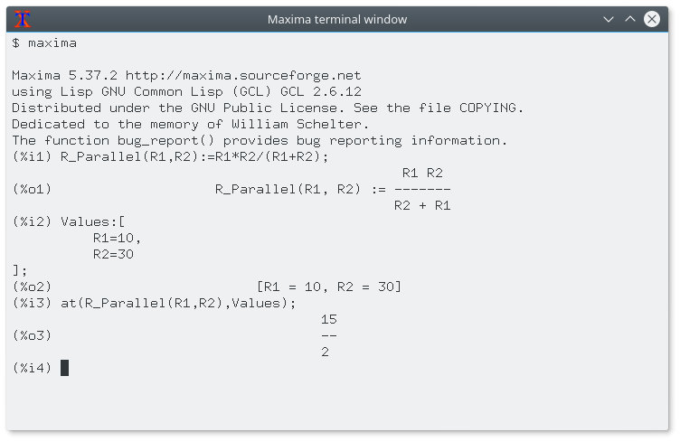{
id=img_maxima_pantallazo }

Extensive documentation for _Maxima_ is  [available in the internet](https://maxima.sourceforge.io/documentation.html). Part of this documentation is also available in wxMaxima’s help menu. Pressing the Help key (on most systems the <kbd>F1</kbd> key) causes _wxMaxima_’s context-sensitive help feature to automatically jump to _Maxima_’s manual page for the command at the cursor.

### WxMaxima

_WxMaxima_ es un interfaz gráfico de usuario que proporciona la
funcionalidad y flexibilidad completa de _Maxima_. WxMaxima ofrece a los
usuarios una pantalla gráfica y varias características que hacen trabajar
más fácilmente con _Maxima_.  Por ejemplo _wxMaxima_ permite a uno exportar
cualquier contenido de celdas (o, si eso es necesario, cualquier parte de
una fórmula, también) como texto, como LaTeX o especificación MathML en una
sola pulsación secundaria.  Por cierto, puede exportarse un cuaderno
completo, ya sea como un archivo HTML o como un archivo LaTeX.  La
documentación para _wxMaxima_, incluyendo los cuadernos para ilustrar
aspectos de su uso, está por conexión al [sitio
web](https://wxMaxima-developers.github.io/wxmaxima/help.html) de
_wxMaxima_, así como a través del menú de ayuda.

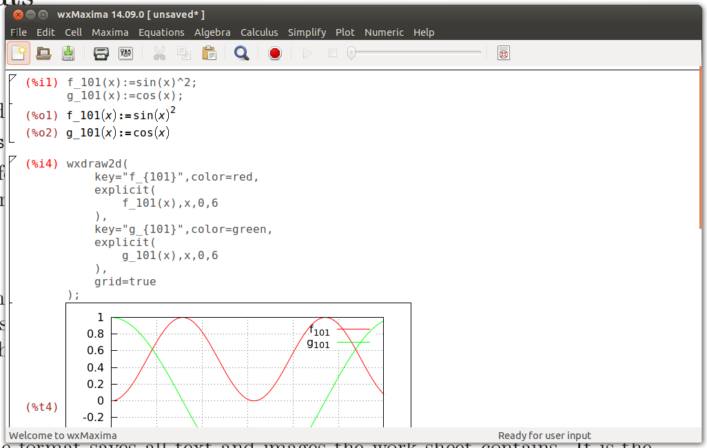{ id=img_wxMaximaWindow }

Los cálculos que son introducidos en _wxMaxima_ son realizados por la
herramienta de línea de instrucciones de _Maxima_ en el segundo plano.

## Workbook basics

Mucho de _wxMaxima_ son auto-explicativos, pero algunos detalles requieren
atención.  [Este
sitio](https://wxMaxima-developers.github.io/wxmaxima/help.html) contiene un
número de cuadernos que dirige varios aspectos de _wxMaxima_.  Trabaja a lo
largo de estos (particularmente el tutorial de «10 minutos _(wx)Maxima_»)
incrementará la familiaridad de uno con ambos del contenido de _Maxima_ y el
uso de _wxMAxima_ para interactuar con _Maxima_.  Este manual se concentra
en describir aspectos de _wxMaxima_ que no son como los evidentes y que tal
vez no está cubierto dentro del material en línea.

### The workbook approach

Una de las muy pocas cosas que no están normalizadas en _wxMaxima_ es que se
organiza los datos para _Maxima_ dentro de celdas que son evaluadas (la cual
indica: envía a _Maxima_) solamente cuando solicita el usuario esto.  Cuando
una celda es evaluada, todas las instrucciones dentro de esa celda, y
solamente esa celda, son evaluadas como un guion. (El enunciado precedente
no es muy preciso: uno puede seleccionar un conjunto de celdas adyacentes y
evaluarlas a la vez. Además, uno puede instruir a _Maxima_ que evalúe todas
las celdas dentro de un cuaderno en una pasada). La aproximación de
_wxMaxima para enviar instrucciones para ejecutar tal vez se sienta poco
familiar en el primer momento. Sin embargo, drásticamente trabaja fácilmente
con documentos grandes (cuando el usuario no desea cada modificación para
disparar automáticamente una re-evaluación completa del todo el documento).
Además, esta aproximación es muy útil para depurar.

Si el texto está tecleado en _wxMaxima_ automáticamente crea una celda de
hoja de trabajo nueva.  El tipo de esta celda puede ser seleccionado en la
barra de herramientas.  Si se crea una celda de código, la celda puede ser
enviada a _Maxima_, la cual causa que el resultado del cálculo es desplegado
debajo del código.  Una pareja de dichas instrucciones se muestra debajo.

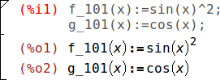{ id=img_InputCell }

En la evaluación de los contenidos de celda de entrada la celda _Maxima_ de
entrada asigna una etiqueta a la entrada (por defecto muestra en rojo y
reconocible por el `%i`) por el cual puede ser referenciado posteriormente
dentro de la sesión _wxMaxima_.  La salida que genera _Maxima_ además
obtiene una etiqueta que comience con `%o` y por defecto está oculta,
excepto si el usuario asigna la salida un nombre.  En este caso por defecto
el etiquetado definido por el usuario está desplegado.  El estilo `%o` de
etiquetado _Maxima_ auto-genera además será accesible, sin embargo.

Al lado de las celdas de entradas _wxMaxima_ permite celdas de texto para
documentación, celdas de imagen, celdas de título, celdas de capítulo y
celdas de sección.  Cada celda tiene su propio tampón para deshacer por lo
que se depura a través de modificar los valores de varias celdas y después
gradualmente es más fácil revertir las modificaciones no necesarias.  Además
la misma hoja de trabajo tiene un tampón global para deshacer que puede
deshacer celdas editadas, agregar y borrar.

La figura inferior muestra tipos de celda diferentes (celdas título,
sección, subsección, texto, E/S e imagen).

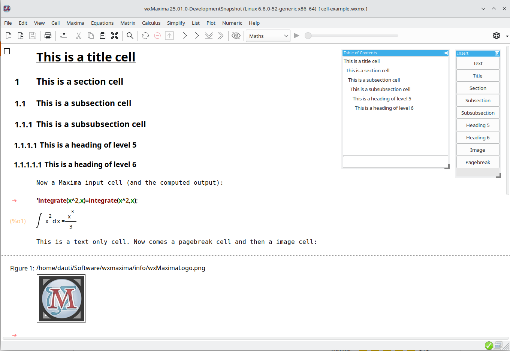{ id=img_cell-example }

### Cells

La hoja de trabajo está organizada dentro de celdas.  wxmaxima conoce los
tipos de celdas siguientes:

- Math cells, containing one or more lines of _Maxima_ input.
- Output of, or a question from, _Maxima_.
- Image cells.
- Text cells, that can for example be used for documentation.
- A title, section or a subsection. 6 levels of different headings are
  possible.
- Page breaks.

El comportamiento predeterminado de _wxMaxima_ cuando el texto es teclado
para creación automática de una celda matemática.  Las celdas de otros tipos
puede ser creadas utilizando el menú Celda, utilizando las teclas resaltadas
mostradas dentro del menú o utilizando el listado de arrastrar-bajar dentro
de la barra de herramientas.  Una vez que la celda no matemática es creada,
lo que se teclee dentro del archivo es interpretado como texto.

Un [comentario de texto]
(C-style)(https://maxima.sourceforge.io/docs/manual/maxima_singlepage.html#Comments)
puede ser parte de una celda matemática como sigue: `/* Este comentario será
ignorado por Maxima */`

"`/*`" marca el inicio del comentario, "`*/`" el final.

### Horizontal and vertical cursors

Si el usuario intenta seccionar una oración completa, un procesador de
palabras intentará extender la selección para iniciar y finalizar
automáticamente con una palabra acotada.  Así mismo, si está seleccionada
más de una celda, _wxMaxima_ extenderá la selección a todas las celdas.

Que no es estándar es que _wxMaxima_ proporciona flexibilidad para
arrastrar-y-soltar definiendo dos tipos de cursores. _wxMaxima_ conmutará
entre ellos automáticamente cuando lo necesite:

- El cursor es dibujado horizontalmente si es trasladado dentro del espacio
  entre dos celdas o pulsando allí.
- A vertical cursor that works inside a cell. This cursor is activated by
  moving the cursor inside a cell using the mouse pointer or the cursor keys
  and works much like the cursor in a text editor.

When you start wxMaxima, you will only see the blinking horizontal cursor. If you start typing, a math cell will be automatically created and the cursor will change to a regular vertical one (you will see a right arrow as "prompt", after the Math cell is evaluated (<kbd>CTRL</kbd>+<kbd>ENTER</kbd>), you will see the labels, e.g. `(%i1)`, `(%o1)`).

{ id=img_horizontal_cursor_only }

Quizá desea crear un tipo de celda diferente (utilizando el menú «Celda»),
puede ser una celda titular o de texto, la cual describe que será hecho,
cuando inicia crear su hoja de trabajo.

Si navegas entre las celdas diferentes, además verá el (parpadeo) cursor
horizontal, donde puede insertar una celda a su hoja de trabajo (bien una
celda matemática, por tan solo inicie tecleando su fórmula - o un tipo de
celda diferente utilizando el menú).

{
id=img_horizontal_cursor_between_cells }

### Sending cells to Maxima

The command in a code cell is executed once by pressing <kbd>CTRL</kbd>+<kbd>ENTER</kbd>, <kbd>SHIFT</kbd>+<kbd>ENTER</kbd> or the <kbd>ENTER</kbd> key on the keypad. The _wxMaxima_ default is to enter commands when either <kbd>CTRL</kbd>+<kbd>ENTER</kbd> or <kbd>SHIFT</kbd>+<kbd>ENTER</kbd> is entered, but _wxMaxima_ can be configured to execute commands in response to <kbd>ENTER</kbd>.

### Command autocompletion

_WxMaxima_ contains an autocompletion feature that is triggered via the menu (Cell/Complete Word) or alternatively by pressing the key combination <kbd>CTRL</kbd>+<kbd>SPACE</kbd>. The autocompletion is context-sensitive. For example, if activated within a unit specification for ezUnits it will offer a list of applicable units.

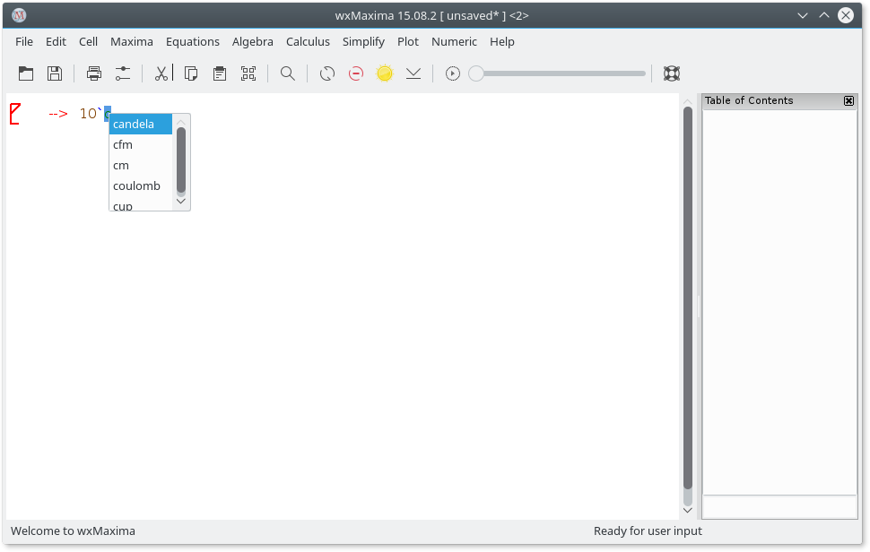{ id=img_ezUnits }

Besides completing a file name, a unit name, or the current command or variable name, the autocompletion is able to show a template for most of the commands indicating the type (and meaning) of the parameters this program expects. To activate this feature press <kbd>SHIFT</kbd>+<kbd>CTRL</kbd>+<kbd>SPACE</kbd> or select the respective menu item (Cell/Show Template).

#### Greek characters

Equipos tradicionalmente almacenados en valores 8-bit.  Esto permite para un
máximo de 256 caracteres diferentes.  Todas las letras, números t y símbolos
de control (final de transmisión, final de cadena, líneas y bordes para
dibujar rectángulos para menús :etc_.) de cerca cualquier idioma puede caber
dentro de ese límite.

Para muchos países, la página de código de 256 caracteres que han sido
elegidos no incluyen cosas como letras griegas, por lo que, eso es utilizado
frecuentemente en matemáticas.  Para solucionar este tipo de limitación
[Unicode] (https://home.unicode.org/) ha sido inventado: una codificación
que hace que el texto inglés funcione como normal, pero para utilizar más
que los 256 caracteres.

_Maxima_ permite Unicode si fue compilado utilizando un compilador Lisp que
o bien admite Unicode o que no tomen en cuenta acerca de la codificación
tipográfica.  Al menos una de este par de condiciones debe ser
cierta. _wxMaxima_ proporciona un método de introducción de caracteres
griegos utilizando el teclado:

- Puede introducir una tecla griega pulsando la tecla <kbd>ESC</kbd> y
  después pulsando la tecla del nombre del carácter griego.
- Alternatively it can be entered by pressing <kbd>ESC</kbd>, one letter (or
  two for the Greek letter omicron) and <kbd>ESC</kbd> again. In this case
  the following letters are supported:

| tecla | Letra griega | tecla | Letra griega | tecla | Letra griega |
|:-----:|:------------:|:-----:|:------------:|:---- :|:------------:|
|   a   |     alfa     |   i   |    iota      |   r   |     rho      |
|   b   |      beta    |   k   |    kappa     |   s   |    sigma     |
|   g   |     gamma    |   l   |    lambda    |   t   |     tau      |
|   d   |     delta    |   m   |      mu      |   u   |   upsilon    |
|   e   |    épsilon   |   n   |      nu      |   f   |      phi     |
|   z   |     zeta     |   x   |      xi      |   c   |      chi     |
|   h   |      eta     |  om   |    ómicron   |   y   |      psi     |
|   q   |     teta     |   p   |      pi      |   o   |     omega    |
|   A   |     Alfa     |   I   |     Iota     |   R   |      Ro      |
|   B   |      Beta    |   K   |     Kappa    |   S   |     Sigma    |
|   G   |     Gamma    |   L   |     Lambda   |   T   |      Tau     |
|   D   |     Delta    |   M   |      Mu      |   U   |    Upsilon   |
|   E   |    Épsilon   |   N   |      Nu      |   P   |      Phi     |
|   Z   |      Zeta    |   X   |      Xi      |   C   |      Chi     |
|   H   |      Eta     |  Om   |    Ómicron   |   Y   |      Psi     |
|   T   |     Teta     |   P   |      Pi      |   O   |     Omega    |

Además puede utilizar la barra lateral de «Teclas griegas» para introducir
las letras griegas.

##### Attention: Lookalike characters

Several Latin letters look like the Greek letters, e.g. the Latin letter "A"
and the Greek letter "Alpha". Although they look identical, they are two
different Unicode characters, represented by different Unicode code points
(numbers).

This might be problematic, if you assign a value to the variable A and later
use the Greek letter Alpha to do something with this variable, especially on
printouts.  For the Greek letter my (which is also used as prefix for micro)
there are also two different Unicode code points.

The "Greek letters"-sidebar therefore has the option, that lookalike
characters are not available (which can be changed using a right-click
menu).

El mismo mecanismo también permite introducir algunos símbolos matemáticos
adicionales:

| teclas a introd| símbolos matemáticos                                  |
|----------------|-------------------------------------------------------|
| barh           | constante de Planck: una h con una barra a hor. sobre |
| barH           | una H con una barra hor. por encima de ésta           |
| 2              | al cuadrado                                           |
| 3              | al cubo                                               |
| /2             | 1/2                                                   |
| parcial        | signo parcial (la d de dx/dt)                         |
| integral       | signo integral                                        |
| sq             | raíz cuadrada                                         |
| ii             | imaginario                                            |
| ee             | elemento                                              |
| in             | en, dentro de                                         |
| impl implies   | implica                                               |
| inf            | infinito                                              |
| empty          | vacío                                                 |
| TB             | triángulo derecho grande                              |
| tb             | triángulo derecho pequeño                             |
| and            | y                                                     |
| or             | o                                                     |
| xor            | ¬o                                                    |
| nand           | ¬y                                                    |
| nor            | ¬o                                                    |
| equiv          | equivalente                                           |
| not            | no                                                    |
| union          | unión                                                 |
| inter          | intersección                                          |
| subseteq       | subconjunto o igual                                   |
| subset         | subconjunto                                           |
| notsubseteq    | no subconjunto o igual                                |
| notsubset      | no subconjunto                                        |
| approx         | aproximadamente                                       |
| propto         | proporcional a                                        |
| neq != /= o #  | no igual a                                            |
| +/- o pm       | un signo suma/resta                                   |
| \<= o meq      | igual o menor que                                     |
| >= o Meq       | igual o Mayor que                                     |
| \<\< o ll      | mucho menor que                                       |
| >> o gg        | mucho mayor que                                       |
| equiv          | equivalente a                                         |
| qed            | final de prueba                                       |
| nabla          | un operador nabla                                     |
| sum            | signo suma                                            |
| prod           | signo producto                                        |
| exists         | existe signo                                          |
| nexists        | no existe signo                                       |
| parallel       | un signo paralelo                                     |
| perp           | un signo perpendicular                                |
| leadsto        | una cabecera de signo                                 |
| ->             | una flecha derecha                                    |
| -->            | una flecha derecha más grande                         |

Puede utilizar también los «Símbolos» de la barra lateral para introducir
estos símbolos matemáticos.

If a special symbol isn’t in the list, it is possible to input arbitrary Unicode characters by pressing <kbd>ESC</kbd> \[number of the character (hexadecimal)\] <kbd>ESC</kbd>. Additionally the "symbols" sidebar has a right-click menu that allow to display a list of all available Unicode symbols one can add to this toolbar or to the worksheet.

<kbd>ESC</kbd><kbd>6</kbd><kbd>1</kbd><kbd>ESC</kbd> therefore results in an `a`.

Note que muchos de estos símbolos (notablemente excepciones son los símbolos
lógicos) no tiene un significado especial dentro de _Maxima_ y por lo tanto
serán interpretados como caracteres ordinarios.  Si _Maxima_ está compilado
utilizando un Lisp que no admite caracteres Unicode quizá cause un mensaje
de error.

It may be the case that e.g. Greek characters or mathematical symbols are not included in the selected font, then they can not be displayed.
To solve that problem, select other fonts (using: Edit -> Configure -> Style).

### Unicode replacement

wxMaxima sustituirá varios caracteres Unicode por sus expresiones
respectivas de Maxima, p.ej. "²" por "^2", "³" por "^3", el signo de raíz
cuadrada por la función `sqrt()`, el signo Sigma (matemático) el cual no es
el mismo carácter Unicode como la letra griega correspondiente) por `sum()`,
etc.

Unicode has several "common" fractions encoded as one Unicode code point:
`¼, ½, ¾, ⅐, ⅑, ⅒, ⅓, ⅔, ⅕, ⅖, ⅗, ⅘, ⅙, ⅚, ⅛, ⅜, ⅝, ⅞`

wxMaxima will replace them with their Maxima representations, e.g `(1/4)`
before the input is sent do Maxima. There are also `⅟`, which will be
replaced by `1/` and `↉` (used in baseball), which will be replaced by
`(0/3)`.

It is recommended to use **Maxima code** (not these Unicode code points) in
input cells (Rationale: (a) it might be possible, that the used font for
math input does not contain them; (b) if you save the document as
`wxm`-file, it is usually readable by (command line) Maxima, but these
changes will of course not work in command line Maxima); but they may occur,
if you cut&paste a formula from another document.

### Side Panes

Enlaces para las instrucciones de _Maxima_ más importantes, cosas como un
índice de contenido, ventanas con mensajes de depuración o un historial de
las últimas instrucciones emitidas pueden ser accedidas utilizando los
paneles laterales.  Puede ser habilitados utilizando el menú de "Vistas".
Todos ellos pueden ser trasladas a otras localización dentro o fuera de la
ventana de _wxMaxima.  Otro de los paneles útiles es el que permite
introducir letras griegas utilizando el ratón.

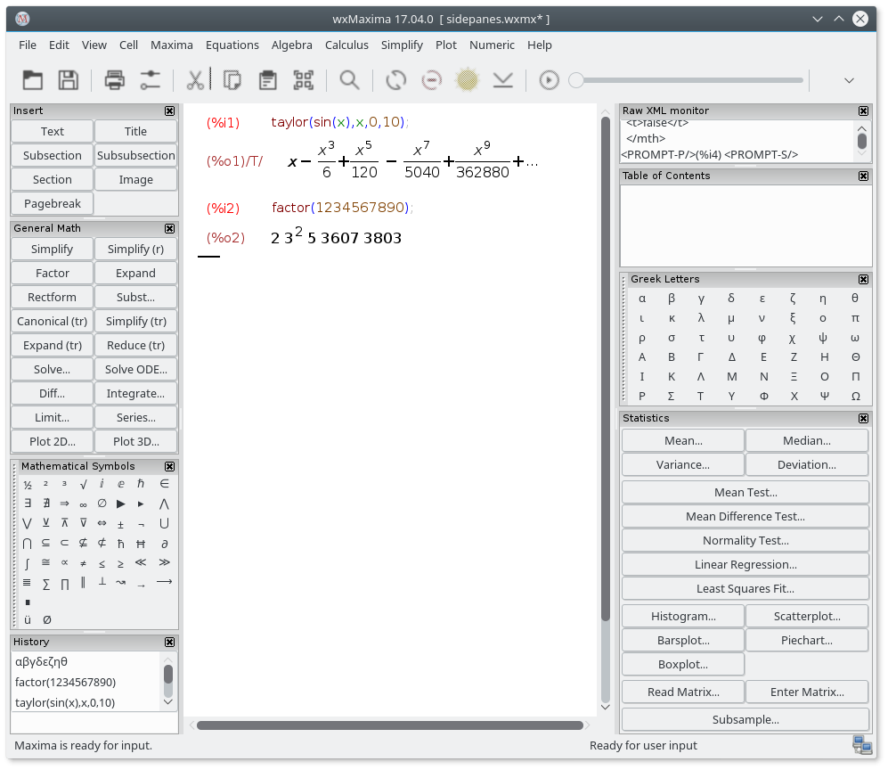{
id=img_SidePanes }

En el panal lateral de "table de contenido", uno puede incrementar o
decrementar un encabezado tan solo pulsando sobre la cabecera con el botón
de ratón secundario y seleccionar el siguiente tipo de cabecera más alto o
bajo.

{ id=Sidepane-TOC-convert-headings
}

### MathML output

Varios procesadores de palabras y programas similares o bien reconocen
entradas de [MathML](https://www.w3.org/Math/) y lo insertan automáticamente
como una ecuación editable 2D - o bien (como LibreOffice 5.1) tiene un
editor de ecuación que ofrece una característica “importar MathML desde
portapapeles”.  Otros admiten matemáticas RTF.  _WxMaxima_ por lo tanto
ofrece varios apuntes dentro del menú a través de la pulsación secundaria
del menú.

### Markdown support

_WxMaxima_ ofrece un conjunto de convenciones de
[Markdown](https://es.wikipedia.org/wiki/Markdown) estándar que no colisione
con la notación matemática.  Una vez que estos elementos son listados de
puntos.

```text
Ordinary text
 * One item, indentation level 1
 * Another item at indentation level 1
   * An item at a second indentation level
   * A second item at the second indentation level
 * A third item at the first indentation level
Ordinary text
```

_WxMaxima_ will recognize text starting with `>` chars as block quotes:

```text
Ordinary text
> quote quote quote quote
> quote quote quote quote
> quote quote quote quote
Ordinary text
```

_WxMaxima_’s TeX and HTML output will also recognize `=>` and replace it by the corresponding Unicode sign:

```text
cogito => sum.
```

Other symbols the HTML and TeX export will recognize are `<=` and `>=` for comparisons, a double-pointed double arrow (`<=>`), single-headed arrows (`<->`, `->` and `<-`) and `+/-` as the respective sign. For TeX output also `<<` and `>>` are recognized.

### Hotkeys

Muchas teclas resaltadas pueden ser encontradas dentro del texto de los
respectivos menús.  Desde que son tomados actualmente desde el texto del
menú y por lo tanto puede ser adaptados por las traducciones de _wxMaxima_
para coincidir con las necesidades de los usuarios del teclado local, no lo
documentamos aquí.  Unas pocas teclas especiales o aliases, sin embargo , no
están documentadas dentro de los menús:

- <kbd>CTRL</kbd>+<kbd>MAYÚS</kbd>+<kbd>SUPR</kbd> borra una celda completa.
- <kbd>CTRL</kbd>+<kbd>TAB</kbd> or
  <kbd>CTRL</kbd>+<kbd>SHIFT</kbd>+<kbd>TAB</kbd> triggers the
  auto-completion mechanism.
- <kbd>MAYÚS</kbd>+<kbd>ESPACIO</kbd> introduce un espacio sin ruptura.

### Raw TeX in the TeX export

Si una celda de texto comienza con `TeX:` la exportación de TeX contiene el
texto literal que continua el marcador `TeX:`.  Utilizando esta
característica permite al apunte del marcado TeX sin el cuaderno _wxMaxima_.

## File Formats

El material desarrollado en una sesión _wxMaxima_ puede ser almacenado para
un posterior uso en cualquiera de estas tras maneras:

### .mac

Los archivos `.mac` son archivos de texto ordinarios que contienen
instrucciones de _Maxima_.  Pueden ser leídos utilizando la instrucción
`batch()` o `load()` de _Maxima_ o un apunte del menú de archivo del
«Archivo/Menú de archivo guion» de _wxMaxima_.

Un ejemplo se muestra debajo.  `Quadratic.mac` define una función y
posteriormente genera un tramado con `wxdraw2d()`.  Posteriormente el
contenido del archivo `Quadratic.mac` es representado y la función `f()`
nueva definida es evaluada.

{ id=img_BatchImage }

Attention: Although the file `Quadratic.mac` has a usual _Maxima_ extension
(`.mac`), it can only be read by _wxMaxima_, since the command `wxdraw2d()`
is a wxMaxima-extension to _Maxima_. (Command line) Maxima will ignore the
unknown command `wxdraw2d()` and print it as output again.

Puede utilizar los archivos `.mac` para escribir su propia biblioteca de
macros.  Pero desde que no contengan suficiente información estructural no
pueden releer como una sesión _wxMaxima_.

### .wxm

`.wxm` files contain the worksheet except for _Maxima_’s output. On Maxima versions >5.38 they can be read using _Maxima_’s `load()` function just as .mac files. Well - mostly. Questions (like `asksign(x)`) are problematic, as the answer is written in the `.wxm` file (so that it can be suggested after loading), but that can Maxima not evaluate.
You can prevent Maxima from asking questions by using `assume()` to declare some properties, Maxima wants to know.

With this plain-text format, it sometimes is unavoidable that worksheets
that use new features are not downwards-compatible with older versions of
_wxMaxima_.

#### File format of wxm files

Esto es tan solo un archivo de texto simple (puede abrirlo con un editor de
texto), conteniendo el contenido de celda como algunos comentarios Maxima
especial.

Comienza con el siguiente comentario:

```maxima
/* [wxMaxima batch file version 1] [ DO NOT EDIT BY HAND! ]*/
/* [ Created with wxMaxima version 24.02.2_DevelopmentSnapshot ] */
```

Y entonces las celdas siguientes, codificados como comentarios Maxima,
p.ej., una celda de sección:

```maxima
/* [wxMaxima: section start ]
Title of the section
   [wxMaxima: section end   ] */
```

o (en una celda matemática la entrada es por supuesto *no* comentada afuera
(la salida no es guardada en un archivo `wxm`)):

```maxima
/* [wxMaxima: input   start ] */
f(x):=x^2+1$
f(2);
/* [wxMaxima: input   end   ] */
```

Imágenes están [codificadas en base64](https://es.wikipedia.org/wiki/Base64)
con el tipo de imagen como primera línea):

```maxima
/* [wxMaxima: image   start ]
jpg
[very chaotic looking character sequence]
   [wxMaxima: image   end   ] */
```

Un salto de página es tan solo una línea conteniendo:

```maxima
/* [wxMaxima: page break    ] */
```

Y las celdas encarpetadas marcadas por:

```maxima
/* [wxMaxima: fold    start ] */
...
/* [wxMaxima: fold    end   ] */
```

### .wxmx

Este archivo cuyo formato está basado en XML guarda la hoja de trabajo
completa incluyendo cosas como el factor de zoom y el listado de vigía.  Es
el formato de archivo preferido.

#### File format of wxmx files

A `wxmx`-file seems to be a binary format, but one can handle it with tools,
which are included in your OS. It is a zip file, one can decompress it with
`unzip` (maybe rename it before, so that is recognized by the unzip program
of your OS).  We do not use the compression function, just the possibility
to merge several files into one file - images are already compressed and the
rest is simple text (probably much smaller, than huge images, which are
included).

It does contain the following files:

- `mimetype`: this file does contain the mimetype of wxMaxima files:
  `text/x-wxmathml`
- `format.txt`: a short description about wxMaxima and the wxmx file format
- Images (e.g. png, jpeg): inline plots which were produced in the wxMaxima
  session and included images.
- `content.xml`: a XML document, which contains the various cells of your
  document in XML format.

So, if something goes wrong, you can unzip a wxMaxima document (maybe rename
it before to a `zip`-file), maybe make changes in the `content.xml` file
with a text editor, or replace an broken image, zip the files again,
probably rename the `zip` to a `wxmx`-file - and you get another modified
`wxmx`-file.

## Configuration options

Para algunas configuraciones comunes de variables _wxMaxima_ ofrecen dos
maneras de configurarlas:

- La caja de diálogo de configuración de abajo le permite modificar sus
  valores predeterminados para las sesiones actuales y subsecuentes.
- Also, the values for most configuration variables can be changed for the
  current session only by overwriting their values from the worksheet, as
  shown below.

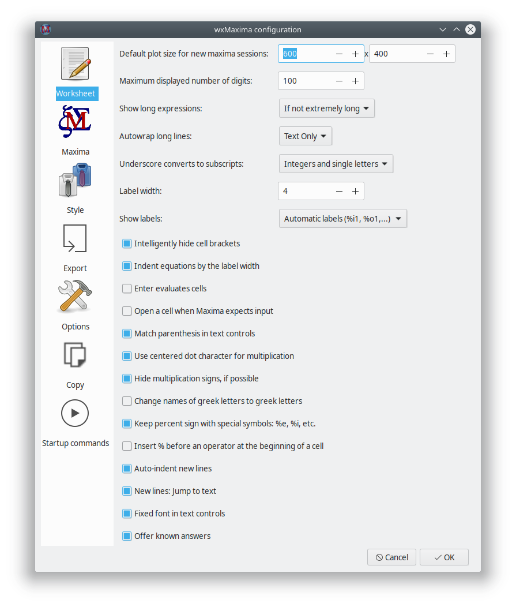{
id=img_wxMaxima_configuration_001 }

### Default animation framerate

La tasa del marco de animación que se utiliza para animaciones nuevas se
conserva dentro de la variable `wxanimate_framerate`.  El valor inicial de
esta variable contiene dentro una hoja de trabajo nueva que puede ser
modificada utilizando el diálogo de configuración.

### Default plot size for new _maxima_ sessions

Tras el siguiente inicio, tramas empotradas a la hoja del trabajo será
creada con este tamaño si el valor de `wxplot_size` no es modificado por
_maxima_.

Con la intención de establecer el tamaño de trama de un grafo único
solamente utilice la notación siguiente puede ser utilizada que fija un
valor de variable solamente para una sola instrucción:

```maxima
wxdraw2d(
   explicit(
       x^2,
       x,-5,5
   )
), wxplot_size=[480,480]$
```

### Match parenthesis in text controls

Esta opción habilita dos cosas:

- If an opening parenthesis, bracket, or double quote is entered _wxMaxima_
  will insert a closing one after it.
- Si el texto está seleccionad si cualquiera de estas teclas es pulsada el
  texto seleccionado será puedes entre los signos coincidan.

### Don’t save the worksheet automatically

Si esta opción está puesta, el archivo donde la hoja de trabajo será
sobrescrita solamente al solicitar el usuario.  En caso de un cuelgue/corte
de luz/... sin embargo, aún está disponible una copia de respaldo reciente
dentro del directorio temporal ‘temp’.

Si esta opción no está fijada _wxMaxima_ se comporta más como una app
telefónica moderna:

- Ficheros son guardados automáticamente al salir
- And the file will automatically be saved every 3 minutes.

### Where is the configuration saved?

If you are using Unix/Linux, the configuration information will be saved in a file `.wxMaxima` in your home directory (if you are using wxWidgets \< 3.1.1), or `.config/wxMaxima.conf` ((XDG-Standard) if wxWidgets >= 3.1.1 is used). You can retrieve the wxWidgets version from the command `wxbuild_info();` or by using the menu option Help->About. [wxWidgets](https://www.wxwidgets.org/) is the cross-platform GUI library, which is the base for _wxMaxima_ (therefore the `wx` in the name).
(Since the filename starts with a dot, `.wxMaxima` or `.config` will be hidden).

Si está utilizando Windows, la configuración será almacenada dentro del
registro.  Encontrará los apuntes para _wxMaxima_ en la posición siguiente
dentro del registro:
`HKEY_CURRENT_USER\Software\wxMaxima`

______________________________________________________________________

# Extensions to _Maxima_

_WxMaxima_ es primariamente un interfaz gráfico de usuario para _Maxima_.
Por lo tanto, su propósito principal es enviar órdenes a _Maxima_ y
comunicar los resultados de ejecutar esas órdenes.  En algunos casos, sin
embargo, _wxMaxima agrega funcionalidades a _Maxima_. La capacidad de
_wxMaxima_ para generar informes exportando un contenido del cuaderno a HTML
y LaTeX ha sido mencionado.  Esta sección considera algunas maneras que
_wxMaxima_ mejora la inclusión de gráficos dentro de una sesión.

## Subscripted variables

Especificidades `wxsubscripts`, si (y como) _wxMaxima_ auto-suscribirá
nombres de variable:

Si es falso, la funcionalidad está apagada, wxMaxima no auto-suscribirá
parte de nombres de variable tras un subrayado.

Si está fijado a `all`, todo será escrito debajo tras un guion bajo (_).

Si está fijado a `true` (verdadero) los nombres de variables del formato
`x_y` están representados utilizando un subguion ‘if’

- Either `x` or `y` is a single letter or
- `y` is an integer (can include more than one character).

{ id=img_wxsubscripts }

Si el nombre de variable no coincide estos requerimientos, aún puede ser
declarado como "para ser sub-guionado" utilizando la instrucción
`wxdeclare_subscript(nombre_variable);` o
`wxdeclare_subscript([nombre_variable1,nombre_variable2,...]);` declarando
una variable como sub-guion puede ser revertido utilizando la instrucción
siguiente: `wxdeclare_subscript(nombre_variable,false);`

You can use the menu "View->Autosubscript" to set these values.

## User feedback in the status bar

Las instrucciones de ejecución largas pueden proporcionar al usuario su
estado dentro de la barra de estado.  Esta comentario es sustituído por
cualquier comentario devuelto que es colocada allí (permitiendo utilizarlo
como un indicador de progreso) y es borrado tan pronto como la instrucción
actual enviada a _Maxima_ ha finalizado.  Es seguro de utilizar
`wxstatusbar()` incluso dentro de bibliotecas que tal vez sean utilizadas
con el simple _Maxima_ (como opuesto a _wxMaxima_): si _wxMaxima_ no está
presente la instrucción `wxstatusbar()` será tan solo dejada sin evaluar.

```maxima
for i:1 thru 10 do (
    /* Tell the user how far we got */
    wxstatusbar(concat("Pass ",i)),
    /* (sleep n) is a Lisp function, which can be used */
    /* with the character "?" before. It delays the */
    /* program execution (here: for 3 seconds) */
    ?sleep(3)
)$
```

## Exporting the worksheet from within Maxima

The command `wxworksheettohtml()` exports the current worksheet to an HTML
file from within a running _Maxima_ session, which is convenient for
scripted or batch export. Like `wxstatusbar()` it is safe to use in code
that might also run in plain (console) _Maxima_: if _wxMaxima_ isn’t present
the command is simply left unevaluated.

```maxima
wxworksheettohtml("report.html")$
wxworksheettohtml("report.html", flavor="svg", wxmx=true)$
```

A relative file name is interpreted relative to _Maxima_’s working
directory. The optional keyword options are:

| option   | values                                          | meaning                                             |
| -------- | ----------------------------------------------- | --------------------------------------------------- |
| `flavor` | `mathml` (default), `mathjax`, `svg`, `bitmap`  | how the equations are rendered in the exported page |
| `wxmx`   | `false` (default), `true`                       | embed a downloadable `.wxmx` copy of the session    |

The `flavor` values match the equation formats offered by the graphical
**File → Export** dialog: `mathml` produces a self-contained page that needs
no internet connection, `mathjax` adds a MathJaX fall-back for browsers that
still lack MathML, and `svg`/`bitmap` render every equation to an image.

The companion command `wxworksheettotex()` exports to a LaTeX (`.tex`) file
the same way:

```maxima
wxworksheettotex("report.tex")$
wxworksheettotex("report.tex", documentclass="report", documentclassoptions="12pt,a4paper")$
```

| option                 | meaning                                                              |
| ---------------------- | -------------------------------------------------------------------- |
| `documentclass`        | overrides the LaTeX `\documentclass` (e.g. `"article"`, `"report"`)  |
| `documentclassoptions` | overrides its options (e.g. `"12pt,a4paper"`)                        |

Support for `wxworksheettopdf()` is planned.

## Plotting

Tramar (teniendo fundamentalmente hacerlo con gráficas) es un lugar donde un
interfaz gráfico del usuario tendrá para proporcionar algunas extensiones
para el programa original.

### Embedding a plot into the worksheet

_Maxima_ normalmente instrumenta el programa _Gnuplot_ externo para abrir
una ventana separada por cada diagrama que crea.  Debido a que muchas veces
es conveniente empotrar grafos a la hoja de trabajo en vez que _wxMaxima_
proporcione su propio conjunto de funciones de trama que no difieran desde
las funciones correspondientes a _maxima_ que guarda dentro de su nombre:
todo está prefijado por un “wx”.

Las siguientes funciones de tramado tienen contrapartes wx:

| Función tramado wxMaxima | Función de plot de Maxima                                                                       |
| ------------------------ | ----------------------------------------------------------------------------------------------- |
| `wxplot2d()`             | [plot2d](https://maxima.sourceforge.io/docs/manual/maxima_singlepage.html#plot2d)               |
| `wxplot3d()`             | [plot3d](https://maxima.sourceforge.io/docs/manual/maxima_singlepage.html#plot3d)               |
| `wxdraw2d()`             | [draw2d](https://maxima.sourceforge.io/docs/manual/maxima_singlepage.html#draw2d)               |
| `wxdraw3d()`             | [draw2d](https://maxima.sourceforge.io/docs/manual/maxima_singlepage.html#draw3d)               |
| `wxdraw()`               | [draw](https://maxima.sourceforge.io/docs/manual/maxima_singlepage.html#draw)                   |
| `wximplicit_plot()`      | [implicit_plot](https://maxima.sourceforge.io/docs/manual/maxima_singlepage.html#implicit_plot) |
| `wxhistogram()`          | [histogram](https://maxima.sourceforge.io/docs/manual/maxima_singlepage.html#histogram)         |
| `wxscatterplot()`        | [scatterplot](https://maxima.sourceforge.io/docs/manual/maxima_singlepage.html#scatterplot)     |
| `wxbarsplot()`           | [barsplot](https://maxima.sourceforge.io/docs/manual/maxima_singlepage.html#barsplot)           |
| `wxpiechart()`           | [piechart](https://maxima.sourceforge.io/docs/manual/maxima_singlepage.html#piechart)           |
| `wxboxplot()`            | [boxplot](https://maxima.sourceforge.io/docs/manual/maxima_singlepage.html#boxplot)             |

Si un archivo de `wxm` es leído por (consola) Maxima, estas funciones son
ignoradas (y escritas como salida, como otras funciones desconocidas en
Maxima).

If you got problems with one of these functions, please check, if the
problem exists in the the Maxima function too (e.g. you got an error with
`wxplot2d()`, check the same plot in the Maxima command `plot2d()` (which
opens the plot in a separate Window)). If the problem does not disappear, it
is most likely a Maxima issue and should be reported in the [Maxima
bugtracker](https://sourceforge.net/p/maxima/bugs/). Or maybe a Gnuplot
issue.

### Making embedded plots bigger or smaller

Tal como notó arriba, el dialogo de configuración proporciona una manera de
modificar el tamaño de trama predeterminada lo cual fija el valor de inicio
de `wxplot_size`.  Las rutinas de tramado de _wxMaxima_ respeta esta
variable que especifica el tamaño de una trama en píxeles.  Siempre puede
ser solicitado o utilizado para fijar el tamaño de las tramas siguientes:

```maxima
wxplot_size:[1200,800]$
wxdraw2d(
    explicit(
        sin(x),
        x,1,10
    )
)$
```

Si el tamaño de solamente una trama va a ser modificada, _Maxima_
proporciona una manera canónica para modificar un atributo solamente para la
celda actual.  En este uso la especificación `wxplot_size = [valor1,
valor2]` es agregada a la instrucción `wxdraw2d( )`, y no es parte de la
instrucción `wxdraw2d`.

```maxima
wxdraw2d(
    explicit(
        sin(x),
        x,1,10
    )
),wxplot_size=[1600,800]$
```

Estableciendo el tamaño de trazas empotradas con `wxplot_size` funciona para
trazos empotrados utilizando p.e. instrucciones `wxplot`, `wxdraw`,
`wxcontour_plot` y `wximplicit_plot` y para animaciones empotradas con
instrucciones `with_slider_draw` y `wxanimate`.

### Better quality plots

_Gnuplot_ parece no proporcionar una manera portable de determinar si admite
bitmap de salida de calidad alta que la biblioteca Cairo proporciona. En los
sistemas donde está compilado _Gnuplot_ para utilizar esta biblioteca la
opción pngCairo desde el menú de configuración (que puede ser sobrescrito
por la variable `wxplot_pngcairo`) habilita el mantenimiento para antialias
y estilos de línea adicional. Si `wxplot_pngCairo` está establecido sin
_Gnuplot_ admitiendo esto el resultado dará mensajes de error en vez de
gráficos.

### Opening embedded plots in interactive _Gnuplot_ windows

Si fue generada una trama utilizando las instrucciones de tipo `wxdraw`
(`wxplot2d` y `wxplot3d` no son admitidas por esta característica) y el
tamaño del archivo del proyecto _Gnuplot_ subyacente no es una manera
demasiado buena que _wxMaxima_ ofrezca un menú de pulsación secundaria que
permita abrir el tramado dentro de una ventana interactiva de _Gnuplot_.

### Opening Gnuplot’s command console in `plot` windows

On MS Windows, there are two Gnuplot programs, `gnuplot.exe` and
`wgnuplot.exe`.  You can configure, which command should be used using the
configuration menu. `wgnuplot.exe` offers the possibility to open a console
window, where _gnuplot_ commands can be entered into, `gnuplot.exe` does not
offer this possibility. Unfortunately, `wgnuplot.exe` causes _Gnuplot_ to
"steal" the keyboard focus for a short time every time a plot is prepared.

### Embedding animations into the spreadsheet

Diagramas 3D tienden hacerlo difícil para lectura de datos
cuantitativos. Una alternativa viable sería asignar el 3er parámetro a la
rueda del ratón.  La instrucción `with_slider_draw` es una versión de
`wxdraw2d` que prepara múltiples tramados y permite conmutar entre ellos
moviendo el arrastre en la cima de la pantalla.  _wxMaxima_ permite exportar
esta animación como un gif animado.

Los primeros dos argumentos para `with_slider_draw` son el nombre de la
variable que está pasada entre las tramas y un listado de los valores de
estas variables.  Los argumentos que siguen son los argumentos ordinarios
para `wxdraw2d`:

```maxima
with_slider_draw(
    f,[1,2,3,4,5,6,7,10],
    title=concat("f=",f,"Hz"),
    explicit(
        sin(2*%pi*f*x),
        x,0,1
    ),grid=true
);
```

La misma funcionalidad para tramas de 3D es accesible como
‘with_slider:draw3d’, el cual permite rotación en tramas de 3D:

```maxima
wxanimate_autoplay:true;
wxanimate_framerate:20;
with_slider_draw3d(
    α,makelist(i,i,1,360,3),
    title=sconcat("α=",α),
    surface_hide=true,
    contour=both,
    view=[60,α],
    explicit(
        sin(x)*sin(y),
        x,-π,π,
        y,-π,π
    )
)$
```

Si el formato general de la trama es que pasa quizá sufra mover el tramado
tan solo un pequeño bit con el fin de crear su naturaleza 3D disponible a la
intuición:

```maxima
wxanimate_autoplay:true;
wxanimate_framerate:20;
with_slider_draw3d(
    t,makelist(i,i,0,2*π,.05*π),
    title=sconcat("α=",α),
    surface_hide=true,
    contour=both,
    view=[60,30+5*sin(t)],
    explicit(
        sin(x)*y^2,
        x,-2*π,2*π,
        y,-2*π,2*π
    )
)$
```

Para aquello más familiar con `trama` en vez de `dibujo`, hay un segundo
conjunto de funciones:

- `with_slider` and
- `wxanimate`.

Normalmente las animaciones son retro-reproducidas o exportadas con la parte
de marco elegida dentro de la configuración de _wxMaxima_.  Para establecer
la velocidad se reproduce una animación individual de vuelta a la variable
`wxanimate_framerate` puede utilizarse:

```maxima
wxanimate(a, 10,
    sin(a*x), [x,-5,5]), wxanimate_framerate=6$
```

Las funciones de animación utilizan las instrucciones `makelist` de _Maxima_
y por lo tanto comparte el escollo que el valor de variable del arrastre se
sustituye dentro de la expresión solamente si la variable es visible
directamente dentro de la expresión.  Por lo tanto el siguiente ejemplo
fallará:

```maxima
f:sin(a*x);
with_slider_draw(
    a,makelist(i/2,i,1,10),
    title=concat("a=",float(a)),
    grid=true,
    explicit(f,x,0,10)
)$
```

Si _Maxima_ solicita explícitamente sustituir el valor del tramado
deslizante funciona bien en su lugar:

```maxima
f:sin(a*x);
with_slider_draw(
    b,makelist(i/2,i,1,10),
    title=concat("a=",float(b)),
    grid=true,
    explicit(
        subst(a=b,f),
        x,0,10
    )
)$
```

### Opening multiple plots in contemporaneous windows

Mientras no sean proporcionados por _wxMaxima_ esta característica de
_Maxima_ (sobre configuraciones que la admitan) algunas veces vienen
manualmente.  Los siguientes ejemplos vienen desde una carta desde Mario
Rodríguez al listado de correo de _Maxima_:

```maxima
load(draw);

/* Parabola in window #1 */
draw2d(terminal=[wxt,1],explicit(x^2,x,-1,1));

/* Parabola in window #2 */
draw2d(terminal=[wxt,2],explicit(x^2,x,-1,1));

/* Paraboloid in window #3 */
draw3d(terminal=[wxt,3],explicit(x^2+y^2,x,-1,1,y,-1,1));
```

Plotting multiple plots in the same window is possible, too (the same is
possible in command line Maxima with the standard `draw()` command):

```maxima
wxdraw(
  gr2d(
    key="sin (x)",grid=[2,2],
    explicit(sin(x),x,0,2*%pi)),
  gr2d(
    key="cos (x)",grid=[2,2],
    explicit(cos(x),x,0,2*%pi))
);
```

### The "Plot using draw" side pane

La barra lateral «Tramado utilizando dibujo» oculta un generador de código
simple que permite generar escenas que hagan uso de alguna de la
flexibilidad del paquete _draw_ con el que _maxima_ viene.

#### 2D

Genera el esqueleto de una instrucción `draw()` que dibuja una escena 2D.
Esta escena posterior tiene que ser completada con instrucciones que generan
los contenidos de la escena, por ejemplo utilizando los botones dentro de
las filas debajo del botón "2D".

La característica de ayuda del botón 2D es que permite configurar la escena
como una animación en la cual una variable (por defecto es _t_) tiene un
valor diferente dentro de cada marco: a menudo un movimiento de trama 2D
permite una interpretación más fácil que el de datos dentro de uno sin
movimiento 3D.

#### 3D

Genera el esqueleto de una instrucción `draw()` que dibuja una escena 3D.
Si no está configurada ninguna escena 2D o 3D, todo de los otros botones
configuran una escena 2D que contenga la instrucción que el botón genera.

#### Expresión

Adjunta una trama común de una expresión como `sin(x)`, `x*sin(x)` o
`x^2+2*x-4` para la instrucción `draw()` el cursor actualmente está dentro.
Si no hay ninguna instrucción de dibujo en una escena 2D con la trama es
generada.  Cada escena puede ser completada con cualquier número de tramas.

#### Implicit plot

Intenta encontrar todos los puntos como una expresión `y=sin(x)`,
`y*sin(x)=3` o `x^2+y^2=4` es verdadero y trama de la curva resultante
dentro de la instrucción `draw()` el cursor actualmente está dentro.  Si no
hay instrucción de dibujo en escena de 2D con el trama es generado.

#### Parametric plot

Para un paso de una variable desde un límite inferior a un límite superior y
utiliza dos expresiones como `t*sin(t)` y `t*cos(t)` para generar
coordenadas x, y (y en tramas 3D también z) de una curva que es puesta
dentro de la instrucción de actual del dibujo.

#### Points

Dibuja muchos puntos que pueden ser unidos opcionalmente.  Las coordenadas
de los puntos son tomados desde un listado de listas, una unimatriz 2D o un
listado o unimatriz por cada eje.

#### Diagram title

Dibuja un título sobre el final superior del diagrama,

#### Axis

Establece los ejes.

#### Contour

(Solo para tramas 3D): agrega líneas de contorno similares a los que puedan
ser encontrados dentro de una asociación de una montaña a la trama de
instrucciones que continúe dentro de la instrucción ‘draw()’ actual y/o al
plano de tierra del diagrama.  Alternativamente, este asistente permite
descartar el dibujo de las curvas completamente.

#### Plot name

Agrega un apunte para leyenda mostrando el nombre del siguiente tramado de
la leyenda del diagrama. Un nombre vacío deshabilita generando apuntes de
leyenda para las tramas siguientes.

#### Line colour

Establece el color de línea para las tramas seguidas que contiene la
instrucción de dibujo actual.

#### Fill colour

Establece un color de relleno para tramas seguidas que contiene la
instrucción de dibujo actual.

#### Grid

Aparece un asistente que permite establecer las líneas de rejilla.

#### Accuracy

Permite seleccionar un punto adecuado dentro de la velocidad versus
exactitud compensada que es parte de cualquier programa de trama.

### Modify font and font size for plots

Especially when you use a high resolution display, the default font size
might be very small. For the `draw`-based commands, you can set the font /
font size using options like `font=...`, `font_size=...`, e.g.:

~~~maxima
wxdraw2d(
     font="Helvetica",
     font_size=30,
     explicit(sin(x),x,1,10));
~~~

For the `plot`-commands (e.g. `wxplot2d`, `wxplot3d`) font sizes and fonts
can be set using the `gnuplot_preamble` command, e.g.:

~~~maxima
wxplot2d(sin(x),[x,1,10],
         [gnuplot_preamble, "set tics font \"Arial, 30\"; set xlabel font \",20\"; set ylabel font \",20\";"]);
~~~

This sets the font for the numbers to Arial with size 30, the size for the
xlabel and ylabel font to 20 (with the default font).

Read the Maxima and Gnuplot documentation for further information.  Note:
Gnuplot seems to have issues with larger font sizes, see [wxMaxima issue
1966](https://github.com/wxMaxima-developers/wxmaxima/issues/1966).

## Embedding graphics

Si el formato de archivo `.wxmx` está siendo utilizado empotrando archivos
dentro de un proyecto _wxMaxima_ puede ser hecho como fácilmente como por
arrastrar-y-soltar.  Pero algunas veces (por ejemplo si el contenido de la
imagen es modificado posteriormente sobre una sesión) es mejor decirle al
archivo que cargue la imagen al evaluar:

```maxima
show_image("man.png");
```

## Startup files

El diálogo de configuración de _wxMaxima_ ofrece editar dos archivos con
instrucciones que son ejecutadas al inicializar:

- Un fichero que contenga instrucciones que estén ejecutadas al iniciar
  _Maxima_: «maxima-init.mac»
- one file of additional commands that are executed if _wxMaxima_ is
  starting _Maxima_: `wxmaxima-init.mac`

For example, if Gnuplot is installed in `/opt` (maybe on MacOS), you can add
`gnuplot_command:"/opt/local/bin/gnuplot"$` (or `/opt/gnuplot/bin/gnuplot`
or any other path) to these files.

These files are in the Maxima user directory (usually `%USERPROFILE%/maxima`
in Windows, `$HOME/.maxima` otherwise). The location can be found out with
the command: `maxima_userdir;`

## Special variables wx...

- ‘wxsubscripts’ le dice a _Maxima_ si debería convertir los nombres de
  variables que contengan un guión bajo (‘R_150’ o lo similar) en variables
  sub-guion.  Vea ‘wxdeclare_subscript’ para detalles los cuales nombres de
  variables son convertidos automáticamente.
- `wxfilename`: esta variable contiene el nombre del fichero actualmente
  abierto en _wxMaxima_.
- `wxdirname`: This variable contains the name the directory, in which the
  file currently opened in _wxMaxima_ is.
- `wxplot_pngcairo` tells whether _wxMaxima_ tries to use _Gnuplot_’s
  pngcairo terminal that provides more line styles and a better overall
  graphics quality.
- `wxplot_size` define la resolución de tramas empotradas.
- `wxchangedir`: en la mayoría de los sistemas _wxMaxima_ establece
  automáticamente el directorio de trabajo de _Maxima_ al directorio del
  fichero actual.  Esto permite la E/S del fichero (p.ej. a través de
  `read_matrix`) para trabajar sin especificar la ruta completa del fichero
  que tiene que ser leído o escrito.  En Windows algunas veces esta
  característica causa mensajes de error y por lo tanto puede ser puesta a
  `false` desde el dialogo de configuración.
- `wxanimate_framerate`: El número de marcos por segundo de las siguientes
  animaciones con las que tienen que ser representadas.
- `wxanimate_autoplay`: Reproduce automáticamente animaciones
  predeterminadamente?
- `wxmaximaversion`: Returns the version number of _wxMaxima_.
- `wxwidgetsversion`: Returns the wxWidgets version _wxMaxima_ is using.
- `wxdirs`: A struct holding the paths _wxMaxima_ itself uses, since these
  differ by maintainer, distribution and operating system:
  - `wxdirs@userconfdir`: The directory the user's configuration is stored
    in. Same directory as `maxima_userdir` (see above) - both point at the
    same place, `wxdirs@userconfdir` is only useful if that is more
    convenient to reach from a `.mac` file than the Maxima-side variable.
  - `wxdirs@datadir`: The directory _wxMaxima_'s own data (icons, the
    built-in autocompletion list, ...) is installed in.
  - `wxdirs@helpdir`: The directory the offline copy of this manual is
    installed in.
  - `wxdirs@localedir`: The directory _wxMaxima_'s translation files are
    installed in.
  - `wxdirs@maximalocation`: The path to the _Maxima_ executable _wxMaxima_
    is configured to start.

## Pretty-printing 2D output

La función `table_form()` representa un listado 2D dentro de un formulario
que es más legible que la salida desde la rutina de salida predeterminada de
_Maxima_. La entrada es un listado de uno o más listados. Como la
instrucción "print", esta instrucción representa la salida incluso cuando
finalizó con signo de dólar. Finalifilledzando la instrucción con un
resultado punto y coma devuelve el resultado en la misma tabla a lo largo
con un enunciado "done".

```maxima
table_form(
    [
        [1,2],
        [3,4]
    ]
)$
```

Como se muestra en el ejemplo siguiente, los listados que son ensamblados
por la instrucción ‘table_form’ pueden ser creados antes que la instrucción
sea ejecutada.

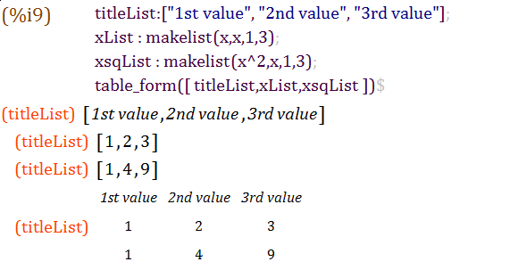{
id=img_MatrixTableExample }

Además, porque una matriz es un listado de listados, las matrices pueden
convertirse a tablas de una aparición similar.

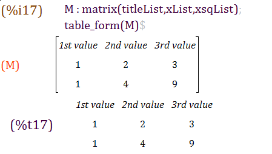{
id=img_SecondTableExample }

The function `wx_matrix()` is a wrapper for Maxima's `matrix()` command that
allows for more flexible formatting of matrices in wxMaxima:

**`wx_matrix( <matrix>, [options] )`**

- **`lines=true`**: Draws internal separator lines between the cells. This
  is required to visually separate headings from data.
- **`rownames=true`**: Tells wxMaxima that the first column of the matrix
  contains labels.
- **`colnames=true`**: Tells wxMaxima that the first row of the matrix
  contains labels.
- **`parenstyle=<style>`**: Sets the type of parenthesis or brackets to draw
  around the matrix. Supported styles are: `round` `()`, `square` `[]`,
  `angled` `<>`, `straight` `||`, or `none`.

Example:

```maxima
wx_matrix(matrix(["Name", "Value"], ["X", 10], ["Y", 20]),
          lines=true, rownames=true, colnames=true, parenstyle=square);
```

## Bug reporting

_WxMaxima_ proporciona unas pocas funciones que obtenga información de
comunicados de fallos acerca del sistema actual:

- `wxbuild_info()` gathers information about the currently running version
  of _wxMaxima_
- `wxbug_report()` informa cómo y donde archivar los gazapos

## Marking output being drawn in red

La instrucción `box()` de _Maxima_ causa que _wxMaxima_ escriba su argumento
con un fondo rojo, si el segundo argumento para la instrucción es el texto
`resaltado`.

## Output rendering.

With `set_display()` one can set, how wxMaxima will render the output.

`set_display('xml)` is the default value. Here Maxima speaks to wxMaxima
using an (machine readable) XML-dialect (can be seen in the "Raw XML
sidebar") and outputs the resulting formulas nicely rendered, e.g. pretty
Matrices, Square root signs, fractions, etc.

<!--- Currently that does not work as it should, the line with the output label is shifted right (issue: #2006) -->
`set_display('ascii)` causes wxMaxima to output formulas as in command line Maxima - as ASCII-Art.

`set_display('none)` causes 'one-line' ASCII results - the same as the
command line Maxima command `display2d:false;` does.

# Help menu

El menú de ayuda de wxMaxima proporciona acceso para el manual de Maxima y
wxMaxima, consejos, algunos ejemplos de hojas de trabajo y en la línea de
instrucción de Maxima incluyó demos (la instrucción `demo()`).

Infórmese, que las demos escriben:

~~~text
At the ’_’ prompt, type ’;’ and <enter> to proceed with the demonstration.
~~~

That is valid for command-line Maxima, however in wxMaxima by default it is necessary to continue the demonstration with: <kbd>CTRL</kbd>+<kbd>ENTER</kbd>

(That can be configured in the Configure->Worksheet->"Hotkeys for sending commands to Maxima" menu.)

______________________________________________________________________

# Troubleshooting

## Cannot connect to _Maxima_

Desde _Maxima_ (el programa que hace las matemáticas actuales) y _wxMaxima_
(proporcionando el interfaz de usuario de uso-fácil) con programas separados
que se comunican por los medios de una conexión de red local.  Por lo tanto
la causa más probable es que esta conexión es algo que no funciona.  Por
ejemplo un cortafuegos pudo configurarse de una manera que no tan solo
impida conexiones no autorizadas desde Internet (y quizá intercepta algunas
conexiones de Internet, también), pero además bloquea la comunicación de
inter-procesos dentro del mismo equipo.  Nótese que desde _Maxima_ se está
ejecutando por un proceso Lisp la comunicación del proceso que está
bloqueado desde unos no necesariamente tiene que ser nombrado como
"maxima".  Los nombres comunes del programa que abre la conexión de red
sería sbcl, gcl, ccl, lisp.exe o nombres similares.

En las máquinas Un\*x otra razón posible sería que la red del bucle
invertido que proporciona conexiones de red entre dos programas dentro del
mismo equipo no está configurado apropiadamente.

## How to save data from a broken .wxmx file

Internamente muchos formatos modernos basados en XML están normalmente en
archivos zip. _WxMaxima_ no activa la compresión, por lo que el contenido de
los archivos `.wxmx` pueden verse en cualquier editor de texto.

Si la firma zip en el final del archivo aún está intacta tras renombrar un
archivo `.wxmx` estropeado a `.zip` muchos sistemas operativos
proporcionarán una manera de extraer cualquier porción de información que
esté almacenada dentro de ésta.  Esto puede ser hecho cuando hay la
necesitad de recuperar los archivos de imagen original desde un documento de
procesamiento de texto.  Si la firma zip no está intacta que no necesita
estar el final del mundo: si _wxMaxima_ al guardar ha detectado que algo es
erróneo habrá un archivo `.wxmx~` cuyo contenido quizá ayude.

And even if there isn’t such a file: The `.wxmx` file is a container format and the XML portion is stored uncompressed. It it is possible to rename the `.wxmx` file to a `.txt` file and to use a text editor to recover the XML portion of the file’s contents (it starts with `<?xml version="1.0" encoding="UTF-8"?>` and ends with `</wxMaximaDocument>`. Before and after that text you will see some unreadable binary contents in the text editor).

Si un archivo de texto conteniendo solamente estos contenidos (p.ej. copiar
y pegar este texto a un archivo nuevo) es guardado como un archivo
terminando en `.xml`, _wxMaxima_ conocerá como recuperar el texto desde el
documento.

## I want some debug info to be displayed on the screen before my command has finished

Normalmente _wxMaxima_ espera a la fórmula 2D completa para ser transferida
antes que comenzar a configurar el conjunto del tipo.  Esto guarda tiempo
para crear muchos intentos para tipos de teclas para solo ecuación
parcialmente completada.  Hay una instrucción `disp`, por lo que, eso
proporcionará salida de depuración inmediatamente y sin esperar a que la
instrucción de _Maxima_ finalice:

```maxima
for i:1 thru 10 do (
   disp(i),
   /* (sleep n) is a Lisp function, which can be used */
   /* with the character "?" before. It delays the */
   /* program execution (here: for 3 seconds) */
   ?sleep(3)
)$
```

Alternativamente uno puede buscar la instrucción `wxstatusbar()` arriba.

## Plotting only shows a closed empty envelope with an error message

Esto significa que _wxMaxima_ no pudo leer el archivo _Maxima_ que fue
proporcionado a la instrucción _Gnuplot_ para crear.

Las posibles razones de este error son:

- La instrucción de tramado es parte de un paquete de tercera parte como
  ‘implicit_plot’ pero este paquete no fue cargado por la instrucción
  ‘load()’ de _Maxima_ porque está intentando puntear.
- _Maxima_ intentó hacer algo que la versión actualmente instalada de
  _gnuplot_ no es capaz de entender.  En este caso, un fichero terminando en
  `.gnuplot` localizado en el directorio, el cual la variable
  `maxima_userdir` está apuntando, contiene las instrucciones desde _Maxima_
  para _gnuplot_.  La mayoría del tiempo, estos contenidos del fichero
  contiene por lo tanto ayuda cuando se depura el problema.
- Gnuplot fue instruido para utilizar la biblioteca pngcairo que proporciona
  antialias y estilos de líneas adicionales, pero no fue compilado para
  admitir esta posibilidad.  Solución: Desmarque la casilla «Utilizar el
  terminal cairo para tramas» dentro del diálogo de configuración y no
  establezca `wxplot_pngcairo` a cierto desde _Maxima_.
- Gnuplot no saca un fichero «.png» válido.

## Plotting an animation results in “error: undefined variable”

El valor de la variable desplazada por defecto únicamente es sustituido
dentro de la expresión que está para ser tramado si es visible ahí.
Utilizando una orden `subst` que sustituya la variable de arrastre dentro de
la ecuación para tramar soluciones que resuelvan este problema.  Al final de
la sección [Animaciones empotradas a la hoja de
cálculo](#embedding-animations-into-the-spreadsheet), puede consultar un
ejemplo.

## I lost cell content and undo doesn’t remember

Hay funciones de deshacer separadas para operaciones de celdas y para
modificaciones dentro de celdas tales que modifiquen son bajos que este a
veces ocurran.  Si no hay varios métodos para cubrir datos:

- _wxMaxima_ actualmente tiene dos características de deshacer: el búfer de
  deshacer global que está activo si ninguna celda está seleccionada y un
  deshacer por celda que está activo si el cursor está dentro de una celda.
  Es peor intentar utilizar ambas opciones con el fin de ver si un valor
  anterior aún puede ser accedido.
- Si todavía tiene una manera de encontrar cual etiqueta de _Maxima_ ha
  asignado a la celda tan solo teclee dentro de la etiqueta de la celda y
  sus contenidos aparecerán.
- Si no: no se asuste. En el menú “Vista” hay una manera de ver un panel
  histórico que muestra todas las instrucciones de _Maxima_ que han sido
  emitidas recientemente.
- Si nada más ayuda _Maxima_ contiene una característica de reproducción:

```maxima
playback();
```

## _WxMaxima_ starts up with the message “Maxima process terminated.”

Una razón posible es que _Maxima_ no puede ser encontrada dentro de la
localización que está fijada dentro de la etiqueta “Maxima” del diálogo de
configuración de _wxMaxima_ y por lo tanto no ejecutará nada.  Estableciendo
la ruta a un _Maxima_ binario para el trabajo debería solucionar este
problema.

## Maxima is forever calculating and not responding to input

Es posible teóricamente que _wxMaxima_ no realiza que _Maxima_ ha finalizado
el cálculo y por lo tanto nunca está informado que puede enviar datos nuevos
a _Maxima_. Si esto es el caso “Disparar evaluación” tal vez re-sincronice
los dos programas.

## My SBCL-based _Maxima_ runs out of memory

El compilador Lisp SBCL por defecto viene con un límite de memoria que lo
permite ejecutar incluso en equipos de bajo nivel.  Cuando compile un
paquete de software grande como Lapack u ocupándose con listados
extremadamente grandes de ecuaciones este límite tal vez sea demasiado
bajo.  Con el fin de extender los límites SBCL puede ser previsto con la
línea del parámetro de instrucción `--dynamic-space-size` que indica a SBCL
cuantos megabytes debería reservar.  Una ventana SBCL de 32-bit puede
reservar hasta 999 megabytes, una versión SBCL de 64-bit ejecutándose en
Windows pude ser instruido para utilizar más que la cantidad de 1280
megabytes compilando las necesidades Lapack.

Una manera de proporcionar a _Maxima_ (y por lo tanto SBCL) con parámetros
de línea de instrucción es el campo «Parámetros adicionales para Maxima» del
diálogo de configuración de _wxMaxima_.

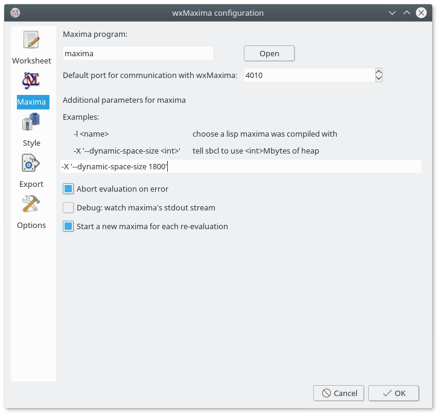{ id=img_sbclMemory }

## Input sometimes is sluggish/ignoring keys on Ubuntu

La instalación del paquete «ibus-gtk» debería resolver este problema.  Vea
[https://bugs.launchpad.net/ubuntu/+source/wxwidgets3.0/+bug/1421558](https://bugs.launchpad.net/ubuntu/+source/wxwidgets3.0/+bug/1421558))
para los detalles.

## _WxMaxima_ halts when _Maxima_ processes Greek characters or Umlauts

Si su _Maxima_ está basado en SBCL las siguientes líneas tienen que ser
agregadas a su `.sbclrc`:

```commonlisp
(setf sb-impl::*default-external-format* :utf-8)
```

La carpeta donde este archivo tiene que colocarse es específico del sistema
e instalación.  Pero cualquier _Maxima_ basada en SBCL que ya ha evaluado
una celda dentro de la sesión actual felizmente dirá donde puede ser
encontrada tras obtener la instrucción siguiente:

```maxima
:lisp (sb-impl::userinit-pathname)
```

## Note concerning Wayland (recent Linux/BSD distributions)

Parecen ser emitidos con el Servidor de Pantalla Wayland y wxWidgets.
WxMaxima puede ser afectado, p.ej. esas barras laterales no son movibles.

Puede o bien desactivar Wayland y utilizar X11 en su lugar (globalmente) o
tan solo decir, que wxMaxima utilizaría el X Window System poniendo:
`GDK_BACKEND=x11`

P.ej. inicia wxMaxima con:

`GDK_BACKEND=x11 wxmaxima`

## The menu bar disappears on KDE Plasma

On some KDE Plasma installations the global menu bar disappears when
clicked.  As this is a bug in the global menu proxy, the only way to avoid
it is to tell that wxMaxima should use its own menu bar instead of the
global one.  This is done by setting: `UBUNTU_MENUPROXY=0`

Starting with version 26.05.0, wxMaxima attempts to set this variable
automatically if it detects an affected system (KDE, Unity, or Ubuntu with
older wxWidgets versions).

If the automatic fix fails, you can manually start wxMaxima with:

`UBUNTU_MENUPROXY=0 wxmaxima`

## Why is the integrated manual browser not offered on my Windows PC?

O bien wxWidgets no fueron compilados con mantenimiento para webview2 o
webview2 de Microsoft no está instalado.

## Why is the external manual browser not working on my Linux box?

El explorador HTML quizá es una versión de «snap», «flatpack» o
«appimage». Todo de estos típicamente no puede acceder archivos que son
instalados en su sistema local. Otra razón quizá sea que «maxima» o
«wxMaxima» es instalado como un «snap», «flatpack» o algo más que no
proporciona el acceso al sistema hospedante para sus contenidos. Una tercera
razón sería que el manual HTML de maxima no está instalado y la conexión por
línea no puede ser accedida.

## Can I make _wxMaxima_ output both image files and embedded plots at once?

La hoja de trabajo empotra archivos .png. _wxMaxima_ permite al usuario
especificar donde serían generados:

```maxima
wxdraw2d(
    file_name="test",  /* extension .png automatically added */
    explicit(sin(x),x,1,10)
);
```

Si es un formato diferente para ser utilizado, es más fácil generar las
imágenes y después importarlas dentro de la hoja de trabajo de nuevo:

```maxima
load("draw");
pngdraw(name,[contents]):=
(
    draw(
        append(
            [
                terminal=pngcairo,
                dimensions=wxplot_size,
                file_name=name
            ],
            contents
        )
    ),
    show_image(printf(false,"~a.png",name))
);
pngdraw2d(name,[contents]):=
    pngdraw(name,gr2d(contents));

pngdraw2d("Test",
        explicit(sin(x),x,1,10)
);
```

## Can I set the aspect ratio of an embedded plot?

Use the variable `wxplot_size`:

```maxima
wxdraw2d(
    explicit(sin(x),x,1,10)
),wxplot_size=[1000,1000];
```

## After upgrading to MacOS 13.1 plot and/or draw commands output error messages like

```text
1 HIToolbox 0x00007ff80cd91726 _ZN15MenuBarInstance22EnsureAutoShowObserverEv + 102
2 HIToolbox 0x00007ff80cd912b8 _ZN15MenuBarInstance14EnableAutoShowEv + 52
3 HIToolbox 0x00007ff80cd35908 SetMenuBarObscured + 408
...
```

This might be an issue with the operating system. Disable the hiding of the menu bar (SystemSettings => Desktop & Dock => Menu Bar) might solve the issue. See [wxMaxima issue #1746](https://github.com/wxMaxima-developers/wxmaxima/issues/1746) for more information.

## Logging

Log messages might be helpful to debug problems. WxMaxima can log many events. Most log entries will be helpful for developers, especially in case of problems or bugs. If you run a "Release"-Build,
the log windows is not shown by default, if you run a development version, it is shown by default as a second window. You can enable and disable
this window using the "View->Toggle log window" menu entry.

Messages are not 'lost', if the log window is not shown, if you select to
show the log window later, you will see past log messages (if you did not
clear the messages).

Such messages may be helpful, when you create bug reports (or trying to find
a bug by yourself).

Log messages can (additionally) be printed to STDERR, when using the command
line option "--logtostderr". On Windows a separate text console will be
opened, as a Windows GUI application does not have the standard IO
connected.

______________________________________________________________________

# FAQ

## Is there a way to make more text fit on a LaTeX page?

Sí.  Utilice el [paquete "geometry" de LaTeX](https://ctan.org/pkg/geometry)
para especificar el tamaño de los bordes.

You can add the following line to the LaTeX preamble (for example by using the respective field in the config dialogue ("Export"->"Additional lines for the TeX preamble"), to set borders of 1cm):

```latex
\usepackage[left=1cm,right=1cm,top=1cm,bottom=1cm]{geometry}
```

## Is there a dark mode?

Si wxWidgets es suficientemente nuevo _wxMaxima_ automáticamente estará en
modo oscuro si el resto del sistema operativo también lo está.  La misma
hoja de trabajo por defecto está equipada con un fondo brillante.  Pero
puede ser configurado de otras maneras.  Alternativamente hay un apunte del
menú para ‘Ver/Invertir brillo de la hoja de trabajo’ para convertir
rápidamente la hoja de trabajo desde oscuro a claro y viceversa.

## _WxMaxima_ sometimes hangs for several seconds once in the first minute

_WxMaxima_ delegates some big tasks like parsing _Maxima_’s >1000-page-manual to background tasks, which normally goes totally unnoticed. At the moment the result of such a task is needed, though, it is possible that _wxMaxima_ needs to wait a couple of seconds before it can continue its work.

## Especially when testing new locale settings, a message box "locale ’xx_YY’ can not be set" occurs

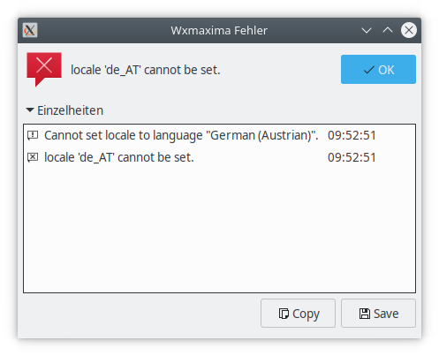{ id=img_locale_warning}

(El mismo problema puede suceder con otras aplicaciones también). Los
traslados parecen ok tras que pulse sobre ‘Aceptar’. Wxmaxima no solo
utiliza su propias transacciones sino también las transacciones del marco de
trabajo de wxWidgets.

Estos locales quizá no sean presente dentro del sistema. En sistemas
Ubuntu/Debian pueden ser generados utilizando: `dpkg-reconfigure locales`

## How can I use symbols for real numbers, natural numbers (ℝ, ℕ), etc.?

Puede encontrar estos símbolos en la barra lateral Unicode (busca
’doble-stuck capital’). Pero la tipografía seleccionada además debe mantener
estos símbolos. Si no representan apropiadamente, seleccione otra
tipografía.

## How can a Maxima script determine, if it is running under wxMaxima or command line Maxima?

Si se utiliza wxMaxima, la variable `maxima_frontend` de Maxima está fijada
a `wxmaxima`. La variable Maxima `maxima_frontend_version` contiene la
versión de wxMaxima en este caso.

Si no ningún frontend es utilizado (está utilizando Maxima en línea de
instrucción), estas variables son falsas.

## Help! I can not save my document!

If saving as wxmx file does not work, try saving the document as wxm file (and vice versa). And you can also try to remove all output (Menu Cell->Remove all output) and save that file, maybe some unexpected output causes issues during the save process.

______________________________________________________________________

# Command-line arguments

Usualmente puede iniciar programas con un interfaz gráfico de usuario tan
solo pulsando en un icono de escritorio o apunte de menú del
escritorio. wxMaxima -si inició desde la línea de instrucción- aún
proporciona algunos interruptores en línea de instrucción, sin embargo.

- ‘-v’ o ‘--version’: extrae la información de la versión
- ‘-h’ o ‘--help’: extrae un texto breve de ayuda
- `-o` u `--open=<cad>`: abre el nombre del archivo proporcionado como un
  argumento a este interruptor de línea de instrucción
- ‘-e’ o ‘--eval’: evalúa el archivo tras abrirlo.
- `-b` o `--batch`: si la línea de orden abre un archivo todas las celdas
  dentro de este archivo son evaluadas y el archivo es guardado después.
  Esto es por ejemplo útil si la sesión descrita dentro del archivo hace que
  _Maxima_ genere archivos de salida.   El guion de procesamiento será
  detenido si _wxMaxima_ detecta que _Maxima_ tiene un error de salida y lo
  detendrá si _Maxima_ tiene una cuestión: las matemáticas es algo
  interactivo por naturaliza por lo que un proceso de guion libre de
  interacción no puede ser garantizado completamente.
- `--logtostdout`:                 Registra todos los mensajes de la barra lateral
                                     "mensajes de depuración" a ‘stderr’, también.
- `--pipe`:                        Conducto de mensajes desde ‘Maxima’ a ‘stdout’.
- `--exit-on-error`:               Cierra el programa en cualquier error de ‘maxima’.
- `-f` o `--ini=<cad>`:            Utiliza el archivo de ‘init’ que fue proporcionado
                                      como argumento a este intercambio de línea de instrucción.
- `-u`, `--use-version=<cad>`:     Utiliza la `<cad>` de la versión de ‘maxima’.
- `-l`, `--lisp=<cad>`:            Utiliza un compilador de ‘maxima’ compilado con Lisp `<cad>`.
- `-X`, `--extra-args=<cad>`:      Permite especificar argumentos adicionales de “Maxima”
- `-m` o `--maxima=<cad>`:         Permite especificar la ubicación del binario de _maxima_
- `--enableipc`:                   Permite que “Maxima” controle “wxMaxima” a través de
                                     comunicaciones de interprocesos.  Utilice esa opción con
                                     cuidado.
- `--wxmathml-lisp=<cdn>`:         Ubicación de wxMathML.lisp (si no es el empotrado sería utilizado,
                                     mayormente para desarrolladores).

En vez de un menos, algunos sistemas operativos tal vez utilicen un guion
breve al frente de los conmutadores de línea de instrucciones.

______________________________________________________________________

# About the program, contributing to wxMaxima

wxMaxima es principalmente desarrollado utilizando el lenguaje de
programación C++ utilizando el [marco de trabajo
wxWidgets](https://www.wxwidgets.org), como sistema de compilación
utilizamos [CMake](https://www.cmake.org), una parte pequeña escrita en
Lisp. Puede contribuir al proyecto wxMaxima en
<https://github.com/wxMaxima-developers/wxmaxima>, si tiene conocimiento de
estos lenguajes de programación y desea ayudar y contribuir al proyecto de
software libre de wxMaxima.

¡Pero no solamente los programadores son necesarios! Puede contribuir además
a wxMaxima, si ayuda para mejorar la documentación, encontrar e informar
defectos (y quizá repararlas), sugerir características nuevas, ayudar a
traducir wxMaxima o el manual a su idioma (lea el README.md en el
[subdirectorio de
idioma](https://github.com/wxMaxima-developers/wxmaxima/tree/main/locales)
como wxMaxima y el manual puede ser traducido).

O responda preguntas de otros usuarios en el foro de debate.

El código fuente de wxMaxima está documentado utilizando Doxygen
[aquí](https://wxmaxima-developers.github.io/wxmaxima/Doxygen-documentation/).

El programa es casi autónomo, por tanto excepto para bibliotecas del sistema
(y la biblioteca wxWidgets), ninguna dependencia externa (como archivos
gráficos o la parte Lisp (el archivo `wxmathML.lisp`) es necesario, se
incluyen estos archivos dentro del ejecutable.

If you are a developer, you might want to try out a modified `wxmathML.lisp`-file without recompiling everything, one can use the command line option `--wxmathml-lisp=<str>` to use another Lisp file, not the included one.
