# Manuel de l'utilisateur de wxMaxima

WxMaxima is a graphical user interface (GUI) for the _Maxima_ computer
algebra system (CAS). WxMaxima allows one to use all of _Maxima_’s
functions. In addition, it provides convenient wizards for accessing the
most commonly used features. This manual describes some of the features that
make wxMaxima one of the most popular GUIs for _Maxima_.

{ id=img_wxMaximaLogo }

______________________________________________________________________

# Présentation de wxMaxima

## _Maxima_ et wxMaxima

In the open-source domain, big systems are normally split into smaller
projects that are easier to handle for small groups of developers. For
example a CD burner program will consist of a command-line tool that
actually burns the CD and a graphical user interface that allows users to
implement it without having to learn about all the command line switches and
in fact without using the command line at all. One advantage of this
approach is that the developing work that was invested into the command-line
program can be shared by many programs: The same CD-burner command-line
program can be used as a “send-to-CD”-plug-in for a file manager
application, for the “burn to CD” function of a music player and as the CD
writer for a DVD backup tool. Another advantage is that splitting one big
task into smaller parts allows the developers to provide several user
interfaces for the same program.

Un système de calcul formel (CAS) comme _Maxima_ s'intègre dans ce cadre. Un
CAS peut fournir la logique derrière une application de type calculatrice à
précision arbitraire ou effectuer des transformations automatiques de
formules en arrière-plan d'un système plus large (par exemple,
[Sage](https://www.sagemath.org/)). Alternativement, il peut être utilisé
directement comme un logiciel autonome. _Maxima_ peut être accessible via
une ligne de commande. Cependant, une interface comme _wxMaxima_ s'avère
souvent un moyen plus efficace d'accéder au logiciel, surtout pour les
nouveaux utilisateurs.

### _Maxima_

_Maxima_ est un système complet de calcul formel (CAS). Un CAS est un
programme capable de résoudre des problèmes mathématiques en manipulant des
formules et en retournant des expressions algébriques qui résolvent le
problème, plutôt que de simplement fournir une valeur numérique du
résultat. Autrement dit, _Maxima_ peut fonctionner comme une calculatrice
qui donne  des valeurs numériques des variables, mais il peut aussi fournir
des solutions analytiques formelles. De plus, il propose une gamme de
méthodes numériques pour analyser des équations ou des systèmes d’équations
qui ne peuvent pas être résolus de manière formelle.

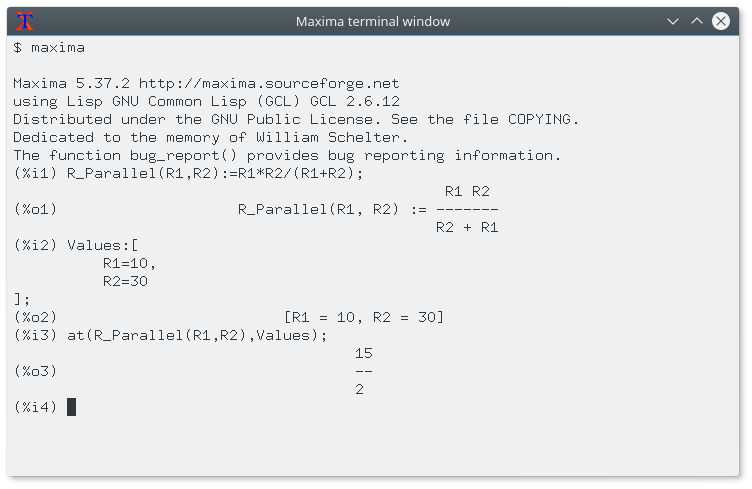{
id=img_maxima_screenshot }

Extensive documentation for _Maxima_ is [available in the
internet](https://maxima.sourceforge.io/documentation.html). Part of this
documentation is also available in wxMaxima’s help menu. Pressing the Help
key (on most systems the <kbd>F1</kbd> key) causes _wxMaxima_’s
context-sensitive help feature to automatically jump to _Maxima_’s manual
page for the command at the cursor.

### WxMaxima

_WxMaxima_ is a graphical user interface that provides the full
functionality and flexibility of _Maxima_. WxMaxima offers users a graphical
display and many features that make working with _Maxima_ easier. For
example _wxMaxima_ allows one to export any cell’s contents (or, if that is
needed, any part of a formula, as well) as text, as LaTeX or as MathML
specification at a simple right-click. Indeed, an entire workbook can be
exported, either as a HTML file or as a LaTeX file. Documentation for
_wxMaxima_, including workbooks to illustrate aspects of its use, is online
at the _wxMaxima_ [help
site](https://wxMaxima-developers.github.io/wxmaxima/help.html), as well as
via the help menu.

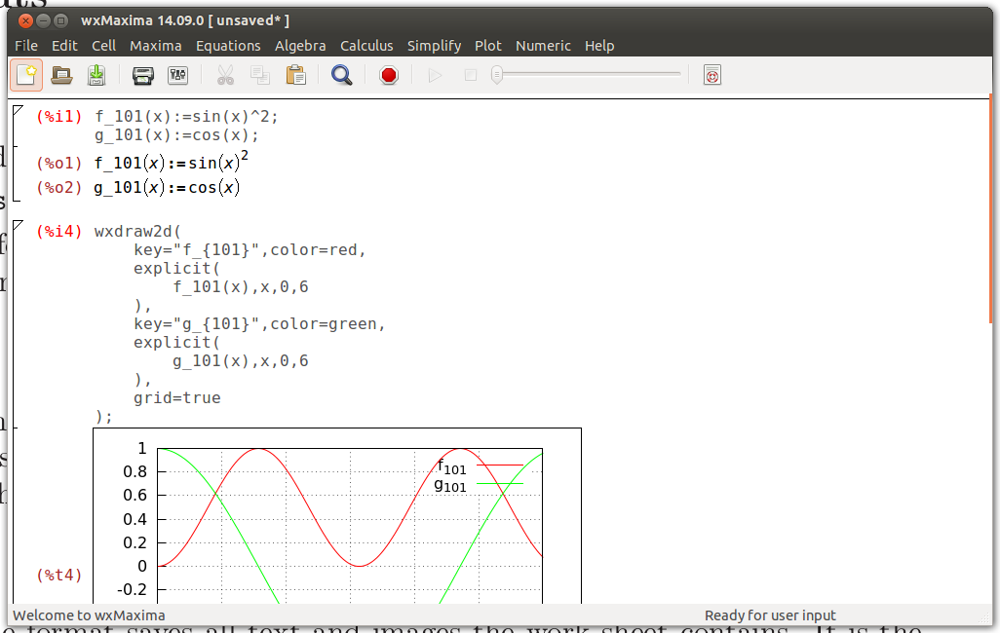{ id=img_wxMaximaWindow }

Les calculs saisis dans _wxMaxima_ sont exécutés en arrière-plan par l'outil
en ligne de commande _Maxima_.

## Notions de base d'un notebook

Much of _wxMaxima_ is self-explaining, but some details require
attention. [This
site](https://wxMaxima-developers.github.io/wxmaxima/help.html) contains a
number of workbooks that address various aspects of _wxMaxima_. Working
through some of these (particularly the "10 minute _(wx)Maxima_ tutorial")
will increase one’s familiarity with both the content of _Maxima_ and the
use of _wxMaxima_ to interact with _Maxima_. This manual concentrates on
describing aspects of _wxMaxima_ that are not likely to be self-evident and
that might not be covered in the online material.

### Fondamentaux du notebook

One of the very few things that are not standard in _wxMaxima_ is that it
organizes the data for _Maxima_ into cells that are evaluated (which means:
sent to _Maxima_) only when the user requests this. When a cell is
evaluated, all commands in that cell, and only that cell, are evaluated as a
batch. (The preceding statement is not quite accurate: One can select a set
of adjacent cells and evaluate them together. Also, one can instruct
_Maxima_ to evaluate all cells in a workbook in one pass.) _WxMaxima_’s
approach to submitting commands for execution might feel unfamiliar at the
first sight. It does, however, drastically ease work with big documents
(where the user does not want every change to automatically trigger a full
re-evaluation of the whole document). Also, this approach is very handy for
debugging.

Si du texte est saisi dans _wxMaxima_, une nouvelle cellule est
automatiquement créée dans le notebook. Le type de cette cellule peut être
sélectionné dans la barre d'outils. Si une cellule de code est créée, elle
peut être envoyée à _Maxima_, ce qui affiche le résultat du calcul en
dessous du code. Une paire de ce type de commandes est présentée ci-dessous.

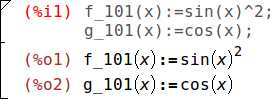{ id=img_InputCell }

On evaluation of an input cell’s contents the input cell _Maxima_ assigns a
label to the input (by default shown in red and recognizable by the `%i`) by
which it can be referenced later in the _wxMaxima_ session. The output that
_Maxima_ generates also gets a label that begins with `%o` and by default is
hidden, except if the user assigns the output a name. In this case by
default the user-defined label is displayed. The `%o`-style label _Maxima_
auto-generates will also be accessible, though.

Outre les cellules d’entrée, _wxMaxima_ permet d’insérer des cellules de
texte pour la documentation, des cellules d’image, des cellules de titre, de
chapitre et de section. Chaque cellule dispose de son propre historique
d’annulation, ce qui facilite le débogage en modifiant les valeurs de
plusieurs cellules puis en annulant progressivement les changements
inutiles. De plus, le notebook en lui-même possède un historique
d’annulation global qui permet d’annuler les modifications, ajouts et
suppressions de cellules.

La figure ci-dessous montre différents types de cellules (cellules de titre,
cellules de section, cellules de sous-section, cellules de texte, cellules
d’entrée/sortie et cellules d’image).

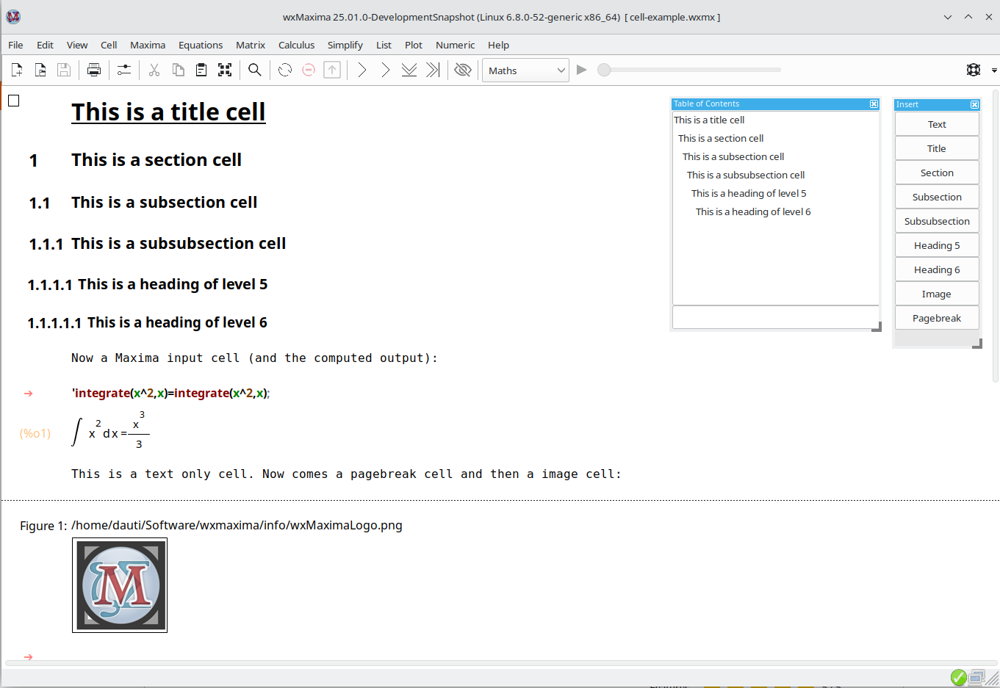{
id=img_cell-example }

### Cellules

Le notebook est organisé en cellules. WxMaxima distingue les types de
cellules suivants  :

- Cellules mathématiques, contenant une ou plusieurs lignes de saisie
  _Maxima_.
- Sortie de, ou une question de, _Maxima_.
- Cellules image.
- Cellules de texte, qui peuvent par exemple être utilisées pour la
  documentation.
- Un titre, une section ou une sous-section. 6 niveaux de titres différents
  sont possibles.
- Sauts de page.

Par défaut, _wxMaxima_ crée automatiquement une cellule de calcul lorsque du
texte est saisi. Pour créer des cellules d’un autre type, utilisez le menu
Cellule, les raccourcis clavier indiqués dans ce menu ou la liste déroulante
de la barre d’outils. Une fois qu’une cellule non mathématique est créée,
tout ce qui y est saisi est interprété comme du texte.

Un [commentaire (style
C)](https://maxima.sourceforge.io/docs/manual/maxima_singlepage.html#Comments)
peut être inséré dans une cellule de calcul comme suit : `/* Ce commentaire
sera ignoré par Maxima */`

"`/*`" indique le début du commentaire, "`*/`" la fin.

### curseurs horizontaux et verticaux

Si l’utilisateur tente de sélectionner une phrase complète, un traitement de
texte étendra automatiquement la sélection pour qu’elle commence et se
termine aux limites d’un mot. De même, si plusieurs cellules sont
sélectionnées, _wxMaxima_ étendra la sélection aux cellules entières.

What isn’t standard is that _wxMaxima_ provides drag-and-drop flexibility by
defining two types of cursors. _WxMaxima_ will switch between them
automatically when needed:

- Le curseur est dessiné horizontalement s’il est déplacé dans l’espace
  entre deux cellules ou en cliquant à cet endroit.
- Un curseur vertical qui fonctionne à l’intérieur d’une cellule. Ce curseur
  est activé en déplaçant le curseur à l’intérieur d’une cellule à l’aide du
  pointeur de la souris ou des touches de direction, et fonctionne de
  manière similaire à celui d’un éditeur de texte.

Quand vous lancez wxMaxima, vous ne verrez que le curseur horizontal
clignotant. Si vous commencez à taper, une cellule mathématique sera
automatiquement créée et le curseur deviendra un curseur vertical classique
(vous verrez une flèche vers la droite comme "invite", et après avoir évalué
la cellule mathématique (<kbd>CTRL</kbd>+<kbd>ENTRÉE</kbd>), les étiquettes
apparaîtront, par exemple `(%i1)`, `(%o1)`.

{ id=img_horizontal_cursor_only }

Vous pourrez peut-être vouloir créer un type de cellule différent (via le
menu "Cellule"), comme une cellule de titre ou une cellule de texte, pour
décrire ce que vous allez faire lorsque vous commencerez à créer votre
notebook.

Si vous naviguez entre les différentes cellules, vous verrez également le
curseur horizontal (clignotant), indiquant l'endroit où vous pouvez insérer
une nouvelle cellule dans votre notebook (soit une cellule mathématique, en
commençant simplement à saisir votre formule, soit un autre type de cellule
en utilisant le menu).

{
id=img_horizontal_cursor_between_cells }

### Envoyer des cellules à Maxima

La commande dans une cellule de code est exécutée en appuyant une fois sur
<kbd>CTRL</kbd>+<kbd>ENTRÉE</kbd>, <kbd>MAJ</kbd>+<kbd>ENTRÉE</kbd> ou la
touche <kbd>ENTRÉE</kbd> du pavé numérique. Par défaut, _wxMaxima_ exécute
les commandes lorsque <kbd>CTRL</kbd>+<kbd>ENTRÉE</kbd> ou
<kbd>MAJ</kbd>+<kbd>ENTRÉE</kbd> est pressé, mais il est possible de
configurer _wxMaxima_ pour qu’il exécute les commandes en réponse à la
touche <kbd>ENTRÉE</kbd>.

### Complétion automatique des commandes

_wxMaxima_ dispose d’une fonction de complétion automatique, accessible via
le menu (Cellule/Compléter le mot) ou en appuyant sur la combinaison de
touches <kbd>CTRL</kbd>+<kbd>ESPACE</kbd>. Cette complétion est sensible au
contexte : par exemple, si elle est activée lors d'une spécification d’unité
pour ezUnits, elle proposera une liste des unités applicables.

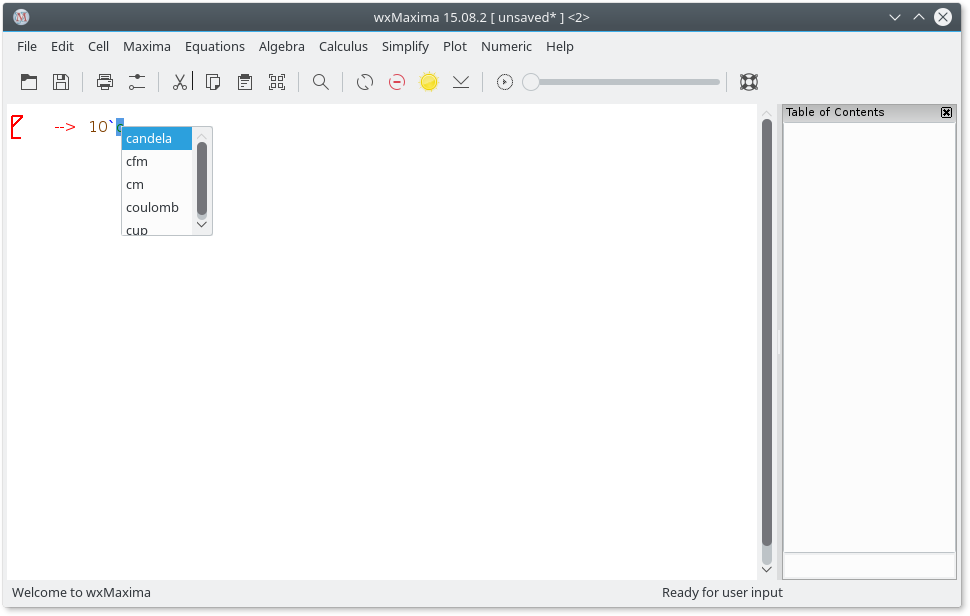{ id=img_ezUnits }

Outre la complétion des noms de fichiers, d’unités, de commandes ou de
variables, la complétion automatique peut aussi afficher un modèle pour la
plupart des commandes, indiquant le type (et la signification) des
paramètres attendus par le programme. Pour activer cette fonctionnalité,
appuyez sur <kbd>MAJ</kbd>+<kbd>CTRL</kbd>+<kbd>ESPACE</kbd> ou sélectionnez
l’option correspondante dans le menu (Cellule/Afficher le modèle).

#### Caractères grecs

Traditionnellement, les ordinateurs stockaient les caractères sur 8 bits, ce
qui permet un maximum de 256 caractères différents. Toutes les lettres,
chiffres et symboles de contrôle (fin de transmission, fin de chaîne, lignes
et bordures pour dessiner des rectangles autour des menus, etc.) de presque
n'importe quelle langue pouvaient tenir avec cette limite.

Pour la plupart des pays, la page de codes de 256 caractères choisie
n'inclut cependant pas des éléments comme les lettres grecques, pourtant
fréquemment utilisées en mathématiques. Pour surmonter ce type de
limitation, [Unicode](https://home.unicode.org/) a été inventé : il s'agit
d'un encodage qui permet aux textes en anglais de s'afficher normalement,
tout en utilisant bien plus que 256 caractères.

_Maxima_ allows Unicode if it was compiled using a Lisp compiler that either
supports Unicode or that doesn’t care about the font encoding. As at least
one of this pair of conditions is likely to be true. _WxMaxima_ provides a
method of entering Greek characters using the keyboard:

- A Greek letter can be entered by pressing the <kbd>ESC</kbd> key and then
  starting to type the Greek character’s name.
- - Une lettre grecque peut être saisie en appuyant sur la touche
  <kbd>ÉCHAP</kbd>, puis en commençant à taper le nom du caractère grec.
  - Elle peut aussi être saisie en appuyant sur <kbd>ÉCHAP</kbd>, une lettre
  (ou deux pour la lettre grecque omicron), puis à nouveau sur
  <kbd>ÉCHAP</kbd>. Dans ce cas, les lettres suivantes sont prises en charge
  :

| touche | Lettre grecque | touche | Lettre grecque | touche | Lettre grecque |
| :-: | :----------: | :-: | :----------: | :-: | :----------: |
|  a  |    alpha     |  i  |     iota     |  r  |     rho      |
|  b  |     beta     |  k  |    kappa     |  s  |    sigma     |
|  g  |    gamma     |  l  |    lambda    |  t  |     tau      |
|  d  |    delta     |  m  |      mu      |  u  |   upsilon    |
|  e  |   epsilon    |  n  |      nu      |  f  |     phi      |
|  z  |     zeta     |  x  |      xi      |  c  |     chi      |
|  h  |     eta      | om  |   omicron    |  y  |     psi      |
|  q  |    theta     |  p  |      pi      |  o  |    omega     |
|  A  |    Alpha     |  I  |     Iota     |  R  |     Rho      |
|  B  |     Beta     |  K  |    Kappa     |  S  |    Sigma     |
|  G  |    Gamma     |  L  |    Lambda    |  T  |     Tau      |
|  D  |    Delta     |  M  |      Mu      |  U  |   Upsilon    |
|  E  |   Epsilon    |  N  |      Nu      |  P  |     Phi      |
|  Z  |     Zeta     |  X  |      Xi      |  C  |     Chi      |
|  H  |     Eta      | Om  |   Omicron    |  Y  |     Psi      |
|  T  |    Theta     |  P  |      Pi      |  O  |    Omega     |

Vous pouvez également utiliser la barre latérale « Lettres grecques » pour
insérer les lettres grecques.

##### Attention aux caractères similaires

Plusieurs lettres latines ressemblent aux lettres grecques, par exemple la
lettre latine "A" et la lettre grecque "Alpha". Bien qu'elles aient la même
apparence, ce sont deux caractères Unicode distincts, représentés par des
codages Unicode (nombres) différents.

Cela peut poser problème si vous attribuez une valeur à la variable A et que
vous utilisez ensuite la lettre grecque Alpha pour faire quelque chose avec
cette variable, notamment sur les impressions. Pour la lettre grecque mu
(utilisée aussi comme préfixe pour micro), il existe également deux codages
Unicode différents.

La barre latérale « Lettres grecques » offre donc l’option de désactiver les
caractères similaires (ce paramètre peut être modifié via un menu accessible
par un clic droit).

Le même mécanisme permet également de saisir divers symboles mathématiques :

Touches à saisir | symbole mathématique                                            |
|---------------|-----------------------------------------------------------------|
| hbar           | Constante de Planck : un h avec une barre horizontale au-dessus |
| Hbar           | un H avec une barre horizontale au-dessus                       |
| 2              | au carré                                                        |
| 3              | à la puissance trois                                            |
| /2             | 1/2                                                             |
| partial        | symbole de dérivation partielle (le d de dx/dt)                 |
| integral       | symbole intégrale                                               |
| sq             | racine carrée                                                   |
| ii             | imaginaire                                                      |
| ee             | appartient à                                                    |
| in             | dans                                                            |
| impl implies   | implique                                                        |
| inf            | infini                                                          |
| empty          | ensemble vide                                                   |
| TB             | grand triangle vers la droite                                   |
| tb             | petit triangle vers la droite                                   |
| and            | et                                                              |
| or             | ou                                                              |
| xor            | ou exclusif                                                     |
| nand           | et non                                                          |
| nor            | ni                                                              |
| equiv          | équivalent à                                                    |
| not            | non                                                             |
| union          | union                                                           |
| inter          | intersection                                                    |
| subseteq       | sous-ensemble ou égal                                           |
| subset         | sous-ensemble                                                   |
| notsubseteq    | n'est pas un  sous-ensemble ou égal                             |
| notsubset      | n'est pas un sous-ensemble                                      |
| approx         | approximativement                                               |
| propto         | proportionnel à                                                 |
| neq != /= ou # | différent de                                                    |
| +/- ou pm      | signe plus/moins                                                |
| \<= ou leq     | inférieur ou égal à                                             |
| >= ou geq      | supérieur ou égal à                                             |
| \<\< ou ll     | beaucoup plus petit que                                         |
| >> ou gg       | beaucoup plus grand que                                         |
| qed            | fin de preuve                                                   |
| nabla          | opérateur nabla                                                 |
| sum            | symbole somme                                                   |
| prod           | symbole produit                                                 |
| exists         | il existe                                                       |
| nexists        | il n'existe pas                                                 |
| parallel       | symbole parallèle                                               |
| perp           | symbole perpendiculaire                                         |
| leadsto        | symbole mène à                                                  |
| ->             | flèche vers la droite                                           |
| -->            | longue flèche vers la droite                                    |

Vous pouvez aussi utiliser la barre latérale « Symboles » pour saisir ces
symboles mathématiques.

If a special symbol isn’t in the list, it is possible to input arbitrary
Unicode characters by pressing <kbd>ESC</kbd> \[number of the character
(hexadecimal)\] <kbd>ESC</kbd>. Additionally the "symbols" sidebar has a
right-click menu that allow to display a list of all available Unicode
symbols one can add to this toolbar or to the worksheet.

<kbd>ESC</kbd><kbd>6</kbd><kbd>1</kbd><kbd>ESC</kbd>  est une séquence qui
produit un `a`.

Please note that most of these symbols (notable exceptions are the logic
symbols) do not have a special meaning in _Maxima_ and therefore will be
interpreted as ordinary characters. If _Maxima_ is compiled using a Lisp
that doesn’t support Unicode characters they might cause an error message.

Il est possible que, par exemple, les caractères grecs ou les symboles
mathématiques ne soient pas inclus dans la police sélectionnée et ne
puissent donc pas s'afficher. Pour résoudre ce problème, choisissez une
autre police (via : Édition -> Configurer -> Style).

### Remplacement de caractères Unicode

wxMaxima will replace several Unicode characters with their respective
Maxima expressions, e.g. `²` with `^2`, `³` with `^3`, the square root sign
with the function `sqrt()`, the (mathematical) Sigma sign (which is not the
same Unicode character as the corresponding Greek letter) with `sum()`, etc.

Unicode has several "common" fractions encoded as one Unicode code point:
`¼, ½, ¾, ⅐, ⅑, ⅒, ⅓, ⅔, ⅕, ⅖, ⅗, ⅘, ⅙, ⅚, ⅛, ⅜, ⅝, ⅞`

wxMaxima will replace them with their Maxima representations, e.g `(1/4)`
before the input is sent do Maxima. There are also `⅟`, which will be
replaced by `1/` and `↉` (used in baseball), which will be replaced by
`(0/3)`.

Il est recommandé d’utiliser le **code Maxima** (et non ces points de code
Unicode) dans les cellules de saisie. Raisons : (a) il se peut que la police
utilisée pour la saisie mathématique ne les contienne pas ;  (b) si vous
enregistrez le document au format `wxm`, celui-ci est généralement lisible
par Maxima en ligne de commande, mais ces substitutions ne fonctionneront
évidemment pas dans Maxima en ligne de commande. Toutefois, ces caractères
peuvent apparaître si vous copiez-collez une formule depuis un autre
document.


### Les panneaux latéraux

Les raccourcis vers les commandes les plus importantes de _Maxima_, comme
une table des matières, des fenêtres avec des messages de débogage ou un
historique des dernières commandes exécutées, peuvent être accessibles via
les panneaux latéraux. Ceux-ci peuvent être activés depuis le menu
« Affichage ». Ils peuvent tous être déplacés vers d’autres emplacements, à
l’intérieur ou à l’extérieur de la fenêtre de _wxMaxima_. Un autre volet
utile est celui qui permet de saisir des lettres grecques avec la souris.

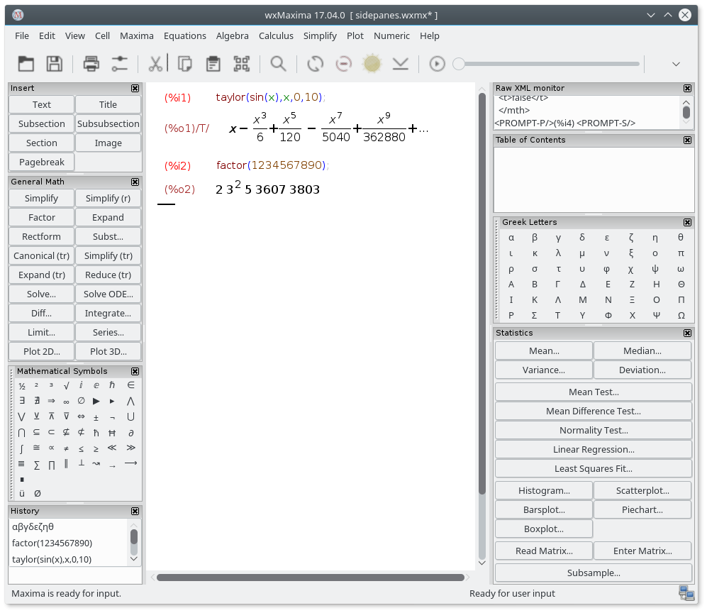{
id=img_SidePanes }

Dans le volet latéral « table des matières », vous pouvez augmenter ou
diminuer le niveau d’un titre en cliquant simplement dessus avec le bouton
droit de la souris et en sélectionnant le niveau de titre supérieur ou
inférieur.

{
id=Sidepane-TOC-convert-headings }

### Export MathML

Several word processors and similar programs either recognize
[MathML](https://www.w3.org/Math/) input and automatically insert it as an
editable 2D equation - or (like LibreOffice) have an equation editor that
offers an “import MathML from clipboard” feature. Others support RTF
maths. _WxMaxima_, therefore, offers several entries in the right-click
menu.

### Prise en charge de Markdown

_WxMaxima_ offers a set of standard
[Markdown](https://en.wikipedia.org/wiki/Markdown) conventions that don’t
collide with mathematical notation. One of these elements is bullet lists.

```
Texte ordinaire
* Un élément, niveau d'indentation 1
* Un autre élément au niveau d'indentation 1
  * Un élément au deuxième niveau d'indentation
  * Un deuxième élément au deuxième niveau d'indentation
* Un troisième élément au premier niveau d'indentation
Texte ordinaire
```

_WxMaxima_ reconnaîtra le texte commençant par le caractère `>` comme des
blocs de citations  :

``` Texte ordinaire > citation citation citation citation > citation
citation citation citation > citation citation citation citation Texte
ordinaire```

_WxMaxima_’s TeX and HTML output will also recognize `=>` and replace it by
the corresponding Unicode sign:

``` cogito => sum.  ```

D’autres symboles reconnus par les exports HTML et TeX sont `<=` et `>=`
pour les comparaisons, une double flèche à double pointe (`<=>`), des
flèches à une seule direction (`<->`, `->` et `<-`) ainsi que `+/-` pour le
symbole correspondant. Pour la sortie TeX, les symboles `<<` et `>>` sont
également reconnus.

### Raccourcis clavier

La plupart des raccourcis clavier peuvent être trouvés dans le texte des
menus associés. Comme ils sont effectivement tirés du texte des menus, ils
peuvent ainsi être personnalisés par les traductions de _wxMaxima_ pour
correspondre aux besoins des utilisateurs des claviers locaux, nous ne les
documentons pas ici. Cependant, quelques raccourcis clavier ou alias de
raccourcis ne sont pas documentés dans les menus :

- <kbd>CTRL</kbd>+<kbd>SHIFT</kbd>+<kbd>DELETE</kbd> supprime complètement
  une cellule.
- <kbd>CTRL</kbd>+<kbd>TAB</kbd> or
  <kbd>CTRL</kbd>+<kbd>SHIFT</kbd>+<kbd>TAB</kbd> déclenche le mécanisme de
  saisie automatique.
- <kbd>SHIFT</kbd>+<kbd>SPACE</kbd> insère un espace insécable.

### TeX brut dans l'export TeX

Si une cellule de texte commence par `TeX:`, l'export TeX inclut le texte
littéral qui suit le marqueur `TeX:`. Cette fonctionnalité permet d'insérer
du code TeX directement dans le classeur _wxMaxima_.

## Formats de fichiers

Le contenu développé lors d'une session _wxMaxima_ peut être enregistré pour
une utilisation ultérieure de trois manières différentes :

### .mac

`.mac` files are ordinary text files that contain _Maxima_ commands. They
can be read using _Maxima_’s `batch()` or `load()` command or _wxMaxima_’s
File/Batch File menu entry.

Un exemple est présenté ci-dessous. `Quadratic.mac` définit une fonction,
puis génère un tracé avec `wxdraw2d()`. Ensuite, le contenu du fichier
`Quadratic.mac` est affiché et la fonction nouvellement définie `f()` est
évaluée.

{
id=img_BatchImage }

Attention : Bien que le fichier `Quadratic.mac` ait l'extension habituelle
de _Maxima_ (`.mac`), il ne peut être lu que par _wxMaxima_, car la commande
`wxdraw2d()` est une extension de wxMaxima à _Maxima_. _Maxima_ en ligne de
commande ignorera la commande inconnue `wxdraw2d()` et l'affichera à
l'identique en sortie.

You can be use `.mac` files for writing your own library of macros. But
since they don’t contain enough structural information they cannot be read
back as a _wxMaxima_ session.

### .wxm

`.wxm` files contain the worksheet except for _Maxima_’s output. On Maxima
versions >5.38 they can be read using _Maxima_’s `load()` function just as
.mac files. Well - mostly. Questions (like `asksign(x)`) are problematic, as
the answer is written in the `.wxm` file (so that it can be suggested after
loading), but that can Maxima not evaluate.  You can prevent Maxima from
asking questions by using `assume()` to declare some properties, Maxima
wants to know.

Avec ce format en texte brut, il est parfois inévitable que les feuilles de
calcul utilisant de nouvelles fonctionnalités ne soient pas rétrocompatibles
avec les anciennes versions de _wxMaxima_.

#### Format de fichier des fichiers wxm

Il s'agit simplement d'un fichier texte brut (vous pouvez l'ouvrir avec un
éditeur de texte), contenant le contenu des cellules sous forme de
commentaires spéciaux Maxima.

Cela commence par le commentaire suivant :

``` /* [wxMaxima batch file version 1] [ DO NOT EDIT BY HAND! ]*/ /* [
Created with wxMaxima version 24.02.2_DevelopmentSnapshot ] */ ```

Puis les cellules suivent, encodées sous forme de commentaires Maxima, par
exemple une cellule de section :

```
/* [wxMaxima: section start ]
Titre de la section
   [wxMaxima: section end   ] */
```

ou (dans une cellule Math, l'entrée n'est bien sûr *pas* mise en commentaire
(la sortie n'est pas enregistrée dans un fichier `wxm`)) :

```
/* [wxMaxima: input   start ] */
f(x):=x^2+1$
f(2);
/* [wxMaxima: input   end   ] */
```

Les images sont [encodées en Base64](https://en.wikipedia.org/wiki/Base64)
avec l'indication du type de l'image sur la première ligne):

```
/* [wxMaxima: image   start ]
jpg
[séquence de caractères très chaotique à première vue]
   [wxMaxima: image   end   ] */
```

Une saut de page est simplement une ligne contenant :

```
/* [wxMaxima: saut de page    ] */
```

Et les cellules repliées sont marquées par :

```
/* [wxMaxima: fold    start ] */
...
/* [wxMaxima: fold    end   ] */
```

### .wxmx

Ce format de fichier basé sur le XML enregistre la feuille de travail
complète, y compris des éléments comme le facteur de zoom et la liste de
suivi du notebook. C'est le format de fichier recommandé.

#### Format de fichier des fichiers wxmx

Un fichier `wxmx` semble être un format binaire, mais on peut le gérer avec
des outils inclus dans votre système d'exploitation. Il s'agit d'un fichier
zip, que l'on peut décompresser avec `unzip` (peut-être faut-il le renommer
au préalable pour qu'il soit reconnu par le programme de décompression de
votre OS). Nous n'utilisons pas la fonction de compression, seulement la
possibilité de regrouper plusieurs fichiers en un seul — les images sont
déjà compressées et le reste est du texte simple (probablement bien plus
petit que les images volumineuses qu'il contient).

Il contient les fichiers suivants :

- `mimetype` : ce fichier contient le type MIME des fichiers wxMaxima :
  `text/x-wxmathml`
- `format.txt` : une brève description de wxMaxima et du format de fichier
  wxmx
- Images (par ex. png, jpeg) : graphiques intégrés produits lors de la
  session wxMaxima et images incluses.
- `content.xml` : un document XML contenant les différentes cellules de
  votre document au format XML.

Donc, si quelque chose ne va pas, vous pouvez décompresser un document
wxMaxima (peut-être en le renommant au préalable en `.zip`), éventuellement
modifier le fichier `content.xml` avec un éditeur de texte ou remplacer une
image corrompue, recompresser les fichiers, probablement renommer le `.zip`
en `.wxmx` — et vous obtiendrez un autre fichier `wxmx` modifié.

## Options pour la configuration

Pour certaines variables courantes liées à la configuration, _wxMaxima_
propose deux méthodes de configuration :

- La boîte de dialogue de configuration ci-dessous vous permet de modifier
  leurs valeurs par défaut pour la session en cours et les suivantes.
- De plus, les valeurs de la plupart des variables de configuration peuvent
  être modifiées uniquement pour la session en cours en remplaçant leurs
  valeurs depuis la feuille de calcul, comme illustré ci-dessous.

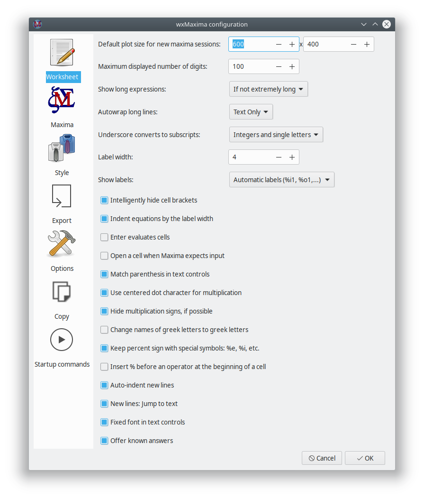{
id=img_wxMaxima_configuration_001 }

### Fréquence par défaut des images pour les animations

La fréquence des images utilisée pour les nouvelles animations est stockée
dans la variable `wxanimate_framerate`. La valeur initiale de cette variable
dans un nouveau notebook peut être modifiée via la boîte de dialogue de
configuration.

### Dimensions par défaut des graphiques pour les nouvelles sessions de
_maxima_

After the next start, plots embedded into the worksheet will be created with
this size if the value of `wxplot_size` isn’t changed by _maxima_.

In order to set the plot size of a single graph only use the following
notation can be used that sets a variable’s value for one command only:

```maxima
wxdraw2d(
   explicit(
       x^2,
       x,-5,5
   )
), wxplot_size=[480,480]$
```

### Correspondance des parenthèses dans les zones de texte

Cette option active deux fonctionnalités :

- Si une parenthèse ouvrante, un crochet ouvrant ou un guillemet double est
  saisi, _wxMaxima_ insère automatiquement le caractère de fermeture
  correspondant.
- Si du texte est sélectionné lorsque l’une de ces touches est enfoncée, le
  texte sélectionné est placé entre les signes correspondants appariés.

### Ne pas enregistrer automatiquement le notebook

Si cette option est activée, le fichier du notebook ne sera écrasé que sur
demande de l'utilisateur. En cas de plantage, de coupure de courant ou autre
incident, une copie de sauvegarde récente reste cependant disponible dans le
dossier temporaire.

If this option isn’t set _wxMaxima_ behaves more like a modern cellphone
app:

- Les fichiers sont sauvegardés automatiquement lorsque l'on quitte le
  programme
- Et le fichier sera automatiquement sauvegardé toutes les 3 minutes.

### Où est enregistrée la configuration  ?

Si vous utilisez Unix/Linux, les informations de configuration sont
enregistrées dans un fichier `.wxMaxima` de votre répertoire personnel (si
vous utilisez wxWidgets < 3.1.1), ou dans `.config/wxMaxima.conf` (norme
XDG, si wxWidgets >= 3.1.1 est utilisé). Vous pouvez connaître la version de
wxWidgets avec la commande `wxbuild_info();` ou via le menu Aide → À
propos. [wxWidgets](https://www.wxwidgets.org/) est la bibliothèque
d'interface graphique multiplateforme sur laquelle repose _wxMaxima_ (d'où
le `wx` dans le nom). (Ces fichiers ou dossiers, commençant par un point,
`.wxMaxima` ou `.config`, sont donc des fichiers cachés).

Si vous utilisez Windows, la configuration est stockée dans le
registre. Vous trouverez les entrées pour _wxMaxima_ à l'emplacement suivant
du registre : `HKEY_CURRENT_USER\Software\wxMaxima`

______________________________________________________________________

# Extensions pour _Maxima_

_WxMaxima_ is primarily a graphical user interface for _Maxima_. As such,
its main purpose is to pass along commands to _Maxima_ and to report the
results of executing those commands. In some cases, however, _wxMaxima_ adds
functionality to _Maxima_. _WxMaxima_’s ability to generate reports by
exporting a workbook’s contents to HTML and LaTeX files has been
mentioned. This section considers some ways that _wxMaxima_ enhances the
inclusion of graphics in a session.

## Variables en indice

`wxsubscripts` définit si (et comment) _wxMaxima appliquera automatiquement
des indices aux noms de variables :

Si sa valeur est `false`, cette fonctionnalité est désactivée : wxMaxima ne
transformera pas automatiquement en indices les parties des noms de
variables suivant un tiret bas.

Si elle est définie sur `'all`, tout ce qui suit un tiret bas sera converti
en indice.

Si elle est définie sur `true`, les noms de variables au format `x_y`
s'affichent avec un indice uniquement si

- Soit `x` soit `y` est une lettre unique ou
- `y` est un entier (peut inclure plus d'un caractère).

{ id=img_wxsubscripts }

If the variable name doesn’t match these requirements, it can still be
declared as "to be subscripted" using the command
`wxdeclare_subscript(variable_name);` or
`wxdeclare_subscript([variable_name1,variable_name2,...]);` Declaring a
variable as subscripted can be reverted using the following command:
`wxdeclare_subscript(variable_name,false);`

Vous pouvez utiliser le menu "Affichage->Mise en indice automatique" pour
définir ces valeurs.

## Message utilisateur dans la barre d'état

Long-running commands can provide user feedback in the status bar. This user
feedback is replaced by any new feedback that is placed there (allowing to
use it as a progress indicator) and is deleted as soon as the current
command sent to _Maxima_ is finished. It is safe to use `wxstatusbar()` even
in libraries that might be used with plain _Maxima_ (as opposed to
_wxMaxima_): If _wxMaxima_ isn’t present the `wxstatusbar()` command will
just be left unevaluated.

```maxima
for i:1 thru 10 do (
    /* Informe l'utilisateur de l'avancement. */
    wxstatusbar(concat("Pass ",i)),
    /* (sleep n) est une fonction Lisp, qui peut être utilisée */
    /* avec le caractère "?" avant. Cela retarde */
    /* l'exécution du programme (dans ce cas : pour 3 secondes) */
    ?sleep(3)
)$
```

## Graphiques

La création de courbes (qui repose fondamentalement sur des éléments
graphiques) est un domaine où une interface utilisateur graphique devra
apporter certaines extensions au programme d'origine.

### Intégrer un graphique dans le notebook

_Maxima_ normally instructs the external program _Gnuplot_ to open a
separate window for every diagram it creates. Since many times it is
convenient to embed graphs into the worksheet instead _wxMaxima_ provides
its own set of plot functions that don’t differ from the corresponding
_maxima_ functions save in their name: They are all prefixed by a “wx”.

Les fonctions graphiques suivantes ont leurs équivalents préfixés par « wx »
:

| wxMaxima’s plot function | Maxima’s plot function                                                                          |
| ------------------------ | ----------------------------------------------------------------------------------------------- |
| `wxplot2d()`             | [plot2d](https://maxima.sourceforge.io/docs/manual/maxima_singlepage.html#plot2d)               |
| `wxplot3d()`             | [plot3d](https://maxima.sourceforge.io/docs/manual/maxima_singlepage.html#plot3d)               |
| `wxdraw2d()`             | [draw2d](https://maxima.sourceforge.io/docs/manual/maxima_singlepage.html#draw2d)               |
| `wxdraw3d()`             | [draw2d](https://maxima.sourceforge.io/docs/manual/maxima_singlepage.html#draw3d)               |
| `wxdraw()`               | [draw](https://maxima.sourceforge.io/docs/manual/maxima_singlepage.html#draw)                   |
| `wximplicit_plot()`      | [implicit_plot](https://maxima.sourceforge.io/docs/manual/maxima_singlepage.html#implicit_plot) |
| `wxhistogram()`          | [histogram](https://maxima.sourceforge.io/docs/manual/maxima_singlepage.html#histogram)         |
| `wxscatterplot()`        | [scatterplot](https://maxima.sourceforge.io/docs/manual/maxima_singlepage.html#scatterplot)     |
| `wxbarsplot()`           | [barsplot](https://maxima.sourceforge.io/docs/manual/maxima_singlepage.html#barsplot)           |
| `wxpiechart()`           | [piechart](https://maxima.sourceforge.io/docs/manual/maxima_singlepage.html#piechart)           |
| `wxboxplot()`            | [boxplot](https://maxima.sourceforge.io/docs/manual/maxima_singlepage.html#boxplot)             |

Si un fichier `.wxm` est lu par _Maxima_ (en mode console), ces fonctions
sont ignorées (et affichées à l'identique en sortie, comme toute autre
fonction inconnue dans _Maxima_).

Si vous rencontrez des problèmes avec l'une de ces fonctions, veuillez
vérifier si le problème existe également pour la fonction Maxima
correspondante (par exemple, si vous obtenez une erreur avec `wxplot2d()`,
testez le même graphique avec la commande Maxima `plot2d()` (qui ouvre le
graphique dans une fenêtre séparée)). Si le problème persiste, il s'agit
probablement d'un problème de Maxima qui devrait être signalé dans le [suivi
des bogues de Maxima](https://sourceforge.net/p/maxima/bugs/). Ou peut-être
un problème de Gnuplot.

### Agrandir ou diminuer les graphiques intégrés

Comme indiqué précédemment, la boîte de dialogue de configuration permet de
modifier la taille par défaut des graphiques créés, en définissant la valeur
initiale de `wxplot_size`. Les routines graphiques de _wxMaxima_ tiennent
compte de cette variable, qui spécifie la taille d'un graphique en
pixels. Il est toujours possible d'interroger ou de définir cette variable
pour ajuster la taille des graphiques suivants :

```maxima
wxplot_size:[1200,800]$
wxdraw2d(
    explicit(
        sin(x),
        x,1,10
    )
)$
```

Si la dimension d'un seul graphique doit être modifiée, _Maxima_ offre une
méthode standard pour changer l'attribut de taille uniquement pour la
cellule actuelle. Dans ce cas, la spécification `wxplot_size = [valeur1,
valeur2]` est ajoutée à la commande `wxdraw2d()`, sans faire partie
intégrante de cette commande.

```maxima
wxdraw2d(
    explicit(
        sin(x),
        x,1,10
    )
),wxplot_size=[1600,800]$
```

Le réglage de la taille des graphiques intégrés avec `wxplot_size`
fonctionne pour les graphiques en ligne utilisant par exemple les commandes
`wxplot`, `wxdraw`, `wxcontour_plot` et `wximplicit_plot`, ainsi que pour
les animations intégrées avec les commandes `with_slider_draw` et
`wxanimate`.

### Des graphiques de meilleur qualité

_Gnuplot_ doesn’t seem to provide a portable way of determining whether it
supports the high-quality bitmap output that the Cairo library provides. On
systems where _Gnuplot_ is compiled to use this library the pngCairo option
from the configuration menu (that can be overridden by the variable
`wxplot_pngcairo`) enables support for antialiasing and additional line
styles. If `wxplot_pngCairo` is set without _Gnuplot_ supporting this the
result will be error messages instead of graphics.

### Ouvrir les graphiques intégrés dans les fenêtres interactives de
_Gnuplot_

If a plot was generated using the `wxdraw`-type commands (`wxplot2d` and
`wxplot3d` isn’t supported by this feature) and the file size of the
underlying _Gnuplot_ project isn’t way too high _wxMaxima_ offers a
right-click menu that allows to open the plot in an interactive _Gnuplot_
window.

### Ouvrir la console de commandes de Gnuplot dans les fenêtres `plot`

Sous MS Windows, il existe deux programmes Gnuplot : `gnuplot.exe` et
`wgnuplot.exe`. Vous pouvez configurer lequel utiliser via le menu de
configuration. `wgnuplot.exe` permet d'ouvrir une fenêtre de console où les
commandes _Gnuplot_ peuvent être saisies, ce que `gnuplot.exe` ne propose
pas. Malheureusement, `wgnuplot.exe` provoque un bref "décrochage" du focus
clavier à chaque génération d'un graphique.

### Intégrer des animations dans le notebook

Les diagrammes en 3D impliquent souvent que la lecture des données
quantitatives soit difficile. Une alternative intéressante consiste à
associer le 3ᵉ paramètre à la molette de la souris. La commande
`with_slider_draw` est une version de `wxdraw2d` qui génère plusieurs
graphiques et permet de basculer entre eux à l'aide d'un curseur situé en
haut de l'écran. _WxMaxima_ permet d'exporter cette animation au format GIF
animé.

Les deux premiers arguments de `with_slider_draw` sont le nom du paramètre
qui varie entre les graphiques et une liste des valeurs prises par ce
paramètre. Les arguments suivants sont les arguments classiques de la
commande `wxdraw2d` :

```maxima
with_slider_draw(
    f,[1,2,3,4,5,6,7,10],
    title=concat("f=",f,"Hz"),
    explicit(
        sin(2*%pi*f*x),
        x,0,1
    ),grid=true
);
```

La même fonctionnalité pour les graphiques 3D est accessible avec
`with_slider_draw3d`, qui permet de faire tourner les graphiques 3D :

```maxima
wxanimate_autoplay:true;
wxanimate_framerate:20;
with_slider_draw3d(
    α,makelist(i,i,1,360,3),
    title=sconcat("α=",α),
    surface_hide=true,
    contour=both,
    view=[60,α],
    explicit(
        sin(x)*sin(y),
        x,-π,π,
        y,-π,π
    )
)$
```

Si c'est plutôt la forme générale du graphique qui importe, un léger
déplacement peut suffire pour rendre la visualisation 3D plus intuitive :

```maxima
wxanimate_autoplay:true;
wxanimate_framerate:20;
with_slider_draw3d(
    t,makelist(i,i,0,2*π,.05*π),
    title=sconcat("α=",α),
    surface_hide=true,
    contour=both,
    view=[60,30+5*sin(t)],
    explicit(
        sin(x)*y^2,
        x,-2*π,2*π,
        y,-2*π,2*π
    )
)$
```

Pour ceux qui maîtrisent mieux la commande `plot` que `draw`, il existe un
second ensemble de fonctions :

- - `with_slider` et
- `wxanimate`.

Normalement, les animations sont lues ou exportées avec le taux de
rafraîchissement défini dans la configuration de _wxMaxima_. Pour régler la
vitesse de lecture d'une animation donnée, on peut utiliser la variable
`wxanimate_framerate` :

```maxima
wxanimate(a, 10,
    sin(a*x), [x,-5,5]), wxanimate_framerate=6$
```

The animation functions use _Maxima_’s `makelist` command and therefore
share the pitfall that the slider variable’s value is substituted into the
expression only if the variable is directly visible in the
expression. Therefore the following example will fail:

``maxima
f:sin(a*x);
with_slider_draw(
    a,makelist(i/2,i,1,10),
    title=concat("a=",float(a)),
    grid=true,
    explicit(f,x,0,10)
)$

If _Maxima_ is explicitly asked to substitute the slider’s value plotting
works fine instead:

```maxima
f:sin(a*x);
with_slider_draw(
    b,makelist(i/2,i,1,10),
    title=concat("a=",float(b)),
    grid=true,
    explicit(
        subst(a=b,f),
        x,0,10
    )
)$
```

### Ouvrir plusieurs graphiques dans des fenêtres de manière simultanée

Cette fonctionnalité de _Maxima_ (sur les configurations qui la supportent),
bien qu'elle ne soit pas disponible via  _wxMaxima_, s'avère parfois bien
pratique. L'exemple suivant provient d'un message de Mario Rodriguez sur la
_liste de diffusion de Maxima_ :

```maxima load(draw);

/* Une parabole dans une fenêtre #1 */
draw2d(terminal=[wxt,1],explicit(x^2,x,-1,1));

/* Une parabole dans une fenêtre #2 */
draw2d(terminal=[wxt,2],explicit(x^2,x,-1,1));

/* Un paraboloide dans une fenêtre #3 */
draw3d(terminal=[wxt,3],explicit(x^2+y^2,x,-1,1,y,-1,1)); ```

Il est également possible de tracer plusieurs graphiques dans une même
fenêtre (la même chose est réalisable avec la commande standard `draw()` de
Maxima en ligne de commande) :

```maxima
wxdraw(
  gr2d(
    key="sin (x)",grid=[2,2],
    explicit(sin(x),x,0,2*%pi)),
  gr2d(
    key="cos (x)",grid=[2,2],
    explicit(cos(x),x,0,2*%pi))
);
```

### Le panneau latéral "Graphiques avec draw"

Le panneau latéral "Graphiques avec draw" cache un générateur simple de code
qui permet de créer des représentations graphiques exploitant une partie des
fonctionnalités du package _draw_ intégré à _Maxima_.

#### 2D

Generates the skeleton of a `draw()` command that draws a 2D scene. This
scene later has to be filled with commands that generate the scene’s
contents, for example by using the buttons in the rows below the "2D"
button.

Une fonctionnalité utile du bouton 2D est qu'il permet de configurer la
scène comme une animation dans laquelle un paramètre (par défaut, _t_) prend
une valeur différente à chaque image : une courbe 2D animée facilite souvent
l'interprétation des données plus qu'une représentation 3D statique des
mêmes informations.

#### 3D

Génère le squelette d'une commande `draw()` pour tracer une scène 3D. Si
aucune scène 2D ou 3D n'est définie, tous les autres boutons configurent
automatiquement une scène 2D contenant la commande générée par le bouton.

#### Expression

Ajoute un tracé standard d'une expression comme `sin(x)`, `x*sin(x)` ou
`x^2+2*x-4` à la commande `draw()` où se trouve actuellement le curseur. Si
aucune commande `draw()` n'existe, une scène 2D avec ce tracé est
générée. Chaque scène peut contenir un nombre illimité de graphiques.

#### Courbe définie de manière implicite

Tente de trouver tous les points où une expression comme `y=sin(x)`,
`y*sin(x)=3` ou `x^2+y^2=4` est vérifiée et trace la courbe résultante dans
la commande `draw()` où se trouve le curseur. Si aucune commande `draw()`
n'existe, une scène 2D avec ce tracé est générée.

#### Courbe paramétrique

Fait varier une variable entre une borne inférieure et une borne supérieure,
puis utilise deux expressions comme `t*sin(t)` et `t*cos(t)` pour générer
les coordonnées x, y (et z dans le cas des tracés 3D) d'une courbe, qui est
ensuite insérée dans la commande `draw()` actuelle.

#### Points

Trace plusieurs points, éventuellement reliés entre eux. Les coordonnées des
points peuvent provenir d'une liste de listes, d'un tableau 2D, ou d'une
liste ou d'un tableau pour chaque axe.

#### Titre du graphique

Ajoute un titre en haut du graphique,

#### Axes

Configurer l'axe.

#### Lignes de niveau

(Uniquement pour les tracés 3D) : Ajoute des lignes de niveau similaires à
celles que l'on trouve sur une carte de montagne aux commandes du tracé qui
suivent dans la commande `draw()` actuelle et/ou au plan de base du
graphique. Alternativement, cet assistant permet de sauter entièrement le
tracé des courbes et d'afficher uniquement le tracé des lignes de niveau.

#### Légende du graphique

Adds a legend entry showing the next plot’s name to the legend of the
diagram. An empty name disables generating legend entries for the following
plots.

#### Couleur de la ligne du tracé

Définit la couleur de ligne pour les tracés suivants contenus dans la
commande `draw()` actuelle.

#### Couleur de remplissage

Définit la couleur de remplissage pour les tracés suivants contenus dans la
commande `draw()` actuelle.

#### Quadrillage

Ouvre un assistant permettant de configurer les lignes du quadrillage.

#### Précision

Permet de choisir un compromis adapté entre vitesse et précision, inhérent à
tout programme de tracé graphique.

### Modifier la police et la taille de police pour les graphiques

Surtout lorsque vous utilisez un affichage haute résolution, la taille de
police par défaut peut être très petite. Pour les commandes basées sur
`draw`, vous pouvez définir la police et la taille de police à l'aide
d'options comme `font=...`, `font_size=...`, par exemple :

~~~maxima
wxdraw2d(
     font="Helvetica",
     font_size=30,
     explicit(sin(x),x,1,10));
~~~

Pour les commandes de type `plot` (par exemple `wxplot2d`, `wxplot3d`), les
tailles et polices de caractères peuvent être définies à l'aide de la
commande `gnuplot_preamble`, par exemple :

~~~maxima
wxplot2d(sin(x),[x,1,10],
         [gnuplot_preamble, "set tics font \"Arial, 30\"; set xlabel font \",20\"; set ylabel font \",20\";"]);
~~~

Cela définit la police pour les nombres en Arial avec une taille de 30, et
la taille de la police des étiquettes xlabel et ylabel à 20 (avec la police
par défaut).

Consultez la documentation de Maxima et Gnuplot pour plus
d'informations. Remarque : Gnuplot semble rencontrer des problèmes avec les
polices de grande taille, voir [wxMaxima issue
1966](https://github.com/wxMaxima-developers/wxmaxima/issues/1966).

## Graphiques intégrés

If the `.wxmx` file format is being used embedding files in a _wxMaxima_
project can be done as easily as per drag-and-drop. But sometimes (for
example if an image’s contents might change later on in a session) it is
better to tell the file to load the image on evaluation:

```maxima show_image("man.png"); ```

## Fichiers au démarrage

La boîte de dialogue de configuration de _wxMaxima_ permet de modifier deux
fichiers contenant des commandes exécutées au démarrage :

- Un fichier contenant des commandes exécutées au démarrage de _Maxima_ :
  `maxima-init.mac`
- un fichier d'instructions supplémentaires exécutées lorsque _wxMaxima_
  démarre _Maxima_ : `wxmaxima-init.mac`

Par exemple, si Gnuplot est installé dans `/opt` (peut-être sur macOS), vous
pouvez ajouter `gnuplot_command:"/opt/local/bin/gnuplot"$` (ou
`/opt/gnuplot/bin/gnuplot` ou tout autre chemin) à ces fichiers.

Ces fichiers se trouvent dans le répertoire utilisateur de Maxima
(généralement `%USERPROFILE%/maxima` sous Windows, ou `$HOME/.maxima`
sinon). Vous pouvez connaître leur emplacement avec la commande :
`maxima_userdir;`

## Variables spéciales wx...

- `wxsubscripts` indique à _Maxima_ s'il doit convertir les noms de
  variables contenant un tiret bas (`R_150` ou similaire) en variables avec
  indices en bas de ligne. Voir `wxdeclare_subscript` pour les détails sur
  les noms de variables automatiquement convertis.
- `wxfilename` : Cette variable contient le nom du fichier actuellement
  ouvert dans _wxMaxima_.
- `wxdirname` : Cette variable contient le nom du répertoire dans lequel se
  trouve le fichier actuellement ouvert dans _wxMaxima_.
- `wxplot_pngcairo` tells whether _wxMaxima_ tries to use _Gnuplot_’s
  pngcairo terminal that provides more line styles and a better overall
  graphics quality.
- `wxplot_size` définit la résolution des graphiques intégrés.
- `wxchangedir`: On most operating systems _wxMaxima_ automatically sets
  _Maxima_’s working directory to the directory of the current file. This
  allows file I/O (e.g. by `read_matrix`) to work without specifying the
  whole path to the file that has to be read or written. On Windows this
  feature sometimes causes error messages and therefore can be set to
  `false` from the config dialogue.
- `wxanimate_framerate` : Le nombre d'images par seconde pour la lecture des
  animations suivantes.
- `wxanimate_autoplay` : Jouer automatiquement les animations par défaut ?
- `wxmaximaversion` : Retourne le numéro de version de _wxMaxima_.
- `wxwidgetsversion` : Retourne la version de wxWidgets utilisée par
  _wxMaxima_.

## Affichage formaté en 2D

The function `table_form()` displays a 2D list in a form that is more
readable than the output from _Maxima_’s default output routine. The input
is a list of one or more lists. Like the "print" command, this command
displays output even when ended with a dollar sign. Ending the command with
a semicolon results in the same table along with a "done" statement.

```maxima
table_form(
    [
        [1,2],
        [3,4]
    ]
)$
```

Comme le montre l'exemple suivant, les listes utilisées par la commande
`table_form` peuvent être créées avant son exécution.

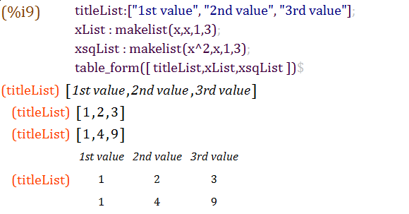{
id=img_MatrixTableExample }

De même, comme une matrice est une liste de listes, elle peut être convertie
en tableau de manière similaire.

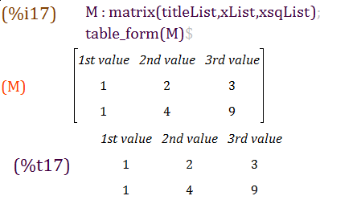{
id=img_SecondTableExample }

The function `wx_matrix()` is a wrapper for Maxima's `matrix()` command that
allows for more flexible formatting of matrices in wxMaxima:

**`wx_matrix( <matrix>, [options] )`**
- **`lines=true`**: Draws internal separator lines between the cells. This is required to visually separate headings from data.
- **`rownames=true`**: Tells wxMaxima that the first column of the matrix contains labels.
- **`colnames=true`**: Tells wxMaxima that the first row of the matrix contains labels.
- **`parenstyle=<style>`**: Sets the type of parenthesis or brackets to draw around the matrix. Supported styles are: `round` `()`, `square` `[]`, `angled` `<>`, `straight` `||`, or `none`.

Example:
```maxima
wx_matrix(matrix(["Name", "Value"], ["X", 10], ["Y", 20]), 
          lines=true, rownames=true, colnames=true, parenstyle=square);
```

## Signalement de bugs

_WxMaxima_ propose quelques fonctions qui collectent des informations utiles
pour signaler un bug concernant le système actuel :

- - `wxbuild_info()` : Rassemble des informations sur la version en cours
  d'exécution  de _wxMaxima_
- `wxbug_report()` indique comment et où signaler les bogues


## Ecrire le résultat de la sortie en rouge

_Maxima_’s `box()` command causes _wxMaxima_ to print its argument with a
red foreground, if the second argument to the command is the text
`highlight`.

## Rendu de la sortie.

Avec `set_display()`, on peut définir de quelle manière wxMaxima affichera
la sortie.

`set_display('xml)` est la valeur par défaut. Ici, Maxima communique avec
wxMaxima en utilisant un dialecte XML (lisible par machine) (visible dans la
barre latérale « XML brut ») et affiche les formules résultantes avec un
visuel mathématique, par exemple des matrices bien délimitées et
structurées, des signes de racine carrée, des fractions, etc.

<!--- Actuellement, cela ne fonctionne pas comme prévu : la ligne avec
l’étiquette de sortie est décalée vers la droite (problème : #2006) -->
`set_display('ascii)` fait en sorte que wxMaxima affiche les formules comme
dans Maxima en ligne de commande — en ASCII-Art.

`set_display('none)` produit des résultats ASCII « sur une seule ligne » —
comme le fait la commande de Maxima en ligne de commande `display2d:false;`.

# Menu d'aide

WxMaxima’s help menu provides access to the Maxima and wxMaxima manual,
tips, some example worksheets and in command line Maxima included demos (the
`demo()` command).

Veuillez noter que les exemples indiquent :

~~~ At the ’_’ prompt, type ’;’ and <enter> to proceed with the
demonstration.  ~~~

Cela est valable pour Maxima en ligne de commande, mais dans wxMaxima, par
défaut, il est nécessaire de poursuivre la démonstration avec :
<kbd>CTRL</kbd> + <kbd>ENTRÉE</kbd>

(Ce comportement peut être configuré dans le menu Configurer → Notebook →
" Raccourcis pour envoyer des commandes à Maxima".)

______________________________________________________________________

# Résolution des problèmes

## Impossible de se connecter à _Maxima_

Since _Maxima_ (the program that does the actual mathematics) and _wxMaxima_
(providing the easy-to-use user interface) are separate programs that
communicate by the means of a local network connection. Therefore the most
probable cause is that this connection is somehow not working. For example,
a firewall could be set up in a way that it doesn’t just prevent
unauthorized connections from the internet (and perhaps intercept some
connections to the internet, too), but also blocks
inter-process-communication inside the same computer. Note that since
_Maxima_ is being run by a Lisp processor the process communication that is
blocked does not necessarily have to be named "maxima". Common names of the
program that opens the network connection would be sbcl, gcl, ccl, lisp.exe,
or similar names.

On Unix computers another possible reason would be that the loopback network
that provides network connections between two programs in the same computer
isn’t properly configured.

## Comment récupérer les données d’un fichier .wxmx corrompu

Internally most modern XML-based formats are ordinary zip files. _WxMaxima_
doesn’t turn on compression, so the contents of `.wxmx` files can be viewed
in any text editor.

If the zip signature at the end of the file is still intact after renaming a
broken `.wxmx` file to `.zip` most operating systems will provide a way to
extract any portion of the information that is stored inside it. This can be
done when there is a need of recovering the original image files from a text
processor document. If the zip signature isn’t intact that does not need to
be the end of the world: If _wxMaxima_ during saving detected that something
went wrong there will be a `.wxmx~` file whose contents might help.

And even if there isn’t such a file: The `.wxmx` file is a container format
and the XML portion is stored uncompressed. It it is possible to rename the
`.wxmx` file to a `.txt` file and to use a text editor to recover the XML
portion of the file’s contents (it starts with `<?xml version="1.0"
encoding="UTF-8"?>` and ends with `</wxMaximaDocument>`. Before and after
that text you will see some unreadable binary contents in the text editor).

Si vous enregistrez un fichier texte contenant uniquement ce contenu (par
exemple, en copiant et collant ce texte dans un nouveau fichier) avec une
extension `.xml`, _wxMaxima_ saura comment récupérer le texte du document.

## Je souhaite afficher des informations de débogage à l’écran avant que ma
commande ne soit terminée

Normalement, _wxMaxima_ attend que la formule 2D soit transférée en totalité
avant de commencer la composition typographique. Cela permet d’économiser du
temps en évitant de tenter d'écrire une équation incomplète. Cependant, il
existe une commande `disp` qui affiche immédiatement des informations de
débogage, sans attendre la fin de l’exécution de la commande _Maxima_ en
cours :

``maxima
for i:1 thru 10 do (
   disp(i),
   /* (sleep n) is a Lisp function, which can be used */
   /* with the character "?" before. It delays the */
   /* program execution (here: for 3 seconds) */
   ?sleep(3)
)$
```

Sinon, on peut utiliser la commande `wxstatusbar()` mentionnée ci-dessus.

## La création d'un graphique n'affiche qu'une enveloppe vide encadrée avec
un message d'erreur

Cela signifie que _wxMaxima_ n'a pas pu lire le fichier généré par _Maxima_,
qui était censé donner les instructions à _Gnuplot_ pour créer le graphique.

Les causes possibles de cette erreur sont :

- The plotting command is part of a third-party package like `implicit_plot`
  but this package was not loaded by _Maxima_’s `load()` command before
  trying to plot.
- _Maxima_ tried to do something the currently installed version of
  _Gnuplot_ isn’t able to understand. In this case, a file ending in
  `.gnuplot` located in the directory, which _Maxima_’s variable
  `maxima_userdir` is pointing, contains the instructions from _Maxima_ to
  _Gnuplot_. Most of the time, this file’s contents therefore are helpful
  when debugging the problem.
- Gnuplot was instructed to use the pngCairo library that provides
  antialiasing and additional line styles, but it was not compiled to
  support this possibility. Solution: Uncheck the "Use the Cairo terminal
  for the plot" checkbox in the configuration dialog and don’t set
  `wxplot_pngcairo` to true from _Maxima_.
- Gnuplot n'a pas produit un fichier .png valide.

## Le tracé d'une animation génère l'erreur "error: undefined variable"

Par défaut, la valeur du paramètre pour le curseur n'est substituée dans
l'expression à tracer que si elle y est visible. L'utilisation d'une
commande `subst` qui substitue la variable du curseur dans l'équation à
tracer résout ce problème. À la fin de la section [Intégrer des animations
dans le notebook](#embedding-animations-into-the-spreadsheet), vous pouvez
voir un exemple.

## J’ai perdu le contenu d’une cellule et la fonction Annuler ne le restaure
pas

Il existe des fonctions Annuler distinctes pour les opérations sur les
cellules et pour les modifications à l’intérieur des cellules, donc il est
peu probable que cela arrive. Si cela se produit, plusieurs méthodes
permettent de récupérer les données :

- _WxMaxima_ dispose en fait de deux fonctions d’annulation : une mémoire
  d’annulation globale, active lorsqu’aucune cellule n’est sélectionnée, et
  une mémoire d’annulation par cellule, active lorsque le curseur se trouve
  à l’intérieur d’une cellule. Cela vaut la peine d’essayer les deux options
  d’annulation pour voir si une ancienne valeur peut encore être récupérée.
- If you still have a way to find out what label _Maxima_ has assigned to
  the cell just type in the cell’s label and its contents will reappear.
- If you don’t: Don’t panic. In the “View” menu there is a way to show a
  history pane that shows all _Maxima_ commands that have been issued
  recently.
- Si rien d’autre ne fonctionne, _Maxima_ contient une fonction de replay :

```maxima playback(); ```

## _WxMaxima_ démarre avec le message  Maxima process terminated

One possible reason is that _Maxima_ cannot be found in the location that is
set in the “Maxima” tab of _wxMaxima_’s configuration dialog and therefore
won’t run at all. Setting the path to a working _Maxima_ binary should fix
this problem.

## Maxima calcule indéfiniment et ne répond plus aux commandes entrées

It is theoretically possible that _wxMaxima_ doesn’t realize that _Maxima_
has finished calculating and therefore never gets informed it can send new
data to _Maxima_. If this is the case “Trigger evaluation” might
resynchronize the two programs.

## Mon _Maxima_ basé sur SBCL manque de mémoire

Le compilateur Lisp SBCL est configuré par défaut avec une limite de mémoire
qui lui permet de fonctionner même sur des ordinateurs peu
puissants. Cependant, lors de la compilation de gros packages logiciels
comme Lapack ou du traitement de listes d'équations extrêmement longues,
cette limite peut s'avérer insuffisante. Pour l'augmenter, vous pouvez
utiliser le paramètre en ligne de commande `--dynamic-space-size` lors du
lancement de SBCL, qui indique combien de mégaoctets doivent être
réservés. - Une version 32 bits de SBCL sous Windows peut réserver jusqu'à
999 Mo. - Une version 64 bits sous Windows peut aller au-delà des 1280 Mo
nécessaires pour compiler Lapack.

One way to provide _Maxima_ (and thus SBCL) with command line parameters is
the "Additional parameters for Maxima" field of _wxMaxima_’s configuration
dialogue.

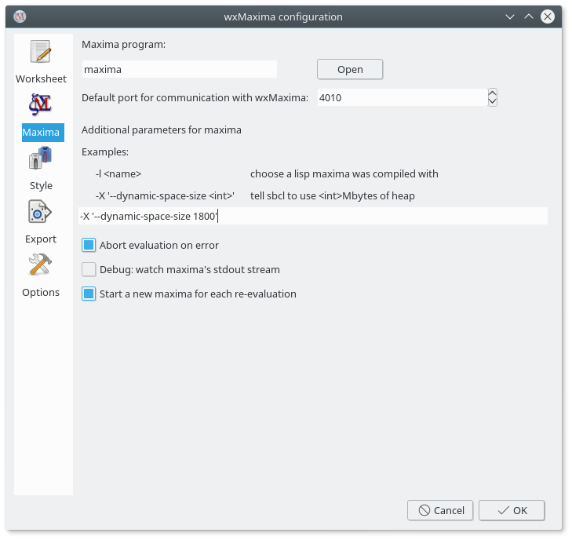{ id=img_sbclMemory }

## Sous Ubuntu, la saisie est parfois lente ou certaines touches sont
ignorées

L'installation du paquet 'ibus-gtk' devrait résoudre ce problème. Pour plus
de détails, voir :
[https://bugs.launchpad.net/ubuntu/+source/wxwidgets3.0/+bug/1421558](https://bugs.launchpad.net/ubuntu/+source/wxwidgets3.0/+bug/1421558).

## _WxMaxima_ se fige lorsque _Maxima_ traite des caractères grecs ou des
lettres accentuées (comme les umlauts)

Si votre _Maxima_ est basé sur SBCL, ajoutez les lignes suivantes à votre
fichier `.sbclrc` :

```commonlisp (setf sb-impl::*default-external-format* :utf-8)  ```

Le dossier où ce fichier doit être placé dépend du système et de
l’installation. Cependant, toute version de _Maxima_ basée sur SBCL, ayant
déjà évalué une cellule durant la session en cours, peut gentiment indiquer
son emplacement après exécution de la commande suivante :

``` :lisp (sb-impl::userinit-pathname)  ```

## Remarque concernant Wayland (distributions Linux/BSD récentes)

Il semble y avoir des problèmes de compatibilité entre le serveur
d'affichage Wayland et wxWidgets. WxMaxima peut en être affecté, par exemple
avec des barres latérales qui ne peuvent pas être déplacées.

Vous pouvez soit : - désactiver Wayland et utiliser X11 à la place (de
manière globale), - ou forcer WxMaxima à utiliser le système X Window en
définissant la variable d’environnement :  `GDK_BACKEND=x11`

Par exemple, lancez WxMaxima avec la commande :

`GDK_BACKEND=x11 wxmaxima`

## The menu bar disappears on KDE Plasma

On some KDE Plasma installations the global menu bar disappears when
clicked.  As this is a bug in the global menu proxy, the only way to avoid
it is to tell that wxMaxima should use its own menu bar instead of the
global one.  This is done by setting: `UBUNTU_MENUPROXY=0`

Starting with version 26.05.0, wxMaxima attempts to set this variable
automatically if it detects an affected system (KDE, Unity, or Ubuntu with
older wxWidgets versions).

If the automatic fix fails, you can manually start wxMaxima with:

`UBUNTU_MENUPROXY=0 wxmaxima`

## Pourquoi le navigateur pour le manuel intégré n’est-il pas disponible sur
mon PC Windows ?

Either wxWidgets wasn’t compiled with support for Microsoft’s webview2 or
Microsoft’s webview2 isn’t installed.

## Pourquoi le navigateur pour le manuel externe ne fonctionne-t-il pas sur
ma machine Linux ?

The HTML browser might be a snap, flatpack or appimage version. All of these
typically cannot access files that are installed on your local
system. Another reason might be that maxima or wxMaxima is installed as a
snap, flatpack or something else that doesn’t give the host system access to
its contents. A third reason might be that the maxima HTML manual isn’t
installed and the online one cannot be accessed.

## Puis-je faire en sorte que _wxMaxima_ génère à la fois des fichiers image
et des graphiques en ligne en même temps ?

Le notebook intègre les fichiers `.png`. _WxMaxima_ permet à l'utilisateur
de spécifier où ces fichiers doivent être générés :

```maxima
wxdraw2d(
    file_name="test",  /* extension .png automatically added */
    explicit(sin(x),x,1,10)
);
```

Si vous souhaitez utiliser un format différent, il est plus simple de
générer les images séparément, puis de les réimporter dans le notebook :

```maxima
load("draw");
pngdraw(name,[contents]):=
(
    draw(
        append(
            [
                terminal=pngcairo,
                dimensions=wxplot_size,
                file_name=name
            ],
            contents
        )
    ),
    show_image(printf(false,"~a.png",name))
);
pngdraw2d(name,[contents]):=
    pngdraw(name,gr2d(contents));

pngdraw2d("Test",
        explicit(sin(x),x,1,10)
);
```

## Puis-je définir le rapport hauteur/largeur (aspect ratio) d’un graphique
en ligne ?

Utilisez la variable `wxplot_size` :

```maxima
wxdraw2d(
    explicit(sin(x),x,1,10)
),wxplot_size=[1000,1000];
```

## Après la mise à niveau vers macOS 13.1, les commandes plot et/ou draw
affichent des messages d'erreur du type

``` 1 HIToolbox 0x00007ff80cd91726
_ZN15MenuBarInstance22EnsureAutoShowObserverEv + 102 2 HIToolbox
0x00007ff80cd912b8 _ZN15MenuBarInstance14EnableAutoShowEv + 52 3 HIToolbox
0x00007ff80cd35908 SetMenuBarObscured + 408 ...  ```

Ce problème pourrait être lié au système d'exploitation. Désactiver le
masquage automatique de la barre de menus (via Réglages Système => Bureau et
Dock => Barre des menus) pourrait résoudre le problème. Pour plus
d'informations, voir [l'issue wxMaxima
#1746](https://github.com/wxMaxima-developers/wxmaxima/issues/1746).

## Journalisation

Les messages du journal peuvent être utiles pour déboguer des
problèmes. WxMaxima peut enregistrer de nombreux événements. La plupart des
entrées du journal seront utiles aux développeurs, notamment en cas de
problème ou de bogue. Si vous exécutez une version « Release », la fenêtre
du journal n’est pas affichée par défaut ; si vous exécutez une version de
développement, elle est affichée par défaut comme une seconde fenêtre. Vous
pouvez activer ou désactiver cette fenêtre via le menu « Affichage ->
Basculer la fenêtre du journal ».

Les messages ne sont pas « perdus » si la fenêtre du journal n’est pas
affichée. Si vous choisissez d’afficher la fenêtre du journal plus tard,
vous verrez les anciens messages du journal (à condition de ne pas les avoir
effacés).

Ces messages peuvent être utiles lorsque vous créez des rapports de bogues
(ou que vous essayez de résoudre un bogue par vous-même).

Les messages du journal peuvent également être envoyés vers STDERR en
utilisant l’option de ligne de commande « --logtostderr ». Sous Windows, une
console texte distincte sera ouverte, car une application graphique Windows
n’a pas de flux d’entrée/sortie standard connecté.

______________________________________________________________________

# FAQ

## Comment faire tenir plus de texte sur une page LaTeX ?

Oui. Utilisez le [package LaTeX "geometry"](https://ctan.org/pkg/geometry)
pour définir la taille des marges.

Vous pouvez ajouter la ligne suivante dans le préambule LaTeX (par exemple
via le champ dédié dans la fenêtre de configuration : ("Export" → "Lignes
supplémentaires pour le préambule TeX") pour régler les marges à 1 cm :

```latex \usepackage[left=1cm,right=1cm,top=1cm,bottom=1cm]{geometry} ```

## Un mode sombre existe-t-il ?

Si wxWidgets est suffisamment récent, _wxMaxima_ passera automatiquement en
mode sombre si le système d'exploitation l'est également. Par défaut, la
feuille de travail a un fond clair, mais cela peut être personnalisé. Sinon,
il existe une option 'Affichage/Inverser la luminosité de la feuille' qui
permet de basculer rapidement entre un fond clair et un fond sombre.

## _WxMaxima_ se fige parfois pendant plusieurs secondes lors de la première
minute d'utilisation

_WxMaxima_ delegates some big tasks like parsing _Maxima_’s
>1000-page-manual to background tasks, which normally goes totally
unnoticed. At the moment the result of such a task is needed, though, it is
possible that _wxMaxima_ needs to wait a couple of seconds before it can
continue its work.

## Especially when testing new locale settings, a message box "locale
’xx_YY’ can not be set" occurs

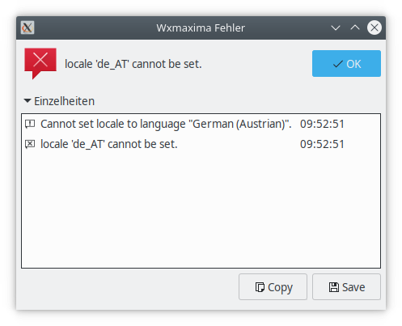{
id=img_locale_warning}

(The same problem can occur with other applications too). The translations
seem okay after you click on ’OK’. WxMaxima does not only use its own
translations but the translations of the wxWidgets framework too.

Ces langues locales peuvent ne pas être présentes dans le système. Sur les
systèmes Ubuntu/Debian, elles peuvent être générées avec : `dpkg-reconfigure
locales`

## How can I use symbols for real numbers, natural numbers (ℝ, ℕ), etc.?

You can find these symbols in the Unicode sidebar (search for ’double-struck
capital’). But the selected font must also support these symbols. If they do
not display properly, select another font.

## Comment un script Maxima peut-il déterminer s'il s'exécute sous wxMaxima
ou en ligne de commande ?

Si wxMaxima est utilisé, la variable Maxima `maxima_frontend` est définie
sur `wxmaxima`. Dans ce cas, la variable Maxima `maxima_frontend_version`
contient la version de wxMaxima.

Si aucun programme pour le frontend n'est utilisé (si vous utilisez Maxima
en ligne de commande), ces variables valent `false`.

## De l'aide ! Je ne peux pas sauvegarder mon document !

If saving as wxmx file does not work, try saving the document as wxm file
(and vice versa). And you can also try to remove all output (Menu
Cell->Remove all output) and save that file, maybe some unexpected output
causes issues during the save process.

______________________________________________________________________

# Arguments en ligne de commande

Généralement, les programmes dotés d'une interface graphique se lancent
simplement en cliquant sur une icône ou une entrée de menu. WxMaxima,
lorsqu'il est démarré depuis la ligne de commande, accepte néanmoins
certains arguments.

- `-v` ou `--version` : affiche les informations de version
- `-h` ou `--help` : affiche un texte d'aide succinct
- `-o` ou `--open=<fichier>` : ouvre le fichier spécifié en argument de
  cette option de la ligne de commande
- `-e` ou `--eval` : évalue le fichier après l'avoir ouvert.
- `-b` ou `--batch` : si un fichier est ouvert en ligne de commande, toutes
  ses cellules sont évaluées et le fichier est ensuite enregistré. Cela peut
  être utile, par exemple, si la session décrite dans le fichier amène
  _Maxima_ à générer des fichiers de sortie. Le traitement en mode batch
  s'arrête si _wxMaxima_ détecte une erreur émise par _Maxima_, et
  s'interrompt au cas où _Maxima_ pose une question : la nature interactive
  des mathématiques ne permet pas toujours un traitement entièrement
  automatisé.
- `--logtostderr` : redirige aussi les messages de débogage (barre latérale) vers stderr.
- `--pipe` : transmet les messages de Maxima vers stdout.
- `--exit-on-error` : ferme le programme en cas d’erreur Maxima.
- `-f` ou `--ini=<fichier>` : utilise le fichier d’initialisation spécifié en argument.
- `-u`, `--use-version=<version>` : utilise la version `<version>` de Maxima.
- `-l`, `--lisp=<compilateur>` : utilise une version de Maxima compilée avec le compilateur Lisp `<compilateur>`.
- `-X`, `--extra-args=<args>` : permet de passer des arguments supplémentaires à Maxima.
- `-m` ou `--maxima=<chemin>` : spécifie l’emplacement du binaire maxima.
- `--enableipc` : permet à Maxima de contrôler wxMaxima via une communication inter-processus (à utiliser avec prudence).
- `--wxmathml-lisp=<fichier>` : indique l’emplacement de `wxMathML.lisp` (pour remplacer la version intégrée, principalement pour les développeur·ses).

Certains systèmes d'exploitation peuvent utiliser un tiret long (—) au lieu
d'un tiret court (-) devant les options en ligne de commande.

______________________________________________________________________

# À propos du logiciel et des contributions à wxMaxima

wxMaxima est principalement développé en C++ avec le framework
[wxWidgets](https://www.wxwidgets.org), et utilise
[CMake](https://www.cmake.org) comme système de build. Une petite partie est
écrite en Lisp. Si vous maîtrisez ces langages et souhaitez contribuer à ce
projet open source, vous pouvez rejoindre l’équipe sur
[GitHub](https://github.com/wxMaxima-developers/wxmaxima).

Mais les programmeurs ne sont pas les seul·es à pouvoir contribuer ! Vous
pouvez aussi aider à améliorer wxMaxima en améliorant la documentation, en
signalant (ou corrigeant) des bugs, en proposant de nouvelles
fonctionnalités, en traduisant l’interface ou le manuel dans votre langue
(consultez le fichier README.md dans le [dossier
locales](https://github.com/wxMaxima-developers/wxmaxima/tree/main/locales)
pour savoir comment procéder).

Ou répondre aux questions d'autres utilisateurs sur le forum de discussion.

Le code source de wxMaxima est documenté avec Doxygen, disponible
[ici](https://wxmaxima-developers.github.io/wxmaxima/Doxygen-documentation/).

Le programme est quasi complet : hormis les bibliothèques système (et la
bibliothèque wxWidgets), il ne nécessite aucune dépendance externe (comme
des fichiers graphiques ou le logiciel Lisp.   Les éléments comme le fichier
( `wxmathML.lisp`) sont intégrés directement dans l'exécutable.

Si vous êtes développeur et que vous souhaitez tester une version modifiée
du fichier `wxmathML.lisp`  sans tout recompiler, vous pouvez utiliser
l'option en ligne de commande : `--wxmathml-lisp=<chemin>` pour spécifier un
autre fichier Lisp à la place de celui intégré à la version actuelle.
