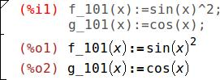

The wxMaxima user’s manual {-}
==============================

wxMaxima is a graphical user interface (GUI) for the Maxima computer algebra system (CAS). wxMaxima allows one to use all of Maxima’s functions. In addition, it provides convenient wizards for accessing the most commonly used features. This manual describes some of the features that make wxMaxima one of the most popular GUIs for Maxima.

Before we look at the content a few points regarding navigation are in order. Immediately below is a short table of contents. Clicking on any of the listed items moves the cursor to the top of the indicated section of the manual. Clicking on [Contents](#SEC_Contents "Full table of contents") here or on the line below the short table of contents moves the cursor to an extended table of contents. This extended table can be used to navigate more directly to specific parts of the manual. Finally, an [index](#Index "Alphabetical index") provides an alphabetical listing of many of the items in the manual with links to these items.

• [Introduction](#Introduction "Introduction to wxMaxima"):

wxMaxima basics

• [Extensions](#Extensions "Extensions"):

The commands wxMaxima adds to Maxima

• [Troubleshooting](#Troubleshooting "Troubleshooting"):

What to do if wxMaxima does not work as expected

• [FAQ](#FAQ "FAQ"):

Frequently asked questions

• [CommandLine](#CommandLine "Maxima Command Line"):

The command-line arguments wxMaxima supports

* * *

Introduction to wxMaxima
========================

## Maxima and wxMaxima

In the open-source domain big systems are normally split into smaller projects that are easier to handle for small groups of developers. For example a CD burner program will consist of a command-line tool that actually burns the CD and a graphical user interface that allows users to implement it without having to learn about all the command line switches and in fact without using the command line at all. One advantage of this approach is that the developing work that was invested into the command-line program can be shared by many programs: The same CD-burner command-line program can be used as a “send-to-CD”-plug-in for a file manager application, for the “burn to CD” function of a music player and as the CD writer for a DVD backup tool. Another advantage is that splitting one big task into smaller parts allows the developers to provide several user interfaces for the same program.

A computer algebra system (CAS) like Maxima fits into this framework. A CAS can provide the logic behind a arbitrary precision calculator application or it can do automatic transforms of formulas in the background of a bigger system (e.g., [Sage](http://www.sagemath.org/)). Alternatively, it can be used directly as a free-standing system. Maxima can be accessed via a command line. Often, however, an interface like wxMaxima proves a more efficient way to access the software, especially for newcomers. computer algebra system.

### Maxima

Maxima is a full-featured computer algebra system (CAS). A CAS is a program that can solve mathematical problems by rearranging formulas and finding a formula that solves the problem as opposed to just outputting the numeric value of the result. In other words, Maxima can serve as a calculator that gives numerical representations of variables, and it can also provide analytical solutions. Furthermore, it offers a range of numerical methods of analysis for equations or systems of equations that cannot be solved analytically.

Extensive documentation for Maxima is  [available in the internet](http://maxima.sourceforge.net/documentation.html). Part of this documentation is also available in wxMaxima’s help menu. Pressing the Help key (on most systems that would be the F1 key) causes wxMaxima’s context-sensitive help feature will automatically jump to Maxima’s manual page for the command at the cursor.

### wxMaxima

wxMaxima is a graphical user interface that provides the full functionality and flexibility of Maxima. wxMaxima offers users a graphical display and many features that make working with Maxima easier. For example wxMaxima allows one to export any cell’s contents (or, if that is needed, any part of a formula, as well) as text, as LaTeX or as MathML specification at a simple right-click. Indeed, an entire workbook can be exported, either as an HTML file or as a LaTeX file. Documentation for wxMaxima, including workbooks to illustrate aspects of its use, is online at the wxMaxima [help site](https://wxMaxima-developers.github.io/wxmaxima/help.html), as well as via the help menu.

The calculations that are entered in _wxMaxima_ are performed by the Maxima command-line tool in the background.

## Workbook basics

Much of wxMaxima is self-explaining, but some details require attention. [This site](https://wxMaxima-developers.github.io/wxmaxima/help.html) contains a number of workbooks that address various aspects of wxMaxima. Working through some of these (particularly the "10 minute (wx)Maxima tutorial") will increase one’s familiarity with both the content of _Maxima_ and the use of wxMaxima to interact with Maxima. This manual concentrates on describing aspects of wxMaxima that are not likely to be self-evident and that might not be covered in the online material.

### The workbook approach

One of the very few things that are not standard in wxMaxima is that it organizes the data for Maxima into cells that are evaluated (which means: sent to _Maxima_) only when the user requests this. When a cell is evaluated, all commands in that cell, and only that cell, are evaluated as a batch. (The preceding statement is not quite accurate: One can select a set of adjacent cells and evaluate them together. Also, one can instruct _Maxima_ to evaluate all cells in a workbook in one pass.) _wxMaxima_'s approach to submitting commands for execution might feel unfamiliar at the first sight. It does, however, drastically ease work with big documents (where the user certainly does not want every small change to automatically to trigger a full re-evaluation of the whole document). Also, this approach is very handy for debugging.

The cells that _wxMaxima_ automatically creates when the user enters some text are _Maxima_ input cells that will eventually be sent to Maxima. A pair of such commands appears below. Once the input is executed, the resulting output appears in the same cell.

On evaluation of an input cell’s contents the input cell _Maxima_ assigns a label to the input (by default shown in red and recognizable by the `%i`) by which it can be referenced later in the _wxMaxima_ session. The output that _Maxima_ generates will be shown in a different style (which can be user-selected) and is preceded by a _Maxima_ label that begins beginning with `%o`. The output item can be accessed later with a reference to this code. By default _wxMaxima_ will also attempt to replace this dynamically-generated label by a more descriptive name if the user provides one. The `%o`\-style label _Maxima_ auto-generates will still be accessible, though.

Besides the input cells wxMaxima allows for text cells for documentation, image cells, title cells, chapter cells and section cells. Every cell has its own undo buffer so debugging by changing the values of several cells and then gradually reverting the unneeded changes is rather easy. Furthermore the worksheet itself has a global undo buffer that can undo cell edits, adds and deletes.

The figure below shows different cell types (Title cells, section cells, subsection cells, text cells, input/output cells and an image cell.

### Cells

The worksheet is organized in cells. Each cell can contain one or more of the following types of content:

*   one or more lines of _Maxima_ input
*   one or more image
*   output of,  or a question from, _Maxima_
*   normal a text block that can for example used for explaining the meaning of the math cell’s contents
*   a title, section or a subsection.

The default behavior of _wxMaxima_ when text is entered is to automatically create a math cell. Cells of other types can be created using the Cell menu or using the hot keys shown in the menu. That is, to enter commands, just type and enter material. Before entering text, a workbook title, or a section or subsection title, one must first create the cell of the specified type. These cells can be created in one of three ways: via the Cell menu, by use of hot key combinations (indicated in the menu), or (depending on your operating system) by right-clicking between two cells and selecting an option from the drop-down menu.

### Horizontal and vertical cursors

It sometimes is desirable to allow selecting multiple cells or only part of a cell for export or Drag-and-Drop. However, beginning such an action in the middle of one cell and ending it in the middle of another will almost certainly lead to unexpected results. _wxMaxima_ will therefore extend the selection to full cells in this case.

_wxMaxima_ provides drag-and-drop flexibility by defining two types of cursors. _wxMaxima_ will switch between automatically when needed:

*   A horizontal cursor that is able to select any number of whole cells. This cursor is activated by moving the cursor between two cells or by clicking on a space between two cells. To select a set of adjacent cells, click in the bracket at the left of the top cell (but not inside the triangle) and then drag the cursor so that this cell and the next cell (or range of cells) is highlighted. Then use ctrl+enter or shift+enter to execute the highlighted cells.
*   A vertical cursor that works inside a cell. This cursor is activated by moving the cursor inside a cell using the mouse pointer or the cursor keys and works much like the cursor in a text editor.

As long as the cursor is inside a cell search operations will limit their scope to the current cell.

### Command autocompletion

_wxMaxima_ contains an autocompletion feature that is triggered via the menu (Cell/Complete Word) or alternatively by pressing the key combination Ctrl+k. The autocompletion is context-sensitive and if activated within an unit specification for ezUnits it will offer a list of applicable units.

Besides completing the current command’s or variable’s name the autocompletion is able to show a template for most of the commands indicating the type (and meaning) of the parameters this program expects. To activate this feature press Shift+Ctrl+k or select the respective menu item (Cell/Show Template).

#### Greek characters

Computers traditionally store characters in 8-bit values. This allows for a maximum of 256 different characters. All letters, numbers, and control symbols (end of transmission, end of string, lines and edges for drawing rectangles for menus _etc_.) of nearly any given language can fit within that limit.

For most countries the codepage of 256 characters that has been chosen does not include Greek letters, though. To overcome this limitation Unicode has been invented: This is a method of including characters that are not normally used in the English language in a text that (as long as only the basic form of Latin characters is used) looks like plain 8-bit ASCII.

_Maxima_ allows for unicode characters if it runs on a lisp (the language on which _Maxima_ is built) that supports them. If the _wxWidgets_ library on which _wxMaxima_ is built on supports Unicode characters, too, then _wxMaxima_ can be built with Unicode support. In this case it (besides a Greek Characters Sidebar) provides a method of entering Greek characters using the keyboard:

*   An alpha is entered by pressing the <ESC> key and then typing in the character a followed by a press on the <ESC> key.
*   A beta is entered by pressing the <ESC> key and then typing in the character b followed by a press on the <ESC> key.
*   A gamma is entered by pressing the <ESC> key and then typing in the character c followed by a press on the <ESC> key.
*   ...and so on.

If the system does not provide unicode support _wxMaxima_ will still provide a method of showing Greek characters: Variable names like "alpha" are always displayed as the corresponding Greek symbols in _wxMaxima_ output.

The lowercase Greek letters actually can be entered both by enter a Latin letter or the whole Latin name of the Greek letter followed and preceded by a press of the escape key:

~~~~
a alpha    i iota      r rho
b beta     k kappa     s sigma
g gamma    l lambda    t tau
d delta    m mu        u upsilon
e epsilon  n nu        f phi
z zeta     x xi        c chi
h eta      om omicron  y psi
q theta    p pi        o omega
~~~~

The same is true for the uppercase greek letters:

~~~~
A Alpha    I Iota      R Rho
B Beta     K Kappa     S Sigma
G Gamma    L Lambda    T Tau
D Delta    M Mu        U Upsilon
E Epsilon  N Nu        P Phi
Z Zeta     X Xi        C Chi
H Eta      Om Omicron  Y Psi
T Theta    P Pi        O Omega
~~~~

This mechanism also allows to enter some miscellaneous mathematical symbols:

~~~~
hbar          planck's constant: a h with a horizontal bar above it
Hbar          a H with a horizontal bar above it
~~~~

This mechanism also allows to enter some miscellaneous mathematical symbols:

~~~~
2             squared
3             to the power of three
/2            1/2
partial       partial sign (the d of dx/dt)
integral      integral sign
sq            root
ii            imaginary
ee            element
hb or hbar    h barred
Hbar          H barred
in            in
impl,implies  implies
inf           infinity
empty         empty
TB            Big triangle right
tb            small triangle right
and           and
or            or
xor           xor
nand          nand
nor           nor
equiv         equivalent
not           not
union         union
inter         intersection
subseteq      subset or equal
subset        subset
notsubseteq   not subset or equal
notsubset     not subset
approx        approximately
propto        proportional to
neq,!=,/=
or #          not equal to
+/- or pm     a plus/minus sign
<= or leq     equal or less than
>= or geq     equal or greater than
<< or ll      much less than
>> or gg      much greater than
equiv         equivalent to
qed           end of proof
sum           sum sign
prod          product sign
exists        "there exists" sign
nexists       "there is no" sign
parallel      a "parallel" sign
perp          a "perpendicular" sign
leadsto       a "leads to" sign
->            a right arrow
-->           a long right arrow
~~~~

If a special symbol isn’t in the list it is possible to input arbitrary unicode characters by pressing `<ESC>number of the character<ESC>`. `<ESC>61<ESC>` therefore results in an `a`.

Be aware that a _Maxima_ running on a lisp without Unicode support might not be able to deal with files that contain special Unicode characters.

Please note that most of these symbols (notable exceptions are the logic symbols) do not have a special meaning in _Maxima_ and therefore will be interpreted as ordinary characters - or might provoke unexpected results in case that the _Maxima_ is being run by a lisp that doesn’t support dealing with special Unicode characters.

### Side Panes

Shortcuts to the most important _Maxima_ commands and a history of the last issued commands can be accessed using the side panes. They can be enabled using the "View" menu. The shortcuts can be moved to where the location is most convenient, inside or outside the _wxMaxima_ window. The same commands can be accessed via the menus. Also, a pane that contains Greek letters can be opened. This pane provides an alternative to the methods of entering these letters that the preceding section discusses.

### MathML output

Several word processors and similar programs either recognize MathML input and automatically insert it as an editable 2D equation - or (like LibreOffice 5.1) have an equation editor that offers an “import MathML from clipboard” feature. In order to accommodate this feature, _wxMaxima_ offers a “copy to word processor” right-click menu entry that outputs the selected part of an equation with MathML formatting.

### Markdown support

A wxMaxima workbook can be exported as either an HTML file or a LaTeX file. The program uses a set of standard markdown conventions. Markdown in many cases collides with the notations that are frequently used for mathematics. wxMaxima will recognize bullet lists, though, for the HTML and TeX export when the items are marked with stars.

~~~~
Ordinary text
 \* One item, indentation level 1
 \* Another item at indentation level 1
   \* An item at a second indentation level
   \* A second item at the second indentation level
 \* A third item at the first indentation level
Ordinary text
~~~~

wxMaxima will recognize text starting with > chars as block quotes:

~~~~
Ordinary text
> quote quote quote quote
> quote quote quote quote
> quote quote quote quote
Ordinary text
~~~~

wxMaxima will also recognize `=>` and replace it by a

cogito => sum.

Other symbols the markdown parser will recognize are `<=` and `>=` for comparisons, a double-pointed double arrow (`<=>`), single- headed arrows (`<->`, `->` and `<-`) and `+/-` as the respective sign. For TeX output also `<<` and `>>` are recognized.

### Hotkeys

Most hotkeys can be found in the text of the respective menus. Since they are actually taken from the menu text and thus can be customized by the translations of _wxMaxima_ to match the needs of users of the local keyboard, we do not document them here. A few hotkeys or hotkey aliases, though, are not documented in the menus:

*   `Ctrl+Shift+Delete` deletes a complete cell.
*   `Ctrl+Tab` or `Ctrl+Shift` triggers the auto-completion mechanism.
*   `Ctrl+I` or `Ctrl+O` Zoom in or out.
*   `Shift+Space` inserts a non-breaking space.

### Raw TeX in the TeX export

If a text cell begins with `TeX:` the TeX export contains the literal text that follows the `TeX:` marker. Using this feature allows the entry of TeX markup within the _wxMaxima_ workbook.

## File Formats

The material that is developed in a wxMaxima session can be stored for later use in any of three ways:

### .mac

.mac files are ordinary text files that can be read using Maxima’s read command or wxMaxima’s File/Batch File menu entry.

One Example:

A .mac file named Quadratic.mac was created. It consists of two commands: `f(x) := (x - 5)^2;` and `wxdraw2d( explicit(f(x),x,-5,15))`. The result of entering that batch file appears below. (Some directory path information is deleted.)

    %i1 read("test.mac");

You can be use `.mac` files for writing own library of macros. But since they don’t contain enough structural information they cannot be read back as a wxMaxima session.

### .wxm

.wxm files contain the input for Maxima, as well as any text cells, title cells and chapter or section cells the user has typed in. On maxima versions >5.38 they can be read using maxima's load() function just as .mac files can be. Maxima’s output is not saved along with the .wxm file, though.

### .wxmx

This xml-based file format saves all text and images the work sheet contains. It is the preferred file format now and comes in two flavors:

*   Files saved in the version-control friendly .wxmx format contain all images in a standard compressed format (.png) and a uncompressed copy of the xml tree that contains the structure of the document and the text typed in by the user. Since the images are compressed individually and the text is saved as text a version control system like bazaar, subversion, git or mercurial will only have to save the elements of the file that actually have changed since the last version.
*   Files saved in disk space-optimized .wxmx format are compressed as a whole. If no version control system is used this will save disk space:

    *   The portion of the file that is pure xml data tends to get fundamentally smaller when being compressed
    *   and after the compression recurring data like image headers will use up only a fraction of the space they originally did.

    This comes at the cost, though, that the change of even a single line of text in the uncompressed version tends to completely change the structure of the compressed version of a file. A version control system that deals with such a file will - however optimized it might be on handling differences between binary files - will therefore have to track (and to store) a much higher number of differences between two file versions than necessary; Since most version control systems compress the data they store on the server the server space occupied by the initial version of both .wxmx flavors should be nearly identical in size.

## Configuration options

For some common configuration variables wxMaxima offers two ways of configuring:

*   The configuration dialog box below lets you change their default values for the current and subsequent sessions.
*   Also, the values for most configuration variables can be changed for the current session only by overwriting their values from the worksheet, as shown below.

### Default animation framerate

The animation framerate that is used for new animations is kept in the variable wxanimate\_framerate. The initial value this variable will contain in a new worksheet can be changed using the configuration dialogue.

### Default plot size for new maxima sessions

After the next start plots embedded into the worksheet will be created with this size if the value of `wxplot_size` isn’t changed by maxima.

In order to set the plot size of a single graph only use the following notation can be used that sets a variable’s value for one command only:

    wxdraw2d( explicit(x^2,x,-5,5)), wxplot_size=[480,480]$

### Use jsMath fonts

The style menu allows customization that pertains to the appearance of your notebook as you work.

It also contains the option to use jsMath fonts. It is a good idea to install these fonts since they were especially designed for mathematics and tend to resolve issues that can be caused by broken fonts. If they are not installed on your computer, the option to activate them will not be highlighted. The jsMath fonts can be found on [this site](https://www.mpim-bonn.mpg.de/node/258). The site describes JsMath fonts and provides installation instructions.

### Match parenthesis in text controls

This option enables two things:

*   If an opening parenthesis, bracket or double quote is entered wxMaxima will insert a closing one after it.
*   If text is selected if any of these keys is pressed the selected text will be put between the matched signs.

### Autosave interval

If this value is set to a value bigger than zero _Maxima_ will work in a more mobile-device-like fashion:

*   Files are saved automatically on exit
*   And the file will automatically be saved every n minutes.

For the automatic saving functionality to work wxMaxima needs to know a name to save the file with, though. This means this feature will only work if the file has already been saved to or opened from the disk.

* * *

Extensions to _Maxima_
======================

_wxMaxima_ is primarily a graphical user interface for _Maxima_. As such, its main purpose is to pass along commands to _Maxima_ and to report the results of executing those commands. In some cases, however, _wxMaxima_ adds functionality to _Maxima_. _wxMaxima_’s ability to generate reports by exporting a workbook’s contents to HTML and LaTeX files has been mentioned. This section considers some ways that _wxMaxima_ enhances the inclusion of graphics into a session. described here.

## Subscripted variables

if wxsubscripts is set to true variable names of the format `x_y` are displayed using a subscript if

*   `y` is a single letter
*   `y` is an integer

If the variable name doesn’t match these requirements it can still be declared as "to be subscripted" using the command `wxdeclare_subscript(variable_name);` or `wxdeclare_subscript([variable_name1,variable_name2,...]);` Declaring a variable as subscripted can be reverted using the following command: `wxdeclare_subscript(variable_name,false);`

## User feedback in the statusbar

Long-runnning commands can provide user-feedback in the status bar. This user feedback is replaced by any new feedback that is placed there (allowing to use it as a progress indicator) and is deleted as soon as the current command sent to maxima is finished. It is safe to use `wxstatusbar()` even in libraries that might be used with plain maxima (as opposed to wxMaxima): If wxMaxima isn't present the `wxstatusbar()` command will just be left unevelated.

    (%i2)	for i:1 thru 10 do (
	            /* Tell the user how far we got */
	            wxstatusbar(concat("Pass ",i)),
	            /* A truly long-running command */
	           a:makelist(o^i,o,1,100000)
	        )$

## Plotting

Plotting (having fundamentally to do with graphics) is a place where a graphical user interface will have to provide some extensions to the original program.

#### Embedding a plot into the work sheet

Maxima normally instructs the external program gnuplot to open a separate window for every diagram it creates. Since many times it is convenient to embed graphs into the work sheet instead wxMaxima provides its own set of plot functions that don’t differ from the corresponding maxima functions save in their name: They are all prefixed by a “wx”. For example `wxplot` corresponds to `plot`, `wxdraw` corresponds to `draw` and `wxhistogram` corresponds to `histogram`.

### Making embedded plots bigger or smaller

As noted above, the configure dialog provides a way to change the default size plots are created with which sets the starting value of wxplot\_size. The plotting routines of wxMaxima respect this variable that specifies the size of a plot in pixels. It can always be queried or used to set the size of the following plots:

    %i1 wxplot_size:[1200,800];
    %o1 [1200,800];

    %i2 wxdraw2d(
        explicit(
            sin(x),
            x,1,10
        )
    )$

If the size of only one plot is to be changed _Maxima_ provides a canonical way to change an attribute only for the current cell.

     %i1 wxplot_size:[1200,800];
     %o1 [1200,800];

     %i1 wxdraw2d(
             explicit(
                 sin(x),
                 x,1,10
             )
         ),wxplot_size=[1600,800]$

    %i1 wxdraw2d(
        explicit(
            sin(x),
            x,1,10
        )
    ),wxplot_size=[1600,800]$

### Better quality plots

Gnuplot doesn’t seem to provide a portable way of determining whether it supports the high-quality bitmap output the `cairo` library provides. On systems where gnuplot is compiled to use this library the pngcairo option from the configuration menu (that can be overridden by the variable wxplot\_pngcairo) enables support for antialiasing and additional line styles.

### Embedding animations into the spreadsheet

The `with_slider_draw` command is a version of `wxdraw2d` that does prepare multiple plots and allows to switch between them by moving the slider on top of the screen. If ImageMagick is installed wxMaxima even allows to export this animation as an animated gif.

The first two arguments for `with_slider_draw` are the name of the variable that is stepped between the plots and a list of the values of these variable. The arguments that follow are the ordinary arguments for `wxdraw2d`:

    with_slider_draw(
        f,[1,2,3,4,5,6,7,10],
        title=concat("f=",f,"Hz"),
        explicit(
            sin(2*%pi*f*x),
            x,0,1
        ),grid=true
    );

The same functionality for 3d plots is accessible as `with_slider_draw3d`.

There is a second set of functions making use of the slider

*   `wxanimate_draw` and
*   `wxanimate_draw3d`:

    wxanimate_draw(
        a, 3,
        explicit(sin(a*x), x, -4, 4),
        title=printf(false, "a=~a", a));

Normally the animations are played back or exported with the frame rate chosen in the configuration of wxMaxima. To set the speed an individual animation is played back the variable wxanimate\_framerate can be used:

    wxanimate(a, 10,
        sin(a*x), [x,-5,5]), wxanimate_framerate=6$

The animation functions have a pitfall that one has to be aware of when using them: The slider variable’s value are substituted into the expression that is to be plotted - which will fail, if the variable isn’t directly visible in the expression. Therefore the following example will fail:

    f:sin(a*x);
    with_slider_draw(
        a,makelist(i/2,i,1,10),
        title=concat("a=",float(a)),
        grid=true,
        explicit(f,x,0,10)
    )$

If Maxima is forced to first evaluate the expression and then asked to substitute the slider’s value plotting works fine instead:

    f:sin(a*x);
    with_slider_draw(
        a,makelist(i/2,i,1,10),
        title=concat("a=",float(a)),
        grid=true,
        explicit(''f,x,0,10)
    )$

### Opening multiple plots in contemporaneous windows

While not being a provided by wxMaxima this feature of Maxima (on setups that support it) sometimes comes in handily. The following example comes from a post from Mario Rodriguez to the Maxima mailing list:

    load(draw);

    /* Parabola in window #1 */
    draw2d(terminal=[wxt,1],explicit(x^2,x,-1,1));

    /* Parabola in window #2 */
    draw2d(terminal=[wxt,2],explicit(x^2,x,-1,1));

    /* Paraboloid in window #3 */
    draw3d(terminal=[wxt,3],explicit(x^2+y^2,x,-1,1,y,-1,1));

## Embedding graphics

if the .wxmx file format is being used embedding files in a wxMaxima project can be done as easily as per drag-and-drop. But sometimes (for example if an image’s contents might change later on in a session) it is better to tell the file to load the image on evaluation:

show\_image("Mann.png");

## wxmaximarc

The _Maxima_ user directory contains a text file named wxmaxima-init.mac the contents of the file is passed to Maxima automatically every time a new worksheet has been started.

To find out which directory Maxima uses as the user directory just type in the following line:

    maxima_userdir;

The answer from Maxima will specify the name of the directory that the startup file can be placed in.

    %o1 /home/username/.maxima

## Special variables wx...

*   wxsubscripts tells _Maxima_ if it should convert variable names that contain an underscore (`R_150` or the like) into subscripted variables. See `wxdeclare_subscript` for details which variable names are automatically converted.
*   wxfilename This variable contains the name of the file currently opened in _wxMaxima_. On Windows this piece of information is available only if in the configuration dialogue the checkbox `Maxima/maxima's pwd is path to document` is checked.
*   wxplot\_pngcairo tells whether _wxMaxima_ tries to use _gnuplot_’s pngcairo terminal that provides more line styles and a better overall graphics quality. This variable can be used for reading or overriding the respective setting in the configuration dialog.
*   wxplot\_size defines the size of embedded plots.
*   wxchangedir: On most operating systems _wxMaxima_ automatically sets _Maxima_’s working directory to the directory of the current file. This allows file I/O (e.g. by `read_matrix`) to work without specifying the whole path to the file that has to be read or written. On Windows this feature is deactivated: The Lisp Standard doesn’t contain a concept of the current working directory. Therefore there is no standard way of setting it and changing to a directory that isn’t on the drive Maxima has been installed to might cause Maxima to try to read is own package files from this drive, too, instead of from the drive to which _Maxima_ has been installed. Setting wxchangedir to `true` tells wxMmaxima that it has to risk that and to set Maxima’s working directory.
*   wxanimate\_framerate The number of frames per second the following animations have to be played back with. -1 tells wxMaxima to use the default frame rate from the config dialog.

## Pretty-printing 2D output

The function `(table_form)` displays a 2D list in a form that is more readable than the output Maxima’s default output routine. The input is a list of one or more lists. Like the print command, this command displays output even when ended with a dollar sign. Ending the command with a semicolon results in the same table along with a "done" statement.

    table_form(
        [
            [1,2],
            [3,4]
        ]
    )$

As the next example shows, the lists that are assembled by the table\_form command can be created before the command is executed.

Also, because a matrix is a list of lists, matrices can be converted to tables in a similar fashion.

## Bug reporting

wxMaxima provides a few functions that gather bug reporting information about the current system:

*   `wxbuild_info()` gathers information about the currently running version of wxMaxima
*   `wxbug_report()` tells how and where to file bugs

* * *

## Marking output being drawn in red

Maxima's `box()` command causes wxMaxima to print its argument with a red background.

Troubleshooting
===============

## Cannot connect to Maxima

Since Maxima (the program that does the actual mathematics) and wxMaxima (providing the easy-to-use user interface) are separate programs that communicate by the means of a local network connection. Therefore the most probable cause is that this connection is somehow not working. For example a firewall could be set up in a way that it doesn’t just prevent against unauthorized connections from the internet (and perhaps to intercept some connections to the internet, too), but it also to blocks inter-process-communication inside the same computer. Note that since Maxima is being run by a lisp processor the process communication that is blocked from does not necessarily have to be named "maxima". Common names of the program that opens the network connection would be sbcl, gcl, ccl, lisp.exe or similar names.

On Un\*x computers another possible reason would be that the loopback network that provides network connections between two programs in the same computer isn’t properly configured.

## How to save data from a broken .wxmx file

Internally most modern xml-based formats are ordinary zip-files with one special characteristic: the first file in the archive is stored uncompressed and provides information about what type of program can open this file.

If the zip signature at the end of the file is still intact after renaming a broken .wxmx file to .zip most operating systems will provide a way to extract any portion of information that is stored inside it. The can be done when there is the need of recovering the original image files from a text processor document. If the zip signature isn’t intact that does not need to be the end of the world: If wxMaxima during saving detected that something went wrong there will be a wxmx~ file whose contents might help and even if there isn’t such a file: If the configuration option is set that .wxmx files have to be optimized for version control it is possible to rename the .wxmx file to a .txt file and to use a text editor to recover the XML portion of the file's contents.

If the text file containing this contents is saved as a file ending in .xml wxMaxima will know how to recover the text of the document from it.

## wxMaxima waits forever for data from Maxima

In old versions of Maxima this might be caused by the fact that a closing brace, bracket, parenthesis or hyphenation mark is missing: In this case Maxima waits until it gets the rest of its input (which it never does).

In order to find out if this is the issue, the operating system normally provides a way to determine whether _Maxima_ is actually really working forever trying to solve the current problem.

## I want some debug info to be displayed on the screen before my command has finished

Normally wxMaxima waits for the whole 2D formula to be transferred before it begins to typeset. This saves time for making many attempts to typeset a only partially completed equation. There is a `disp` command, though, that will provide debug output immediately and without waiting for the current Maxima command to finish:

    for i:1 thru 10 do (
       disp(i),
       t:makelist(i,i,1000000),
       length(t)
    )$

## wxMaxima on Windows crashes on displaying seemingly simple equations

The jsMath fonts allow for excellent 2D-display of equations. But there are broken versions of this package that crash wxMaxima. A working version can be downloaded from [http://www.math.union.edu/~dpvc/jsmath/download/jsMath-fonts.html](http://www.math.union.edu/%7Edpvc/jsmath/download/jsMath-fonts.html). To make wxMaxima actually use these fonts the according checkbox has to be enabled in the Styles tab of wxMaxima’s configuration dialogue.

## Plotting only shows an closed empty envelope with an error message

This means that _wxMaxima_ could not read the file _Maxima_ that was supposed to instruct gnuplot to create.

Possible reasons for this error are:

*   The plotting command is part of a third-party package like `implicit_plot` but this package was not loaded by Maxima’s `load()` command before trying to plot.
*   Maxima tried to do something the currently installed version of gnuplot isn’t able to understand. In this case the file maxout.gnuplot in the directory Maxima’s variable maxima\_userdir points to contains the instructions from Maxima to gnuplot. Most of the time this file’s contents therefore are helpful when debugging the problem.
*   Gnuplot was instructed to use the pngcairo library that provides antialiassing and additional line styles, but it was not compiled to support this possibility. Solution: Uncheck the "Use the cairo terminal for plot" checkbox in the configuration dialog and don’t set wxplot\_pngcairo to true from Maxima.
*   Gnuplot didn’t output a valid .png file.

## Plotting an animation results in “error: undefined variable”

The value of the slider variable by default is only substituted into the expression that is to be plotted if it is visible there. Putting an `ev()` around this expression should resolve this problem.

## I lost a cell contents and undo doesn’t remember

There are separate undo functions for cell operations and for changes inside of cells so chances are low that this ever happens. If it does there are several methods to recover data:

*   wxMaxima actually has two undo features: The global undo buffer that is active if no cell is selected and a per-cell undo buffer that is active if the cursor is inside a cell. It is worth trying to use both undo options in order to see if an old value can still be accessed.
*   If you still have a way to find out what label Maxima has assigned to the cell just type in the cell’s label and its contents will reappear.
*   If you don’t: Don’t panic. In the “Maxima” menu there is a way to show a history pane that shows all Maxima commands that have been issued recently.
*   If nothing else helps Maxima contains a replay feature:

    %i1 playback();

## wxMaxima starts up with the message “Maxima process Terminated.”

One possible reason is that Maxima cannot be found in the location that is set in the “Maxima” tab of wxMaxima’s configuration dialog and therefore won’t run at all. Setting the path to a working Maxima binary should fix this problem.

## Maxima is forever calculating and not responding to input

It is theoretically possible that wxMaxima doesn’t realize that Maxima has finished calculating and therefore never gets informed it can send new data to Maxima. If this is the case “Trigger evaluation” might resynchronize the two programs.

## File I/O from Maxima doesn’t work on Windows

On Windows, file I/O is not relative to the directory of the current file by default. If you store the Maxima file on the drive on which wxMaxima is installed, then setting wxchangedir to `true` will fix that for `load`, `read_list`, `batch`, `read_matrix`, `save` and all similar commands.

Setting this variable to `true` might have a drawback, though: Maxima knows which directory it is installed in and will search for any additional package that is requested by a `load` command in this directory, too. But it might not know which drive it is installed on. If wxchangedir is `true` and the current file is saved on a different drive than the one Maxima is installed on Maxima therefore might fail to load the additional packages it was bundled with.

## My SBCL-based Maxima runs out of memory

SBCL by default comes with a memory limit that allows it to run even on low-end computers. When compiling a big software package like lapack or dealing with extremely big lists or equations this limit might be too low. In order to extend the limits sbcl can be provided with the command line parameter `--dynamic-space-size` that tells sbcl how many megabytes it should reserve. A 32bit-windows-sbcl can reserve up to 999 Megabytes, 1800. A 64-bit sbcl version running on windows can be instructed to use more than the about 1280 Megabytes compiling lapack needs.

One way to provide maxima (and thus sbcl) with command line parameters is the `additional parameters` field of wxMaxima’s configuration dialogue.

## Input sometimes is sluggish/ignoring keys on Ubuntu

Installing the package `ibus-gtk` should resolve this issue. See ([https://bugs.launchpad.net/ubuntu/+source/wxwidgets3.0/+bug/1421558](https://bugs.launchpad.net/ubuntu/+source/wxwidgets3.0/+bug/1421558)) for details.

## wxMaxima halts when Maxima processes Greek characters or Umlauts

If your Maxima is based on sbcl the following lines have to be added to your .sblrc:

(setf sb-impl::\*default-external-format\* :utf-8)

The folder this file has to be placed in is system- and installation-specific. But any sbcl-based Maxima that already has evaluated a cell in the current session will happily tell where it can be found after getting the following command:

:lisp (sb-impl::userinit-pathname)

## Plotting

### Can I make wxMaxima output both image files and embedded plots at once?

It is easier to make it first generate the images and then import them again as the following two functions will do:

~~~~
load("draw");
pngdraw(name,[contents]):=
(
    draw(
        append(
            [
                terminal=pngcairo,
                dimensions=wxplot_size,
                file_name=name
            ],
            contents
        )
    ),
    show_image(printf(false,"~a.png",name))
);
pngdraw2d(name,[contents]):=
    pngdraw(name,gr2d(contents));

pngdraw2d("Test",
        explicit(sin(x),x,1,10)
);
~~~~

### Can I set the aspect ratio of a plot?

Not directly using Maxima. But there are gnuplot commands for it:

     wxdraw2d(
         user_preamble="set size ratio 1;set tmargin 3;set bmargin 3;set lmargin 3;set rmargin 3",
         explicit(sin(x),x,1,10)
     ),wxplot_size=[1000,1000];

* * *

FAQ
===

## Is there a way to make more text fit on a pdfLaTeX page?

There is: Just add the following lines to the LaTeX preamble (for example by using the respective field in the config dialog):

    \usepackage[a4paper,landscape,left=1cm,right=1cm,top=1cm,bottom=1cm]{geometry}

* * *

Command-line arguments
======================

Most operating systems provide less complicated ways of starting programs than the command line so this possibility is only rarely used. wxMaxima still provides some command line switches, though.

*   `-v` or `--version`: Output the version information
*   `-h` or `--help`: Output a short help text
*   `-o` or `--open`: Open the filename given as argument to this command-line switch
*   `-b` or `--batch`: If the command-line opens a file all cells in this file are evaluated and the file is saved afterwards. This is for example useful if the sesson described in the file makes Maxima generate output files. Batch-processing will be stopped if wxMaxima detects that Maxima has output an error and will pause if Maxima has a question: Mathematics is somewhat interactive by nature so a completely interaction-free batch processing cannot always be guaranteed.
*   (Only on windows): `-f` or `--ini`: Use the init file that was given as argument to this command-line switch

Instead of a minus some operating systems might use a dash in front of the command-line switches.

* * *

Annotated Index
===============

**A**
[Animations](#Embedding-animations-into-the-spreadsheet): commands to embed animations into a wxMaxima workbook
[Animations, failure](#Outputting-animations-doesn_0027t-work): why creation and execution of some animations might not work
[Autocompletion](#Command-autocompletion): using _wxMaxima_ a command
[Aspect ratio](#Can-I-set-the-aspect-ratio-of-a-plot_003f): set the aspect ratio for a plot
[Autosave](#Autosave-interval): set interval for saving a wxMaxima session file (workbook)

**C**
[Cells](#Cells): the nature and use of cells in a _wxMaxima_ workbook
[Cells, Input/Output](#Input%20Output%20Cell): Cells that contain one or more commands and the results of executing the command(s)
[Command autocompletion](#Command-autocompletion): using _wxMaxima_ a command
[Configure wxMaxima](#Configuration-options): how to configure a _wxMaxima_ workbook
[Cursors, vertical and horizontal](#Drag%20and%20drop): entering text or selecting entered material

**D**
[Drag and drop](#Drag%20and%20drop): Copying and pasting material in one or more cells or eexecuting a sequence of cells

**F**
[File Info](#wxfilename%20command): command to print name and location of currently-open wxMaxima workbook
[File Formats](#File-Formats): types of files that _wxMaxima_ can create and open

**G**
[Greek characters](#Greek-characters): Ways to enter Greek letters into a _wxMaxima_ workbook (see Side Panels below)

**H**
[HTML](#Markdown-support): export material as html
[Hotkeys](#Hotkeys): shortcut key combinations, alternatives to menu options

**I**
[Input/Output Cells](#Input%20Output%20Cell): Cells that contain one or more commands and the results of executing the command(s)

**J**
[jsMath](#Use-jsMath-fonts): useful fonts set for mathematical expressions

**L**
[LaTeX](#Markdown-support): export material as LaTeX
[Lost content](#I-lost-a-cell-contents-and-undo-doesn_0027t-remember): ways to recover lost cell contents
**
M**
[Macro files](#g_t_002emac): .mac files, batch files that can be entered into _wxMaxima_ workbooks
[MathML](#MathML-output): export mathematical expressions with MathML markup
[Matrix](#Matrix): Create a matrix and convert the matrix to a table
[Maxima and wxMaxima](#Maxima-and-wxMaxima "Maxima and wxMaxima"): the relationship between the Maxima CAS and the wxMaxima front-end
[Maxima-wxMaxima connection](#Cannot-connect-to-Maxima): possible reasons from failure of wxMaxima to communicate with Maxima

**N**
[Name of file](#wxfilename%20command): command to print name and location of currently-open wxMaxima workbook

**P**
[Plot, aspect ratio](#Can-I-set-the-aspect-ratio-of-a-plot_003f): set the aspect ratio for a plot
[Plot, embedding](#Embedding-a-plot-into-the-work-sheet): embed a _Maxima_\-generated plot in a _wxMaxima_ workbook
[Plot, failure](#Plotting-only-shows-an-closed-empty-envelope-with-an-error-message): some reasons that attempts to plot might fail
[Plot file, embedding](#Embedding-graphics): embed a plot file in a _wxMaxima_ workbook
[Plot size](#Making-embedded-plots-bigger-or-smaller): control the size of embedded plots
[Plots, better quality](#Better-quality-plots): notes related to the quality of gnuplot plots
[Plots, multiple](#Opening-multiple-plots-in-contemporaneous-windows): open multiple plots in contemporaneous windows
[Progress indicators](#statusbar): Giving user feedback in the status bar

**R**
[Recover lost content](#I-lost-a-cell-contents-and-undo-doesn_0027t-remember)

**S**
[Side Panes](#Side-Panes): collections of buttons that open dialog boxes, enter commands, and enter special characters
[Startup file location](#index-Startup-File): location of an initialization file that is passed to _wxMaxima_ when it opens
[Status bar](#statusbar): Giving user feedback in the status bar
[Subscripted variables](#Subscripted-variables): using the command wxsubscripts to display subscripted variables

**T**
[Table](#Pretty_002dprinting-2D-output): show lists of text and values as a table
[TeX markup](#Raw-TeX-in-the-TeX-export): allows TeX markup to be entered into a text file

**U**
[undo](#I-lost-a-cell-contents-and-undo-doesn_0027t-remember): ways to recover lost cell contents

**W**
[with\_slider\_draw](#Embedding-animations-into-the-spreadsheet): command to embed animations -- alternative: wxanimate\_draw
[with\_slider\_draw3d](#Embedding-animations-into-the-spreadsheet): command to embed animations -- alternative: wxnimate\_draw3d
[wxanimate\_draw](#Embedding-animations-into-the-spreadsheet): command to embed animations
[wxanimate\_draw3d](#Embedding-animations-into-the-spreadsheet): command to embed animations
[wxMaxima and Maxima](#Maxima-and-wxMaxima "wxMaxima and Maxima"): the relationship between the Maxima CAS and the wxMaxima front-end
[wxMaxima documentation](#wxMaxima)
[wxMaxima workbook structure](#The-worksheet-approach): central features of a _wxMaxima_ workbook
[wxm and wxmx files](#g_t_002ewxm): formats for _wxMaxima_ workbooks
[wxmx data](#Broken%20wxmx): retrieve data from a broken wxmx file
