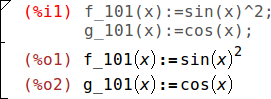

# Руководство пользователя wxMaxima

WxMaxima — графический интерфейс пользователя для системы компьютерной
алгебры (СКА) _Maxima_. WxMaxima позволяет использовать все функции
_Maxima_. А также предоставляет ряд удобных мастеров для работы с наиболее
распространёнными функциями. Данное руководство описывает некоторые из этих
функций, которые делают wxMaxima одним из наиболее популярных графических
интерфейсов для _Maxima_.

{ id=img_wxMaximaLogo }

______________________________________________________________________

# Введение в wxMaxima

## _Maxima_ и wxMaxima

В области открытого программного обеспечения большие системы обычно делятся
на небольшие проекты, которые проще обслуживать небольшим группам
разработчиков. Например, программа записи компакт-дисков будет состоять из
средства командной строки, которое фактически выполняет запись CD, и
графического интерфейса пользователя, позволяющего выполнять запись без
необходимости изучения всех ключей командной строки, как и вообще без
необходимости использования консоли. Одним из преимуществ такого подхода
является возможность применить силы и средства, вложенные в разработку
консольной программы, в работе сразу нескольких программ: Одна и та же
программа записи компакт-дисков может использоваться и в виде модуля
файлового менеджера «Отправить на CD», и в качестве функции музыкального
проигрывателя «Запись на CD», и в качестве программы записи CD в составе
системы резервного копирования DVD. Другим преимуществом такого подхода
является разделение одной большой задачи на меньшие части, позволяющее
разработчикам создавать несколько интерфейсов для одной и той же программы.

Система компьютерной алгебры (СКА) в исполнении _Maxima_ вполне вписывается
в эту парадигму. СКА может выполнять роль логики калькулятора произвольной
точности, либо выполнять автоматические преобразования формул в составе
более крупной системы, например, [Sage](https://www.sagemath.org/)). И при
этом вполне может применяться и в качестве независимой системы. Работать с
_Maxima_ можно в командной строке. Однако часто интерфейс в стиле _wxMaxima_
обеспечивает более эффективную работу с ПО, особенно новичкам.

### _Maxima_

_Maxima_ является полноценной системой компьютерной алгебры (СКА). СКА
представляет собой программу, которая решает математические задачи путём
преобразования формул для нахождения формулы, способной решить заданную
задачу, в противоположность простому выводу числового значения
результата. Иными словами, _Maxima_ может служить в качестве калькулятора,
выводящего числовые представления переменных, и вместе с тем может выдавать
и аналитические решения. Более того, она предлагает ряд числовых методов
анализа для уравнений или систем уравнений, которые не могут быть решены
аналитически.

{
id=img_maxima_screenshot }

Исчерпывающая документация _Maxima_ [доступна в сети
Интернет](https://maxima.sourceforge.io/documentation.html). Часть этой
документации также доступна в меню справки wxMaxima. При нажатии клавиши
Help (на большинстве систем эту функцию выполняет клавиша <kbd>F1</kbd>)
контекстно-зависимая функция справки _wxMaxima_ автоматически переходит на
страницу руководства _Maxima_ с описанием команды, заданной в поле ввода.

### WxMaxima

_WxMaxima_ — это графический интерфейс пользователя, полностью сохраняющий
функциональность и гибкость _Maxima_. WxMaxima предлагает пользователям
графическое отображение наряду с множеством функциональных возможностей,
позволяющих сделать работу с _Maxima_ более простой и приятной. Например,
_wxMaxima_ может экспортировать содержимое любой ячейки (а при необходимости
и любой части формулы) в виде текста в формате LaTeX или MathML одним
щелчком правой клавиши мыши. Это позволяет экспортировать целую книгу либо в
виде HTML-файла, либо в виде файла LaTeX. Документация _wxMaxima_, включая
рабочие книги для иллюстрации аспектов использования программы, доступна
онлайн на [сайте
справки](https://wxMaxima-developers.github.io/wxmaxima/help.html)
_wxMaxima_, а также в меню справки программы.

{ id=img_wxMaximaWindow }

Введённые в _wxMaxima_ вычисления выполняются в фоновом режиме консольной
программой _Maxima_.

## Основная информация о рабочей книге

Большая часть интерфейса _wxMaxima_ интуитивно понятна, но некоторые детали
требуют особенного внимания. [Этот
сайт](https://wxMaxima-developers.github.io/wxmaxima/help.html) содержит
несколько рабочих книг, помогающих разобраться в различных аспектах работы с
_wxMaxima_. Проработка некоторых из них (особенно «_(wx)Maxima_ за 10
минут») позволит лучше ознакомиться как с содержимым _Maxima_, так и с
использованием _wxMaxima_ во взаимодействии с _Maxima_. Это руководство
концентрируется на описании таких аспектов _wxMaxima_, которые не будут
интуитивно понятны, и описание которых может отсутствовать в материалах,
доступных онлайн.

### Метод работы с использованием рабочих книг

Одним из незначительного числа нестандартных подходов, нашедших применение в
_wxMaxima_ является организация данных для работы с _Maxima_ по полям,
которые вычисляются (имеется в виду «отправляются в _Maxima_») только по
требованию пользователя. При вычислении ячейки все команды в этом поле, и
только в этом поле, вычисляются путём пакетной обработки. (Предыдущее
высказывание не совсем точно: Можно выбрать несколько смежных полей для
совместного вычисления. Также _Maxima_ может вычислять сразу все поля в
рабочей книге за один проход.) Принятый в _WxMaxima_ подход к отправке
команд для вычисления на первый взгляд может показаться необычным. Однако он
значительно упрощает работу с большими документами (где пользователь не
хочет, чтобы каждое изменение автоматически запускало полный пересчёт целого
документа). А также данный подход очень удобен для отладки.

При вводе текста _wxMaxima_ автоматически создаёт новое поле рабочего
листа. Тип этого поля можно выбрать в панели инструментов. Если создано поле
кода, то это поле может быть отправлено в _Maxima_, после чего ниже этого
кода выводится результат вычисления. Пара таких команд показана ниже.

{ id=img_InputCell }

При вычислении содержимого, введённого в поле ввода, _Maxima_ назначает
вводу метку (по умолчанию отображается красным и распознаётся по `%i`),
который позволяет адресовать её позднее в сеансе
_wxMaximma_. Сгенерированный в _Maxima_ вывод также получает заголовок,
начинающийся с `%o` и по умолчанию скрыт, если только пользователь не
назначит выводу имя. Тогда заданный пользователем заголовок будет по
умолчанию отображаться. Хотя автоматически создаваемый в _Maxima_ заголовок
в виде `%o` также будет доступен.

Рядом с полями ввода _wxMaxima_ позволяет разместить текстовые поля для
документации, поля изображений, поля заголовков, поля глав и поля
разделов. Каждая ячейка имеет свой собственный буфер отмены действий,
поэтому отладка путём внесения изменения в значения нескольких полей с
последовательной отменой ненужных изменений выполняется несложно. Более
того, рабочий лист также имеет глобальный буфер отмены действий, который
может отменять изменения полей, добавления и удаления.

На рисунке внизу показаны различные типы полей (поля заголовков, поля
разделов, поля подразделов, текстовые поля, поля ввода/вывода и поля
изображений).

{ id=img_cell-example
}

### Поля

Рабочий лист состоит из полей. WxMaxima оперирует следующими их типами:

- Math cells, containing one or more lines of _Maxima_ input.
- Output of, or a question from, _Maxima_.
- Image cells.
- Text cells, that can for example be used for documentation.
- A title, section or a subsection. 6 levels of different headings are
  possible.
- Page breaks.

По умолчанию при вводе текста в _wxMaxima_ автоматически создаётся
математическое поле. Поля других типов можно создавать с помощью меню
«Поле», с помощью указанных в меню сочетаний клавиш или раскрывающегося
списка в панели инструментов. При создании не-математической ячейки любой
текст, введённый в файл, интерпретируется как текст.

[Текст
комментария](https://maxima.sourceforge.io/docs/manual/maxima_singlepage.html#Comments)
(в стиле языка C) может использоваться в математических полях следующим
образом: `/* Этот комментарий будет игнорироваться Maxima */`

«`/*`» указывает начало комментария, «`*/`» указывает его конец.

### Горизонтальный и вертикальный курсоры

Если пользователь пытается выделить предложение полностью, текстовый
процессор будет автоматически пытаться расширить выделение, чтобы оно
начиналось и завершалось на границе слова. Подобным образом при выборе более
одного поля _wxMaxima_ расширяет выделение до целых полей.

Необычной возможностью _wxMaxima_ является гибкость при перетаскивании,
осуществляемая путём определения двух типов курсоров. При необходимости
_WxMaxima_ переключается между ними автоматически:

- The cursor is drawn horizontally if it is moved in the space between two
  cells or by clicking there.
- A vertical cursor that works inside a cell. This cursor is activated by
  moving the cursor inside a cell using the mouse pointer or the cursor keys
  and works much like the cursor in a text editor.

После загрузки wxMaxima отображается только мигающий горизонтальный
курсор. Если начать ввод, автоматически создаётся математическое поле и
курсор принимает обычную вертикальную форму (стрелка вправо играет роль
«приглашения ввода», после вычисления математического поля
(<kbd>CTRL</kbd>+<kbd>ENTER</kbd>), выводятся метки, например, `(%i1)`,
`(%o1)`).

{ id=img_horizontal_cursor_only }

Может потребоваться создание поля другого типа (с помощью меню «Поле»),
например, поля заголовка или текстового поля, в котором будет содержаться
описание назначения работы, выполняемое при создании рабочего листа.

При переходе по различным полям также отображается горизонтальный (мигающий)
курсор в местах, где в рабочий лист можно ввести поле (математическое поле
простым вводом формулы, либо поле другого типа с помощью меню).

{
id=img_horizontal_cursor_between_cells }

### Отправка полей в Maxima

Команда в поле кода исполняется однажды путём нажатия сочетания клавиш
<kbd>CTRL</kbd>+<kbd>ENTER</kbd>, <kbd>SHIFT</kbd>+<kbd>ENTER</kbd> или
клавиши <kbd>ENTER</kbd> на клавиатуре. По умолчанию _wxMaxima_ вводит
команды при нажатии <kbd>CTRL</kbd>+<kbd>ENTER</kbd> или
<kbd>SHIFT</kbd>+<kbd>ENTER</kbd>, но после соответствующей настройки
_wxMaxima_ будет выполнять команды нажатием <kbd>ENTER</kbd>.

### Автодополнение команд

_WxMaxima_ содержит функцию автодополнения, которая включается через меню
(«Поле/Завершить слово»), либо путём нажатия сочетания клавиш
<kbd>CTRL</kbd>+<kbd>SPACE</kbd>. Автодополнение зависит от
контекста. Например, при активации из спецификации модулей для ezUnits будет
предлагаться список применимых модулей.

{ id=img_ezUnits }

Помимо дополнения имени файла, имени модуля, текущей команды или имени
переменной, автодополнение может отображать шаблон большинства команд с
указанием типа (и значения) необходимых для неё параметров. Для включения
этой функции нажмите <kbd>SHIFT</kbd>+<kbd>CTRL</kbd>+<kbd>SPACE</kbd> или
выберите соответствующий элемент меню («Поле/Показать шаблон»).

#### Греческие символы

Компьютеры традиционно хранят символы в 8-разрядных значениях. Это позволяет
создать набор из 256 различных символов. В такой набор можно включить все
буквы, числа и символы управления (конец передачи, конец строки, линии и
углы для рисования прямоугольников меню _и т.д._.) практически любого языка.

Для большинства стран выбранная кодовая страница из 256 символов не включает
дополнительные символы, такие как греческие буквы, хотя они часто
используются в математике. Для преодоления данного ограничения был
разработан [Юникод](https://home.unicode.org/): кодировка, позволяющая
стандартно использовать латиницу, но содержит намного больше 256 символов.

_Maxima_ позволяет использовать Юникод, если она была скомпилирована
компилятором Lisp, который либо поддерживает Юникод, либо не занимается
вопросом кодирования символов. Поскольку из пары представленных условий по
крайней мере одно может оказаться справедливым, _WxMaxima_ поддерживает
метод ввода греческих символов с помощью клавиатуры:

- A Greek letter can be entered by pressing the <kbd>ESC</kbd> key and then
  starting to type the Greek character’s name.
- Alternatively it can be entered by pressing <kbd>ESC</kbd>, one letter (or
  two for the Greek letter omicron) and <kbd>ESC</kbd> again. In this case
  the following letters are supported:

| кл. | Греч. буква  | кл. | Греч. буква  | кл. | Греч. буква  |
| :-: | :----------: | :-: | :----------: | :-: | :----------: |
|  a  |    альфа     |  i  |     йота     |  r  |     ро       |
|  b  |     бета     |  k  |    каппа     |  s  |    сигма     |
|  g  |    гамма     |  l  |    ламбда    |  t  |     тау      |
|  d  |    дельта    |  m  |      мю      |  u  |   ипсилон    |
|  e  |   епсилон    |  n  |      ню      |  f  |     фи       |
|  z  |     дзета    |  x  |      кси     |  c  |     хи     |
|  h  |     эта      | om  |   омикрон    |  y  |     пси      |
|  q  |    тэта      |  p  |      пи      |  o  |    омега     |
|  A  |    Альфа     |  I  |     Йота     |  R  |     Ро       |
|  B  |     Бета     |  K  |    Каппа     |  S  |    Сигма     |
|  G  |    Гамма     |  L  |    Ламбда    |  T  |     Тау      |
|  D  |    Дельта    |  M  |      Мю      |  U  |   Ипсилон    |
|  E  |   Эпсилон    |  N  |      Ню      |  P  |     Фи       |
|  Z  |     Дзета    |  X  |      Кси     |  C  |     Хи       |
|  H  |     Эта      | Om  |   Омикрон    |  Y  |     Пси      |
|  T  |    Тэта     |  P  |      Пи      |  O  |    Омега     |

Для ввода греческих букв также можно воспользоваться боковой панелью
«Греческие буквы».

##### Внимание: Похожие буквы

Несколько букв латиницы схожи с греческими буквами. Например, латинская «A»
и греческая буква «Альфа». Однако, не смотря на кажущееся сходство, они
являются разными символами, и представлены в Юникоде различными кодовыми
точками (числами).

Это может привести к возникновению проблем, если задать значение переменной
A, но впоследствии пытаться использовать греческую букву Альфа для
выполнения каких-либо операций с этой переменной, особенно при печати. Для
греческой буквы Мю (которая может использоваться и в качестве приставки
микро-) также существует две различных кодовых точки Юникода.

Поэтому на боковой панели «Греческие буквы» имеется параметр, позволяющий
сделать схожие буквы недоступными (изменяется в контекстном меню).

Подобный механизм существует для ввода различных математических символов:

| клавиши ввода  | математический символ                                 |
| -------------- | ----------------------------------------------------- |
| hbar           | Постоянная Планка: h с горизонтальной линией сверху |
| Hbar           | H с горизонтальной линией сверху                      |
| 2              | квадрат                                               |
| 3              | куб                                                   |
| /2             | 1/2                                                   |
| partial        | знак частной производной (d в dx/dt)                  |
| integral       | знак интеграла                                        |
| sq             | квадратный корень                                     |
| ii             | мнимая единица                                        |
| ee             | элемент                                               |
| in             | включает                                                    |
| impl implies   | импликация                                            |
| inf            | бесконечность                                         |
| empty          | пустое множество                                      |
| TB             | большой треугольник направо                           |
| tb             | малый треугольник направо                             |
| and            | и                                                     |
| or             | или                                                   |
| xor            | исключающее или                                       |
| nand           | не-и                                                  |
| nor            | не-или                                                |
| equiv          | эквивалентно                                          |
| not            | не                                                    |
| union          | объединение                                           |
| inter          | пересечение                                           |
| subseteq       | подмножество или равно                                |
| subset         | подмножество                                          |
| notsubseteq    | не подмножество или равно                             |
| notsubset      | не подмножество                                       |
| approx         | приблизительно                                        |
| propto         | пропорционально                                       |
| neq != /= or # | не равно                                              |
| +/- or pm      | знак плюс/минус                                       |
| \<= or leq    | меньше или равно                                    |
| >= or geq      | больше или равно                                      |
| \<\< or ll   | намного меньше                                        |
| >> or gg       | намного меньше                                        |
| qed            | конец доказательства                                  |
| nabla          | оператор Лапласа                                      |
| sum            | знак суммы                                            |
| prod           | знак умножения                                        |
| exists         | квантор существования                                 |
| nexists        | квантор несуществования                               |
| parallel       | знак параллельности                                   |
| perp           | знак перпендикулярности                               |
| leadsto        | знак «отсюда следует»                                 |
| ->             | стрелка направо                                       |
| -->            | длинная стрелка направо                               |

Точно также для ввода математических символов можно использовать боковую
панель «Математические символы».

Если специальный символ отсутствует в списке, то произвольный символ Юникода
можно ввести нажатием <kbd>ESC</kbd> \[код символа (шестнадцатеречный)\]
<kbd>ESC</kbd>. С помощью контекстного меню боковой панели «Математические
символы» можно также отобразить список всех доступных символов Юникод,
которые можно добавить на эту панель или в рабочий лист.

Таким образом комбинация
<kbd>ESC</kbd><kbd>6</kbd><kbd>1</kbd><kbd>ESC</kbd> позволяет ввести символ
«a».

Обратите внимание, что большая часть этих символов (заметным исключением
являются логические символы) не имеют специального значения в _Maxima_ и
поэтому будут интерпретироваться как обычные символы. Если _Maxima_
собирается в компиляторе Lisp, не имеющем поддержки символов Юникода, то при
использовании их может быть выведено сообщение об ошибке.

Также может случится, что греческие или математические символы отсутствуют в
выбранном шрифте, в силу чего отображение их будет невозможно. Для решения
проблемы в данном случае необходимо выбрать другие шрифты (с помощью меню:
«Правка -> Настройка -> Стиль»).

### Замена символов Юникода

wxMaxima will replace several Unicode characters with their respective
Maxima expressions, e.g. `²` with `^2`, `³` with `^3`, the square root sign
with the function `sqrt()`, the (mathematical) Sigma sign (which is not the
same Unicode character as the corresponding Greek letter) with `sum()`, etc.

Unicode has several "common" fractions encoded as one Unicode code point:
`¼, ½, ¾, ⅐, ⅑, ⅒, ⅓, ⅔, ⅕, ⅖, ⅗, ⅘, ⅙, ⅚, ⅛, ⅜, ⅝, ⅞`

wxMaxima will replace them with their Maxima representations, e.g `(1/4)`
before the input is sent do Maxima. There are also `⅟`, which will be
replaced by `1/` and `↉` (used in baseball), which will be replaced by
`(0/3)`.

It is recommended to use **Maxima code** (not these Unicode code points) in
input cells (Rationale: (a) it might be possible, that the used font for
math input does not contain them; (b) if you save the document as
`wxm`-file, it is usually readable by (command line) Maxima, but these
changes will of course not work in command line Maxima); but they may occur,
if you cut&paste a formula from another document.


### Боковые панели

Ярлыки для наиболее важных команд _Maxima_, таких как содержание, окна с
отладочными сообщениями или история последних введённых команд, могут
размещаться на боковых панелях. Включаются они с помощью меню «Вид», а также
могут перемещаться в другие места внутри или снаружи окна _wxMaxima_. Другие
полезные панели позволяют вводить греческие буквы с помощью мыши.

{ id=img_SidePanes }

Боковая панель «Содержание» позволяет увеличивать или уменьшать заголовок
путём щелчка по заголовку правой клавишей мыши с последующим выбором
верхнего или нижнего типа заголовка.

{
id=Sidepane-TOC-convert-headings}

### Вывод MathML

Несколько текстовых процессоров и подобных им программ способы распознать
ввод [MathML](https://www.w3.org/Math/) и автоматически вставить его в виде
редактируемого двумерного уравнения, либо (как LibreOffice) имеют редактор
уравнений, позволяющий «импортировать MathML из буфера обмена». Другие
поддерживают RTF maths. Поэтому в контекстном меню _WxMaxima_ содержится
несколько элементов.

### Поддержка Markdown

_WxMaxima_ поддерживает стандартные элементы форматирования
[Markdown](https://en.wikipedia.org/wiki/Markdown), которые не конфликтуют с
математической записью. Одним из таких элементов являются маркированные
списки.

```
Обычный текст
 * Один элемент, уровень отступа 1
 * Другой элемент с уровнем отступа 1
   * Элемент на втором уровне отступа
   * Второй элемента на втором уровне отступа
 * Третий элемент на первом уровне отступа
Обычный текст
```

_WxMaxima_ считает цитатой текст, начинающийся символом `>`:

``` Обычный текст > цитата цитата цитата цитата > цитата цитата цитата
цитата > цитата цитата цитата цитата Обычный текст ```

Вывод _WxMaxima_ в формате TeX и HTML также распознаёт `=>` и заменяет его
на соответствующий символ Юникода:

``` cogito => sum.  ```

Другие символы, которые распознаются при экспорте HTML и TeX: `<=` и `>=`
для сравнений, двойная двухсторонняя стрелка (`<=>`), односторонние стрелки
(`<->`, `->` и `<-`) и `+/-` в качестве соответствующих заков. Для вывода
TeX также распознаются `<<` и `>>`.

### Сочетания клавиш

Большинство сочетаний клавиш можно найти в тексте соответствующих
меню. Поскольку они фактически берутся из текста меню и могут быть
локализованы при переводе _wxMaxima_ для использования клавиатур с
соответствующими локальными настройками, то мы не будем приводить их
здесь. Хотя несколько сочетаний клавиш с их псевдонимами в меню отсутствуют:

- <kbd>CTRL</kbd>+<kbd>SHIFT</kbd>+<kbd>DELETE</kbd> deletes a complete
  cell.
- <kbd>CTRL</kbd>+<kbd>TAB</kbd> or
  <kbd>CTRL</kbd>+<kbd>SHIFT</kbd>+<kbd>TAB</kbd> triggers the
  auto-completion mechanism.
- <kbd>SHIFT</kbd>+<kbd>SPACE</kbd> inserts a non-breaking space.

### Код TeX при экспорте в TeX

Если поле начинается с `TeX:` экспорт TeX будет содержать дословно текст,
который который следует за меткой `TeX:`. Эта функция позволяет вводить
разметку TeX непосредственно в рабочую книгу _wxMaxima_.

## Форматы файлов

Разрабатываемые в сеансе _wxMaxima_ материалы могут сохранятся для
дальнейшего использования одним из трёх способов:

### .mac

Файлы `.mac` представляют собой обычные текстовые файлы, содержащие команды
_Maxima_. Их можно считывать с помощью команд _Maxima_ `batch()` или
`load()`, либо с помощью меню _wxMaxima_ «Файл/Пакетный файл».

Ниже приводится один пример. `Quadratic.mac` определяет функцию, после чего
генерирует график с помощью `wxdraw2d()`. Впоследствии выводится содержимое
файла `Quadratic.mac` и вычисляется вновь определённая функция `f()`.

{ id=img_BatchImage }

Внимание: Не смотря на то, что файл `Quadratic.mac` имеет обычное расширение
_Maxima_ (`.mac`), прочитать его сможет только _wxMaxima_, поскольку команда
`wxdraw2d()` является расширение wxMaxima для _Maxima_. (Командная строка)
Maxima проигнорирует неизвестную команду `wxdraw2d()`, просто продублировав
её имя в выводе.

Файлы `.mac` можно использовать для создания собственной библиотеки
макросов. Но, поскольку они не содержат достаточно информации по структуре,
то не могут быть считаны как сеанс _wxMaxima_.

### .wxm

Файлы `.wxm` содержат рабочий лист, за исключением вывода _Maxima_. В
версиях Maxima >5.38 эти файлы можно читать с помощью функции _Maxima_
`load()` точно также как и файлы .mac. Но неизбежной проблемой этого
текстового формата является несовместимость рабочих листов, использующих
новые функции, со старыми версиями _wxMaxima_.

#### Формат файлов wxm

Это простой текстовый файл (открывается в текстовом редакторе), в котором
содержимое полей хранится в виде специальных комментариев Maxima.

Файл начинается со следующего комментария:

``` /* [wxMaxima batch file version 1] [ DO NOT EDIT BY HAND! ]*/ /* [
Created with wxMaxima version 24.02.2_DevelopmentSnapshot ] */ ```

Затем следуют поля, записанные в виде комментариев Maxima. Например, поле
раздела:

```
/* [wxMaxima: section start ]
Заголовок раздела
   [wxMaxima: section end   ] */
```

или (разумеется, в математическом поле ввод будет *не* закомментирован
(вывод в файле `wxm` не сохраняется)):

```
/* [wxMaxima: input   start ] */
f(x):=x^2+1$
f(2);
/* [wxMaxima: input   end   ] */
```

Изображения [закодированы в Base64](https://en.wikipedia.org/wiki/Base64). В
первой строке находится тип изображения:

```
/* [wxMaxima: image   start ]
jpg
[кажущаяся беспорядочной последовательность символов]
   [wxMaxima: image   end   ] */
```

Разрыв страницы представляет собой одну строку следующего содержания:

```
/* [wxMaxima: page break    ] */
```

При этом для свёрнутых полей используется разметка:

```
/* [wxMaxima: fold    start ] */
...
/* [wxMaxima: fold    end   ] */
```

### .wxmx

Этот файл на основе формата XML сохраняет рабочий лист целиком, включающая
такие параметры, как масштаб отображения и список отслеживания. Этот формат
самый предпочтительный.

#### Формат файлов wxmx

Файл `wxmx` похож на двоичный формат, но работать с ним можно с помощью
базовых инструментов ОС. Это файл zip, который можно разархивировать с
помощью программы `unzip` (рекомендуется переименовать файл, чтобы программа
`unzip` могла распознать его в ОС). При создании файла используется не
функция сжатия, а способность объединять несколько файлов в один -
изображения уже сжаты, а всё остальное представлено простым текстом
(занимает куда меньший объём, чем громадные включаемые изображения).

Содержит следующие файлы:

- `mimetype`: this file does contain the mimetype of wxMaxima files:
  `text/x-wxmathml`
- `format.txt`: a short description about wxMaxima and the wxmx file format
- Images (e.g. png, jpeg): inline plots which were produced in the wxMaxima
  session and included images.
- `content.xml`: a XML document, which contains the various cells of your
  document in XML format.

Таким образом, в случае появления ошибок можно разархивировать документ
wxMaxima (рекомендуется сначала переименовать его в файл `zip`), внести
изменения в файл `content.xml` в текстовом редакторе, либо заменить
сломанное изображение, снова собрать файл zip и заменить расширение `zip` на
`wxmx` - и получаем отредактированный файл `wxmx`.

## Параметры конфигурации

Для некоторых общих переменных конфигурации _wxMaxima_ обеспечивает два вида
установки параметров конфигурации:

- The configuration dialog box below lets you change their default values
  for the current and subsequent sessions.
- Also, the values for most configuration variables can be changed for the
  current session only by overwriting their values from the worksheet, as
  shown below.

{
id=img_wxMaxima_configuration_001 }

### Частота кадров анимации по умолчанию

Значение частоты кадров анимации, использующееся при создании новых
анимаций, содержится в переменной `wxanimate_framerate`. Начальное значение
этой переменной, которое будет содержаться в новом рабочем листе, можно
изменить в диалоговом окне настройки параметров конфигурации.

### Размер графика по умолчанию для новых сеансов _maxima_

Начиная со следующего запуска, указанный размер будет использоваться для
создания графиков, встраиваемых в рабочий лист, если значение параметра
`wxplot_size` не изменялось _maxima_.

Чтобы задать размер одного графика используйте следующую запись при
установке значения переменной для одной команды:

```maxima
wxdraw2d(
   explicit(
       x^2,
       x,-5,5
   )
), wxplot_size=[480,480]$
```

### Создание парных скобок в текстовых элементах управления

Этот параметр активирует сразу две функции:

- If an opening parenthesis, bracket, or double quote is entered _wxMaxima_
  will insert a closing one after it.
- If text is selected if any of these keys is pressed the selected text will
  be put between the matched signs.

### Не сохраняйте рабочий лист автоматически

При включении этого параметра файл с рабочим листом перезаписывается только
по требованию пользователя. В случае сбоя/отключении питания/... свежая
резервная копия остаётся доступной во временном каталоге.

Если этот параметр не включён, работа _wxMaxima_ больше напоминает
современное приложение сотового телефона:

- Files are saved automatically on exit
- And the file will automatically be saved every 3 minutes.

### Где сохраняется конфигурация параметров?

При использовании Unix/Linux параметры конфигурации сохраняются в домашнем
каталоге в файле `.wxMaxima` (если используется wxWidgets \< 3.1.1) или в
`.config/wxMaxima.conf` ((XDG-Standard), если используется wxWidgets >=
3.1.1). Версию wxWidgets можно посмотреть с помощью команды
`wxbuild_info();` или в меню «Справка->О
программе». [wxWidgets](https://www.wxwidgets.org/) представляет собой
кросс-платформенную библиотеку пользовательского интерфейса, на которой
основан интерфейс _wxMaxima_ (отсюда `wx` в имени).  (Поскольку имя файла
начинается с точки, `.wxMaxima` или `.config` будут скрытыми файлами).

При использовании Windows параметры конфигурации будут храниться в
реестре. Записи _wxMaxima_ в реестре будут храниться на следующем месте:
`HKEY_CURRENT_USER\Software\wxMaxima`

______________________________________________________________________

# Расширения _Maxima_

_WxMaxima_ является прежде всего графическим интерфейсом _Maxima_. В этом
качестве её главной целью является передача команд _Maxima_ и получение
результатов выполнения этих команд. Однако в некоторых случаях _wxMaxima_
позволяет дополнить функциональные возможности _Maxima_. Уже упоминалась
способность _WxMaxima_ генерировать отчёты путём экспорта содержимого
рабочей книги в файлы HTML и LaTeX. Этот раздел описывает способы, которые
использует _wxMaxima_ для усовершенствования использования графики в сеансе.

## Переменные в нижнем регистре

Параметр `wxsubscripts` указывает, если (и как) _wxMaxima_ будет
автоматически переводить в нижний регистр имена переменных:

При значении `false` функциональная возможность отключена и wxMaxima не
будет автоматически переводить в нижний регистр часть имён переменных после
символа подчёркивания.

При значении `'all` весь текст после символа подчёркивания будет
переводиться в нижний регистр.

При значении `true` имена переменных отображаются в формате `x_y` в нижнем
регистре, если

- Either `x` or `y` is a single letter or
- `y` is an integer (can include more than one character).

{ id=img_wxsubscripts }

Если имя переменной не соответствует этим требованиям, её всё равно можно
объявить в качестве «переводимой в нижний регистр» с помощью команды
`wxdeclare_subscript(variable_name);` или
`wxdeclare_subscript([variable_name1,variable_name2,...]);` Объявление
переменной, в качестве переводимой в нижний регистр, можно обратить с
помощью команды: `wxdeclare_subscript(variable_name,false);`

Для установки этих значений можно воспользоваться меню «Вид->Автоперевод в
нижний индекс».

## Информация в строке состояния

Долго работающие команды могут выводить информацию в строку состояния. Новая
информация последовательно заменяет размещённую там старую (позволяя
использовать строку состояния в качестве индикатора выполнения) и удаляется
сразу по завершении выполнения отправленной в _Maxima_ текущей
команды. Безопасно использовать `wxstatusbar()` можно даже в библиотеках,
использующих только команды _Maxima_ (в противоположность _wxMaxima_): При
отсутствии _wxMaxima_ команда `wxstatusbar()` просто не будет выполняться.

```maxima
for i:1 thru 10 do (
    /* Визуализация процесса выполнения */
    wxstatusbar(concat("Pass ",i)),
    /* (sleep n) — функция Lisp, которая может */
    /* предваряться символом "?". Она откладывает */
    /* выполнение программы (здесь: на 3 секунды) */
    ?sleep(3)
)$
```

## Построение графиков

Построение графиков (в основном связано с графической системой) необходимо
предполагает, что графический интерфейс пользователя обеспечит здесь ряд
расширений к исходной программе.

### Включение графиков в рабочий лист

Обычно _Maxima_ использует внешнюю программу _Gnuplot_, которая открывает
отдельное окно для каждого создаваемого графика. Поскольку во многих случаях
удобнее вставлять графики в рабочий лист, _wxMaxima_ предлагает вместо этого
собственный набор графических функций, которые ничем не отличаются от
соответствующих функций _maxima_, за исключением имени: Все они имеют
префикс “wx”.

Следующие графические функции имеют wx-аналоги:

|Графические функции wxMaxima| Графические функции Maxima                                                                          |
| ------------------------ | ----------------------------------------------------------------------------------------------- |
| `wxplot2d()`             | [plot2d](https://maxima.sourceforge.io/docs/manual/maxima_singlepage.html#plot2d)               |
| `wxplot3d()`             | [plot3d](https://maxima.sourceforge.io/docs/manual/maxima_singlepage.html#plot3d)               |
| `wxdraw2d()`             | [draw2d](https://maxima.sourceforge.io/docs/manual/maxima_singlepage.html#draw2d)               |
| `wxdraw3d()`             | [draw2d](https://maxima.sourceforge.io/docs/manual/maxima_singlepage.html#draw3d)               |
| `wxdraw()`               | [draw](https://maxima.sourceforge.io/docs/manual/maxima_singlepage.html#draw)                   |
| `wximplicit_plot()`      | [implicit_plot](https://maxima.sourceforge.io/docs/manual/maxima_singlepage.html#implicit_plot) |
| `wxhistogram()`          | [histogram](https://maxima.sourceforge.io/docs/manual/maxima_singlepage.html#histogram)         |
| `wxscatterplot()`        | [scatterplot](https://maxima.sourceforge.io/docs/manual/maxima_singlepage.html#scatterplot)     |
| `wxbarsplot()`           | [barsplot](https://maxima.sourceforge.io/docs/manual/maxima_singlepage.html#barsplot)           |
| `wxpiechart()`           | [piechart](https://maxima.sourceforge.io/docs/manual/maxima_singlepage.html#piechart)           |
| `wxboxplot()`            | [boxplot](https://maxima.sourceforge.io/docs/manual/maxima_singlepage.html#boxplot)             |

Если Maxima прочитает файл `wxm` (в консоли), то эти функции игнорируются
(печатаются в выводе, как и другие неизвестные функции в Maxima).

If you got problems with one of these functions, please check, if the
problem exists in the the Maxima function too (e.g. you got an error with
`wxplot2d()`, check the same plot in the Maxima command `plot2d()` (which
opens the plot in a separate Window)). If the problem does not disappear, it
is most likely a Maxima issue and should be reported in the [Maxima
bugtracker](https://sourceforge.net/p/maxima/bugs/). Or maybe a Gnuplot
issue.

### Увеличение или уменьшение вложенных графиков

Как указано выше, диалоговое окно настройки конфигурации позволяет изменять
размер по умолчанию для создаваемых графиков, устанавливая начальное
значение параметра `wxplot_size`. Графические процедуры _wxMaxima_
используют эту переменную для получения размера графика в пикселах. Этот
размер всегда можно запросить или использовать для установки размера
последующих графиков:

```maxima
wxplot_size:[1200,800]$
wxdraw2d(
    explicit(
        sin(x),
        x,1,10
    )
)$
```

Если изменить размер необходимо только у одного графика, _Maxima_
обеспечивает канонический путь изменения атрибута только для текущего
поля. В этом случае строка установки параметра `wxplot_size = [value1,
value2]` присоединяется к команде `wxdraw2d( )`, и не является частью
команды `wxdraw2d`.

```maxima
wxdraw2d(
    explicit(
        sin(x),
        x,1,10
    )
),wxplot_size=[1600,800]$
```

Установка размера встроенного графика с помощью параметра `wxplot_size`
работает для встроенного графика при использовании команд `wxplot`,
`wxdraw`, `wxcontour_plot` и `wximplicit_plot`, а также для встроенных
анимаций при использовании команд `with_slider_draw` и `wxanimate`.

### Улучшение качества графиков

По всей видимости в _Gnuplot_ не реализован универсальный способ определения
наличия поддержки вывода растрового изображения в улучшенном качестве,
реализуемый библиотекой Cairo. На системах, где _Gnuplot_ скомпилирован с
поддержкой этой библиотеки, параметр pngCairo в меню настройки конфигурации
(может быть перезаписана с помощью переменной `wxplot_pngcairo`) включает
поддержку сглаживания и дополнительные стили линий. Если включить параметр
`wxplot_pngCairo` на системах без поддержки _Gnuplot_, то вместо
графического изображения будут получены сообщения об ошибке.

### Открытие встроенных графиков в интерактивных окнах _Gnuplot_

Если график был создан с помощью команд типа `wxdraw` (`wxplot2d` и
`wxplot3d` в этой функции не поддерживаются) и размер файла основного
проекта _Gnuplot_ не слишком высок, то можно использовать контекстное меню
_wxMaxima_, которое позволяет открыть график в интерактивном окне _Gnuplot_.

### Открытие командной строки Gnuplot в окне `plot`

В MS Windows существует две программы Gnuplot: `gnuplot.exe` и
`wgnuplot.exe`. Выбрать ту из них, которая будет использоваться, можно в
меню настройки конфигурации. При этом `wgnuplot.exe` позволяет открыть окно
командной строки для ввода команд _gnuplot_, а `gnuplot.exe` такой
возможности не предоставляет. К сожалению, `wgnuplot.exe` позволяет
_Gnuplot_ на некоторое время «захватывать» фокус клавиатуры каждый раз при
подготовке графика.

### Вставка анимаций в электронную таблицу

Трёхмерные графики затрудняют чтение количественных данных. В качестве
возможной альтернативы можно назначить третий параметр колёсику
мыши. Команда `with_slider_draw` является версией команды `wxdraw2d`,
позволяющей подготовить несколько графиков и переключаться между ними путём
перемещения движка в верхней части экрана. _WxMaxima_ позволяет
экспортировать эту анимацию в виде анимированного файла gif.

Первые два аргумента команды `with_slider_draw` представляют собой имя
переменной, значение которой пошагово изменяется в графиках, и список этих
значений. За ними следуют обычные аргументы для `wxdraw2d`:

```maxima
with_slider_draw(
    f,[1,2,3,4,5,6,7,10],
    title=concat("f=",f,"Hz"),
    explicit(
        sin(2*%pi*f*x),
        x,0,1
    ),grid=true
);
```

Аналогичный функционал для трёхмерных графиков доступен при использовании
команды `with_slider_draw3d`, которая позволяет вращать трёхмерные графики:

```maxima
wxanimate_autoplay:true;
wxanimate_framerate:20;
with_slider_draw3d(
    α,makelist(i,i,1,360,3),
    title=sconcat("α=",α),
    surface_hide=true,
    contour=both,
    view=[60,α],
    explicit(
        sin(x)*sin(y),
        x,-π,π,
        y,-π,π
    )
)$
```

Если ключевым моментом является общая форма графика, то небольшого смещения
графика может быть достаточно, чтобы сделать его трёхмерную природу
интуитивно узнаваемой:

```maxima
wxanimate_autoplay:true;
wxanimate_framerate:20;
with_slider_draw3d(
    t,makelist(i,i,0,2*π,.05*π),
    title=sconcat("α=",α),
    surface_hide=true,
    contour=both,
    view=[60,30+5*sin(t)],
    explicit(
        sin(x)*y^2,
        x,-2*π,2*π,
        y,-2*π,2*π
    )
)$
```

Для тех, кто лучше знаком с `plot`, чем с `draw`, имеется другой набор
функций:

- `with_slider` and
- `wxanimate`.

Обычно анимации воспроизводятся или экспортируются с частотой кадров,
заданной в конфигурации _wxMaxima_. Для установки скорости воспроизведения
отдельным анимациям можно воспользоваться параметром `wxanimate_framerate`:

```maxima
wxanimate(a, 10,
    sin(a*x), [x,-5,5]), wxanimate_framerate=6$
```

Функции анимации используют команду _Maxima_ `makelist` и подвержены тем же
недостаткам, в связи с которыми значение переменной движка передаётся в
выражение только когда переменная непосредственно видима в
выражении. Поэтому следующий ниже пример вызовет появление ошибки:

```maxima
f:sin(a*x);
with_slider_draw(
    a,makelist(i/2,i,1,10),
    title=concat("a=",float(a)),
    grid=true,
    explicit(f,x,0,10)
)$
```

Но при отправке _Maxima_ явного запроса на передачу значения движка,
построение графиков работает прекрасно:

```maxima
f:sin(a*x);
with_slider_draw(
    b,makelist(i/2,i,1,10),
    title=concat("a=",float(b)),
    grid=true,
    explicit(
        subst(a=b,f),
        x,0,10
    )
)$
```

### Одновременное открытие нескольких графиков в нескольких окнах

Эта функция _Maxima_ (на системах, которые её поддерживают) не реализована в
_wxMaxima_, но иногда может быть очень удобной. Следующий пример взят из
письма, которое Mario Rodriguez отправил в рассылку _Maxima_:

```maxima load(draw);

/* Парабола в окне #1 */ draw2d(terminal=[wxt,1],explicit(x^2,x,-1,1));

/* Парабола в окне #2 */ draw2d(terminal=[wxt,2],explicit(x^2,x,-1,1));

/* Парабола в окне #3 */
draw3d(terminal=[wxt,3],explicit(x^2+y^2,x,-1,1,y,-1,1)); ```

Также возможно создание нескольких графиков в одном окне (то же самое
возможно в командной строке Maxima при использовании стандартной команды
`draw()`):

```maxima
wxdraw(
  gr2d(
    key="sin (x)",grid=[2,2],
    explicit(sin(x),x,0,2*%pi)),
  gr2d(
    key="cos (x)",grid=[2,2],
    explicit(cos(x),x,0,2*%pi))
);
```

### Боковая панель «График с помощью Draw»

Боковая панель «График с помощью Draw» работает как простой генератор кода,
который позволяет создавать сцены, использующие гибкие возможности пакета
_draw_, поставляемого с _maxima_.

#### Двумерный график

Генерирует основную конструкцию команды `draw()`, которая рисует двумерную
сцену. Эту сцену далее необходимо заполнить командами, формирующими её
наполнение, например, с помощью кнопок в строке под кнопкой «2D».

Одной из полезных функций кнопки «2D» является возможность задать сцену в
виде анимации, где переменная (по умолчанию используется _t_) имеет разное
значение в каждом кадре: Часто бывает проще понять анимированный двумерный
график, чем те же самые данные в неподвижной трёхмерной сцене.

#### Трёхмерный график

Генерирует основную конструкцию команды `draw()`, которая рисует трёхмерную
сцену. Если ни двумерная, ни трёхмерная сцена не заданы, при нажатии всех
остальных кнопок создаётся двумерная сцена, содержащая генерируемую кнопкой
команду.

#### Выражение

Добавляет стандартный график выражения, подобного `sin(x)`, `x*sin(x)` или
`x^2+2*x-4`, в команду `draw()`, в которой в данный момент находится
курсор. Если команда draw отсутствует, то будет создана двумерная
сцена. Каждая сцена может быть заполнена любым количеством графиков.

#### График неявной функции

Пытается найти все точки, для которых истинны выражения, подобные
`y=sin(x)`, `y*sin(x)=3` или `x^2+y^2=4`, и помещает итоговую кривую в
команду `draw()`, в которой в данный момент находится курсор. Если команда
draw отсутствует, то будет создана двухмерная сцена.

#### График параметрической функции

Проводит переменную по шагам от нижнего до верхнего предела с использованием
двух выражений, подобных `t*sin(t)` и `t*cos(t)`, для генерации координат x,
y (а в трёхмерных графиках ещё и z) для кривой, заданной в текущей команде
draw.

#### Точки

Рисует несколько точек, которые при необходимости можно
соединить. Координаты точек берутся из списка списков, двумерного массива,
либо из одного списка или массива для каждой оси.

#### Заголовок диаграммы

Рисует заголовок в верхней части диаграммы,

#### Ось

Задаёт ось.

#### Контур

(Только для трёхмерных графиков): Добавляет отображение контурных линий,
подобных изображаемым на картах гор, в команды создания графиков, которые
следуют за текущей командой `draw()`, и/или на нижнюю плоскость
графика. Данный мастер также позволяет полностью исключить начертание
кривых, оставляя на графике только контуры.

#### Имя графика

Добавляет запись с отображением имени следующего графика к легенде
диаграммы. Пустое имя отключает формирование легенды для последующих
графиков.

#### Цвет линии

Задаёт цвет линии для последующих графиков, содержащихся в составе текущей
команды draw.

#### Цвет заполнения

Задаёт цвет заполнения для последующих графиков, передаваемых в составе
команды draw.

#### Сетка

Выводит мастер, позволяющий задать линии сетки.

#### Точность

Позволяет выбрать приемлемое значение компромисса между скоростью и
точностью, являющейся неотъемлемой частью любой программы формирования
графиков.

### Modify font and font size for plots

Размер шрифта по умолчанию может оказаться слишком маленьким, особенно при
использовании мониторов с высоким разрешением. Для команд на основе `draw`
установка шрифта / размера шрифта выполняется с помощью таких параметров,
как `font=...`, `font_size=...`, и подобных им:

~~~maxima
wxdraw2d(
     font="Helvetica",
     font_size=30,
     explicit(sin(x),x,1,10));
~~~

Для команд построения диаграмм (например, `wxplot2d`, `wxplot3d`) размеры
шрифтов и шрифты можно задавать с помощью команды `gnuplot_preamble`,
например:

~~~maxima
wxplot2d(sin(x),[x,1,10],
         [gnuplot_preamble, "set tics font \"Arial, 30\"; set xlabel font \",20\"; set ylabel font \",20\";"]);
~~~

Это позволяет в качестве шрифта для чисел установить Arial с размером 30,
размер шрифта для xlabel и ylabel будет 20 (с шрифтом по умолчанию).

Изучите документацию Maxima и Gnuplot для получения более подробной
информации. Примечание: Известно о наличии у Gnuplot проблем с шрифтами
большого размера, см. [wxMaxima issue
1966](https://github.com/wxMaxima-developers/wxmaxima/issues/1966).

## Встраивание графики

При использовании формата файла `.wxmx` встраивание графики в проект
_wxMaxima_ выполняется простым перетаскиванием. Но иногда (например, если
содержимое изображения может измениться позднее во время сеанса) лучше
задать загрузку файла изображения после проведения вычислений:

```maxima show_image("man.png"); ```

## Файлы запуска

В диалоговом окне настройки конфигурации _wxMaxima_ позволяет внести
изменения в два файла с командами, которые запускаются при загрузке:

- A file that contains commands that are executed on starting up _Maxima_:
  `maxima-init.mac`
- one file of additional commands that are executed if _wxMaxima_ is
  starting _Maxima_: `wxmaxima-init.mac`

Например, если Gnuplot установлен в `/opt` (может быть на MacOS), в эти
файлы можно добавить`gnuplot_command:"/opt/local/bin/gnuplot"$` (либо
`/opt/gnuplot/bin/gnuplot` или любой другой путь).

Эти файлы находятся в каталоге пользователя Maxima (обычно
`%USERPROFILE%/maxima` в Windows, либо в `$HOME/.maxima`). Местоположение
можно выяснить с помощью команды: `maxima_userdir;`

## Специальные переменные wx…

- `wxsubscripts` tells _Maxima_ if it should convert variable names that
  contain an underscore (`R_150` or the like) into subscripted
  variables. See `wxdeclare_subscript` for details which variable names are
  automatically converted.
- `wxfilename`: This variable contains the name of the file currently opened
  in _wxMaxima_.
- `wxdirname`: This variable contains the name the directory, in which the
  file currently opened in _wxMaxima_ is.
- `wxplot_pngcairo` tells whether _wxMaxima_ tries to use _Gnuplot_’s
  pngcairo terminal that provides more line styles and a better overall
  graphics quality.
- `wxplot_size` defines the resolution of embedded plots.
- `wxchangedir`: On most operating systems _wxMaxima_ automatically sets
  _Maxima_’s working directory to the directory of the current file. This
  allows file I/O (e.g. by `read_matrix`) to work without specifying the
  whole path to the file that has to be read or written. On Windows this
  feature sometimes causes error messages and therefore can be set to
  `false` from the config dialogue.
- `wxanimate_framerate`: The number of frames per second the following
  animations have to be played back with.
- `wxanimate_autoplay`: Automatically play animations by default?
- `wxmaximaversion`: Returns the version number of _wxMaxima_.
- `wxwidgetsversion`: Returns the wxWidgets version _wxMaxima_ is using.

## Структурный вывод двухмерных данных

Функция `table_form()` отображает двумерный список в более удобочитаемой
форме, нежели при стандартном выводе процедуры _Maxima_. Ввод осуществляется
в виде списка одного или нескольких списков. Как и команда «print», данная
команда отображает вывод, даже когда завершается символом
доллара. Завершение команды символом точки с запятой приводит к выводу такой
же таблицы вместе с сообщением «done».

```maxima
table_form(
    [
        [1,2],
        [3,4]
    ]
)$
```

Согласно примеру, представленному ниже, списки, собранные командой
`table_form`, могут создаваться до выполнения команды.

{
id=img_MatrixTableExample }

Также, поскольку матрица является списком списков, матрицы могут схожим
образом преобразовываться в таблицы.

{
id=img_SecondTableExample }

## Отчёты об ошибках

_WxMaxima_ содержит новые функции, которые собирают информацию о текущей
системе для формирования отчёта об ошибках:

- `wxbuild_info()` gathers information about the currently running version
  of _wxMaxima_
- `wxbug_report()` tells how and where to file bugs


## Выделение вывода красным цветом

Команда _Maxima_ `box()` вызывает вывод аргументов _wxMaxima_ с выделением
красным цветом, если второй аргумент команды содержит текст `highlight`.

## Output rendering.

With `set_display()` one can set, how wxMaxima will render the output.

`set_display('xml)` is the default value. Here Maxima speaks to wxMaxima
using an (machine readable) XML-dialect (can be seen in the "Raw XML
sidebar") and outputs the resulting formulas nicely rendered, e.g. pretty
Matrices, Square root signs, fractions, etc.

<!--- Currently that does not work as it should, the line with the output
label is shifted right (issue: #2006) --> `set_display('ascii)` causes
wxMaxima to output formulas as in command line Maxima - as ASCII-Art.

`set_display('none)` causes 'one-line' ASCII results - the same as the
command line Maxima command `display2d:false;` does.

# Меню справки

Меню справки WxMaxima предоставляет доступ к руководству, подсказкам и
некоторым примерам рабочих листов Maxima и wxMaxima, а также к демонстрациям
в командной строке Maxima (команда `demo()`).

Обратите внимание на вывод демонстраций:

~~~ При выводе приглашения в виде ’_’ введите ’;’ и нажмите <enter> для
продолжения демонстрации.  ~~~

Это работает в командной строке Maxima, но в wxMaxima для продолжения
демонстрации необходимо использовать сочетания клавиш:
<kbd>CTRL</kbd>+<kbd>ENTER</kbd>

(Это можно настроить в меню «Настройка->Worksheet->Hotkeys for sending
commands to Maxima».)

______________________________________________________________________

# Устранение неполадок

## Не удаётся установить соединение с _Maxima_

_Maxima_ (программа, которая фактически выполняет математические расчёты) и
_wxMaxima_ (обеспечивает работу удобного пользовательского интерфейса)
представляют собой отдельные программы, которые общаются посредством
локальной вычислительной сети. Поэтому наиболее вероятной причиной проблемы
могут быть сбои в работе соединения. Например, межсетевой экран может быть
настроен таким образом, что не только предотвращает несанкционированные
соединения, поступающие из сети Интернет (а возможно и некоторые соединения
в обратном направлении), но также блокирует взаимодействие между процессами
на одном и том же компьютере. Поскольку _Maxima_ работает на процессоре
Lisp, блокируемые процессы не обязательно будут носить имя «maxima». Для
открытия сетевых соединений обычно используются программы: sbcl, gcl, ccl,
lisp.exe или подобные им.

На компьютерах с Unix другой возможной причиной может быть неправильная
конфигурация закольцованной сети, обеспечивающей сетевое соединение между
двумя программами на одном компьютере.

## Как сохранить данные из повреждённого файла .wxmx

Большинство современных форматов на основе XML представляют собой обычные
zip-файлы. _WxMaxima_ не использует функцию сжатия, поэтому содержимое
файлов `.wxmx` можно просматривать в текстовом редакторе.

Если сигнатура в конце zip-файла после переименования повреждённого файла
`.wxmx` в `.zip` остаётся нетронутой, то большинство операционных систем
смогут обеспечить извлечение любой части находящихся в нём данных. Это может
быть сделано при необходимости восстановления исходных файлов изображений из
текстового документа. И даже повреждение сигнатуры zip файла не означает,
что всё потеряно: Если во время сохранения _wxMaxima_ возникли проблемы, то
остаётся файл `.wxmx~`, содержимое которого может оказаться полезным.

И даже если этого файла нет: Формат файла `.wxmx` представляет собой
контейнер, содержимое XML в котором хранится без сжатия. Можно переименовать
файл `.wxmx` в файл `.txt` и с помощью текстового редактора восстановить
XML-содержимое файла (которое начинается со строки `<?xml version="1.0"
encoding="UTF-8"?>` и завершается строкой `</wxMaximaDocument>`. До и после
этих строк в текстовом редакторе располагается нечитаемый двоичный код).

Если извлечь это содержимое (например, скопировать и вставить этот текст в
новый файл) и сохранить отдельно в текстовый файл с расширением `.xml`, то
_wxMaxima_ сможет восстановить текст из этого документа.

## Требуется вывод отладочной информации на экран до завершения работы
команды

Обычно _wxMaxima_ начинает вёрстку только после полной передачи двумерной
формулы. Это сделано, чтобы не тратить время на выполнение нескольких
попыток вёрстки частично завершённого уравнения. При этом существует команда
`disp`, которая обеспечивает непосредственный вывод отладочной информации
без ожидания завершения работы текущей команды _Maxima_:

```maxima
for i:1 thru 10 do (
   disp(i),
   /* (sleep n) функция Lisp, которой должно предшествовать */
   /* указание символа "?". Она откладывает исполнение */
   /* программы (здесь: на 3 секунды) */
   ?sleep(3)
)$
```

С другой стороны, можно рассмотреть использование представленной выше
команды `wxstatusbar()`.

## Функция построения графика показывает только закрытый пустой конверт с
сообщением об ошибке

Это означает, что _wxMaxima_ не смогла прочитать файл _Maxima_, который
должен содержать данные для создания графика с помощью _Gnuplot_.

Возможные причины ошибки:

- The plotting command is part of a third-party package like `implicit_plot`
  but this package was not loaded by _Maxima_’s `load()` command before
  trying to plot.
- _Maxima_ tried to do something the currently installed version of
  _Gnuplot_ isn’t able to understand. In this case, a file ending in
  `.gnuplot` located in the directory, which _Maxima_’s variable
  `maxima_userdir` is pointing, contains the instructions from _Maxima_ to
  _Gnuplot_. Most of the time, this file’s contents therefore are helpful
  when debugging the problem.
- Gnuplot was instructed to use the pngCairo library that provides
  antialiasing and additional line styles, but it was not compiled to
  support this possibility. Solution: Uncheck the "Use the Cairo terminal
  for the plot" checkbox in the configuration dialog and don’t set
  `wxplot_pngcairo` to true from _Maxima_.
- Gnuplot didn’t output a valid `.png` file.

## При создании анимации выводится ошибка «error: undefined variable»

По умолчанию значение переменной движка передаётся в выражение, которое
печатается только когда оно видимо на графике. Проблему решает использование
команды `subst`, которая передаёт переменную движка в уравнение для
формирования графика. В завершении раздела [Вставка анимаций в электронную
таблицу](#embedding-animations-into-the-spreadsheet), имеется
соответствующий пример.

## Содержимое поля потеряно и отмена действия не может помочь в его
восстановлении

Операции с полями и изменением их содержимого имеют свои отдельные функции
отмены действий. Поэтому возникновение такой ситуации крайне
маловероятно. Если же это случилось, то имеется несколько способов
восстановления данных:

- _WxMaxima_ actually has two undo features: The global undo buffer that is
  active if no cell is selected and a per-cell undo buffer that is active if
  the cursor is inside a cell. It is worth trying to use both undo options
  in order to see if an old value can still be accessed.
- If you still have a way to find out what label _Maxima_ has assigned to
  the cell just type in the cell’s label and its contents will reappear.
- If you don’t: Don’t panic. In the “View” menu there is a way to show a
  history pane that shows all _Maxima_ commands that have been issued
  recently.
- If nothing else helps _Maxima_ contains a replay feature:

```maxima playback(); ```

## _WxMaxima_ запускается с выводом сообщения «Процесс Maxima неожиданно
завершился.»

Одна возможная причина заключается в том, что _Maxima_ не может быть найдена
в расположении, которое задано на вкладке «Maxima» диалогового окна
параметров конфигурации _wxMaxima_ и поэтому не может запуститься в
принципе. Проблема решается указанием пути к рабочему исполняемому файлу
_Maxima_.

## Maxima слишком долго выполняет вычисление и не отвечает на ввод

Теоретически возможно, что _wxMaxima_ не подозревает о том, что _Maxima_ уже
завершила вычисление, и поэтому не получает уведомление о том, что пора
отправлять новые данные для _Maxima_. Если дело в этом, то “Trigger
evaluation” может помочь повторно синхронизировать две программы.

## При работе _Maxima_ на основе SBCL заканчивается свободная память

Компилятор Lisp SBCL по умолчанию поставляется с ограничением памяти,
которое позволяет работать даже на очень слабых компьютерах. В процессе
компилирования такого большого программного пакета, как Lapack, или при
работе с бесконечно большими списками уравнений этот лимит может оказаться
слишком низким. Для увеличения этого ограничения, SBCL можно запустить с
параметром командной строки `--dynamic-space-size`, который указывает SBCL
сколько мегабайт нужно резервировать. SBCL для 32-разрядной версии Windows
может резервировать до 999 Мегабайт. 64-разрядная версия SBCL для Windows
может резервировать более 1280 Мегабайт, необходимых для компилирования
Lapack.

Единственная возможность указать параметры командной строки для _Maxima_ (а
значит и для SBCL), это использовать поле «Additional parameters for Maxima»
в диалоговом окне настройки параметров конфигурации _wxMaxima_.

{ id=img_sbclMemory }

## Иногда ввод бывает медленным/игнорирует нажатия клавиш на Ubuntu

Установка пакета `ibus-gtk` должна решить этот вопрос. Более подробную
информацию см. на
([https://bugs.launchpad.net/ubuntu/+source/wxwidgets3.0/+bug/1421558](https://bugs.launchpad.net/ubuntu/+source/wxwidgets3.0/+bug/1421558)).

## _WxMaxima_ зависает, когда _Maxima_ обрабатывает греческие символы или
умляуты

Если версия _Maxima_ основана на SBCL, то в `.sbclrc` необходимо добавить
следующие строки:

```commonlisp (setf sb-impl::*default-external-format* :utf-8)  ```

Папка, где размещается этот файл зависит от конкретной системы и
установки. Но любая версия _Maxima_ на основе SBCL, у которой в текущем
сеансе уже производилось вычисление поля, всегда укажет его местонахождение
после получения следующей команды:

``` :lisp (sb-impl::userinit-pathname)  ```

## Примечание касательно Wayland (свежие дистрибутивы Linux/BSD)

Возможны проблемы с работой протокола графического сервера Wayland и
wxWidgets. На WxMaxima также могут возникнуть проблемы, например, могут
перестать двигаться боковые панели.

Можно либо отключить Wayland и использовать вместо него X11 (глобально),
либо просто указать, что wxMaxima должна использовать X Window System,
установкой параметра: `GDK_BACKEND=x11`

Например, запустить wxMaxima с параметром:

`GDK_BACKEND=x11 wxmaxima`

## Почему встроенный браузер руководства отсутствует на ПК с Windows?

Либо wxWidgets был скомпилирован без поддержки Microsoft’s webview2, либо не
установлен Microsoft’s webview2.

## Почему внешний браузер руководства не работает на Linux?

Браузер HTML может быть реализован в виде версии пакета snap, flatpack или
appimage. Все они обычно не имеют доступа к файлам, установленным локально в
системе. Другая причина может заключаться в том, что maxima или wxMaxima
установлена в виде версии пакета snap, flatpack или ещё чего-то, что не
предоставляет доступа к содержимому операционной системы. Третьей причиной
может быть то, что HTML-руководство maxima локально не установлено, а
получить доступ к руководству онлайн не получается.

## Можно ли сделать вывод _wxMaxima_ одновременно в виде файлов изображений
и встроенных в документ графиков?

В рабочий лист встраиваются .png-файлы. _WxMaxima_ позволяет пользователю
указать где они должны генерироваться:

```maxima
wxdraw2d(
    file_name="test",  /* автоматически добавляется расширение .png */
    explicit(sin(x),x,1,10)
);
```

Если необходимо использовать другой формат, то проще сначала сгенерировать
изображения, а затем снова импортировать их в рабочий лист:

```maxima
load("draw");
pngdraw(name,[contents]):=
(
    draw(
        append(
            [
                terminal=pngcairo,
                dimensions=wxplot_size,
                file_name=name
            ],
            contents
        )
    ),
    show_image(printf(false,"~a.png",name))
);
pngdraw2d(name,[contents]):=
    pngdraw(name,gr2d(contents));

pngdraw2d("Test",
        explicit(sin(x),x,1,10)
);
```

## Как узнать соотношение сторон встроенного графика?

С помощью переменной `wxplot_size`:

```maxima
wxdraw2d(
    explicit(sin(x),x,1,10)
),wxplot_size=[1000,1000];
```

## После обновления до MacOS 13.1 команды plot и/или draw возвращают
следующее сообщение об ошибке:

``` 1 HIToolbox 0x00007ff80cd91726
_ZN15MenuBarInstance22EnsureAutoShowObserverEv + 102 2 HIToolbox
0x00007ff80cd912b8 _ZN15MenuBarInstance14EnableAutoShowEv + 52 3 HIToolbox
0x00007ff80cd35908 SetMenuBarObscured + 408 ...  ```

Эта ошибка может быть связана с операционной системой. Отключение скрытия
панели меню (SystemSettings => Desktop & Dock => Menu Bar) может решить
проблему. Более подробную информацию см. на [wxMaxima issue
#1746](https://github.com/wxMaxima-developers/wxmaxima/issues/1746).

## Logging

Log messages might be helpful to debug problems. WxMaxima can log many
events. Most log entries will be helpful for developers, especially in case
of problems or bugs. If you run a "Release"-Build, the log windows is not
shown by default, if you run a development version, it is shown by default
as a second window. You can enable and disable this window using the
"View->Toggle log window" menu entry.

Messages are not 'lost', if the log window is not shown, if you select to
show the log window later, you will see past log messages (if you did not
clear the messages).

Such messages may be helpful, when you create bug reports (or trying to find
a bug by yourself).

Log messages can (additionally) be printed to STDERR, when using the command
line option "--logtostderr". On Windows a separate text console will be
opened, as a Windows GUI application does not have the standard IO
connected.

______________________________________________________________________

# Вопросы и ответы

## Существует ли возможность поместить больше текста на страницу LaTeX?

Да. Можно использовать [Пакет LaTeX
«geometry»](https://ctan.org/pkg/geometry), который позволяет указать
размеры границ.

Можно добавить следующую строку к преамбуле LaTeX (например, путём
использования соответствующего поля в диалоговом окне настройки конфигурации
(«Экспорт->Additional lines for the TeX preamble»), чтобы установить границы
размером 1см):

```latex \usepackage[left=1cm,right=1cm,top=1cm,bottom=1cm]{geometry} ```

## Существует ли тёмная тема?

Если версия wxWidgets достаточно свежая, то _wxMaxima_ автоматически
поставляется в тёмной теме, если вся остальная операционная система
настроена на работу в ней. Сам по себе рабочий лист по умолчанию оснащён
светлым фоном, но можно установить тёмный. С другой стороны, имеется элемент
меню «Вид/Инвертировать яркость рабочего листа», позволяющий быстро
преобразовывать рабочий лист из тёмного в светлый и обратно.

## _WxMaxima_ иногда зависает на несколько секунд один раз на первой минуте

_WxMaxima_ делегирует ряд больших задач, таких как обработка
>1000-страничного руководства _Maxima_, фоновым задачам, что обычно
происходит абсолютно незаметно. В данный момент ожидается получение
результата такой задачи, и вполне возможно, что _wxMaxima_ должна подождать
пару секунд пока снова сможет продолжить работу.

## Часто при тестировании новых настроек локали выводится сообщение «locale
’xx_YY’ can not be set»

{ id=img_locale_warning}

(Та же ошибка может возникать и с другими приложениями). После нажатия
кнопки «ОК» никаких проблем с переводом не обнаруживается. WxMaxima
использует не только свои собственные переводы, но и переводы платформы
wxWidgets.

Указанные локали могут отсутствовать в системе. На системах Ubuntu/Debian
они могут генерироваться с помощью: `dpkg-reconfigure locales`

## Каким образом использовать символы для вещественных чисел, натуральных
чисел (ℝ, ℕ), и так далее?

Эти символы доступны на боковой панели «Юникод» (выполните поиск по
’double-struck capital’). Но такие символы должен поддерживать и выбранный
шрифт. Выберите другой шрифт, если символы отображаются неправильно.

## Каким образом сценарий Maxima может определить, что он работает из под
wxMaxima или из под командной строки Maxima?

Если используется wxMaxima, то переменная Maxima `maxima_frontend`
установлена в значение `wxmaxima`. Переменная Maxima
`maxima_frontend_version` в этом случае содержит версию wxMaxima.

Если графический интерфейс не используется (работа выполняется в командной
строке Maxima), то эти переменные содержат значение `false`.

______________________________________________________________________

# Аргументы командной строки

Обычно программы с графическим интерфейсом можно запускать простым щелчком
по значку на рабочем столе или элементу меню рабочего стола. Тем не менее
WxMaxima - при запуске из командной строки - может использовать некоторые
аргументы командной строки.

- `-v` или `--version`: Вывести информацию о версии
- `-h` или `--help`: Вывести краткую справочную информацию
- `-o` или `--open=<str>`: Открыть имя файла, заданное в виде аргумента к
  этому ключу командной строки
- `-e` или `--eval`: Выполнить вычисление файла после его открытия.
- `-b` или `--batch`: Если файл открывается из командной строки, то все поля
  в этом файле вычисляются, после чего выполняется сохранение
  файла. Например, это полезно, когда сеанс, описанный в файле заставляет
  _Maxima_ генерировать файлы вывода. Пакетная обработка будет остановлена,
  если _wxMaxima_ обнаруживает, что _Maxima_ вывела сообщение об ошибке,
  либо приостанавливается, если у _Maxima_ возникает вопрос: Математика по
  своей природе обладает некоторой интерактивностью, поэтому при обработке
  пакета соблюдение абсолютной неинтерактивности не всегда возможно.
- `--logtostderr`:                 Заводить в журнал в том числе и «отладочные сообщения» из боковой панели в stderr.
- `--pipe`:                        Перенаправлять сообщения из Maxima в stdout.
- `--exit-on-error`:               Закрывать программу при любой ошибке maxima.
- `-f` or `--ini=<str>`: Использовать файл init, переданный в качестве аргумента данному ключу командной строки.
- `-u`, `--use-version=<str>`:     Использовать версию maxima `<str>`.
- `-l`, `--lisp=<str>`:              Использовать Maxima, скомпилированную компилятором Lisp`<str>`.
- `-X`, `--extra-args=<str>`:        Позволяет указать внешние аргументы Maxima.
- `-m` or `--maxima=<str>`:    Позволяет указать расположение двоичного файла _maxima_.
- `--enableipc`: Позволяет Maxima использовать межпроцессорное взаимодействие для управления wxMaxima. Используйте этот параметр с осторожностью.
- `--wxmathml-lisp=<str>`:   Расположение wxMathML.lisp (если необходимо использовать не встроенный файл; предназначено, главным образом, для разработчиков).

Вместо минуса некоторые операционные системы перед ключами командной строки
могут использовать тире.

______________________________________________________________________

# О программе, вклад в wxMaxima

wxMaxima написана большей частью на языке программирования C++ с
использованием [платформы wxWidgets](https://www.wxwidgets.org), в качестве
системы сборки используется [CMake](https://www.cmake.org), небольшая часть
написана на Lisp. Можно принять участие в разработке wxMaxima. Для этого
необходимо присоединиться к проекту wxMaxima на
<https://github.com/wxMaxima-developers/wxmaxima> при наличии навыков
программирования на этих языках и желании внести вклад в разработку проекта
wxMaxima с открытым исходным кодом.

Но требуются не только программисты! Внести вклад в разработку wxMaxima
можно также в виде улучшения документации, поиска и нахождения (а также
исправления) ошибок, предложения новых функциональных возможностей, помощи в
переводе интерфейса или документации wxMaxima на другие языки (для получения
информации о порядке перевода интерфейса и документации wxMaxima изучите
файл README.md в [подкаталоге
локализации](https://github.com/wxMaxima-developers/wxmaxima/tree/main/locales)).

А также предоставляя ответы на вопросы других пользователей на дискуссионном
форуме.

Исходный код wxMaxima документирован с помощью Doxygen
[здесь](https://wxmaxima-developers.github.io/wxmaxima/Doxygen-documentation/).

Программа практически полностью автономна, поэтому за исключением системных
библиотек (и библиотек wxWidgets), не имеется никаких внешних зависимостей
(например, графических файлов или части на языке Lisp (файл
`wxmathML.lisp`), так как эти файлы включены в исполняемый файл.

Если вы разработчик, то можете опробовать изменённый файл `wxmathML.lisp`
без выполнения полной перекомпиляции. Указать другой файл Lisp
(нестандартный файл) можно при указании параметра командной строки
`--wxmathml-lisp=<str>`.
